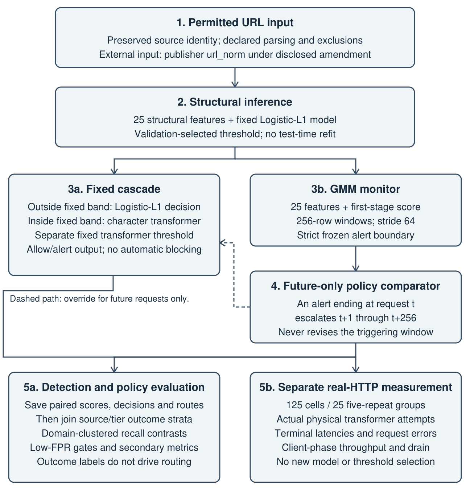
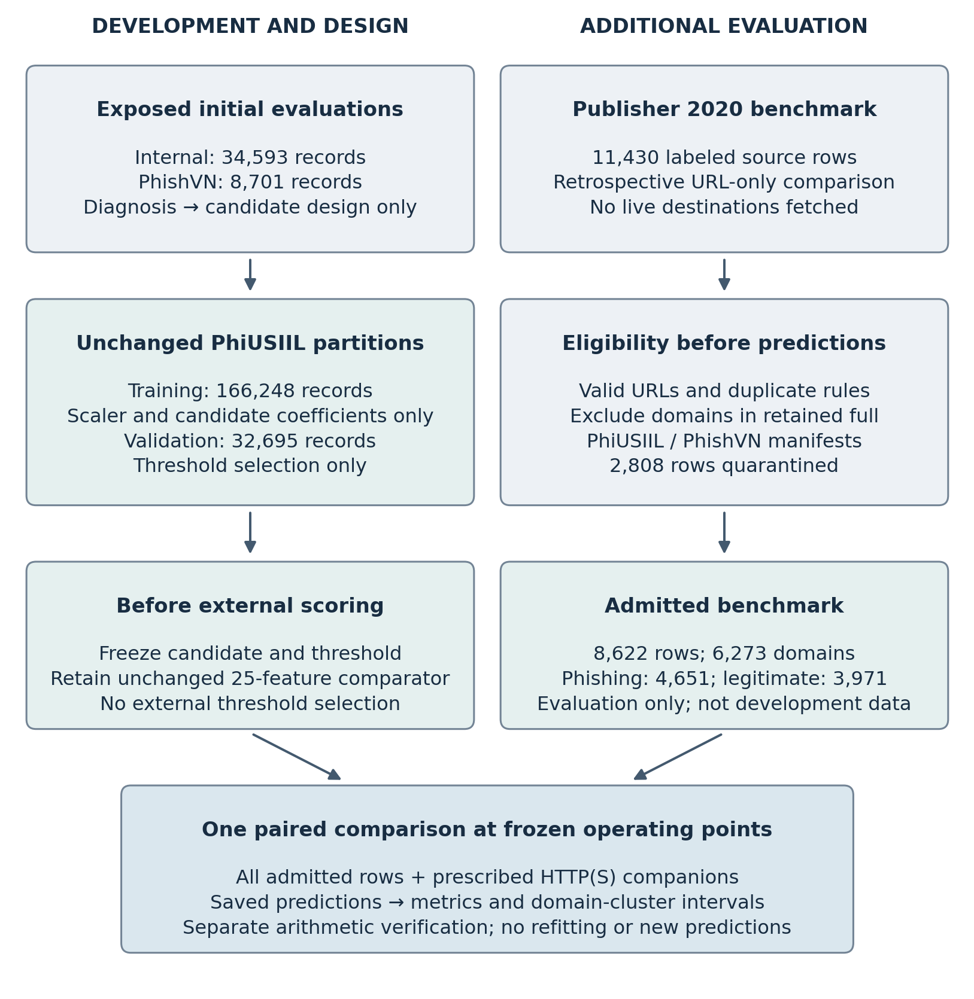
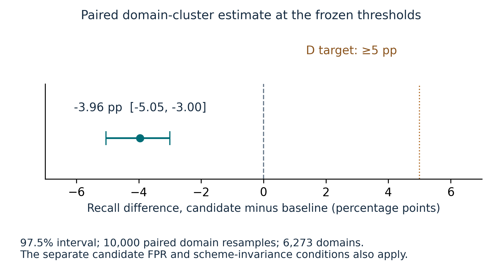
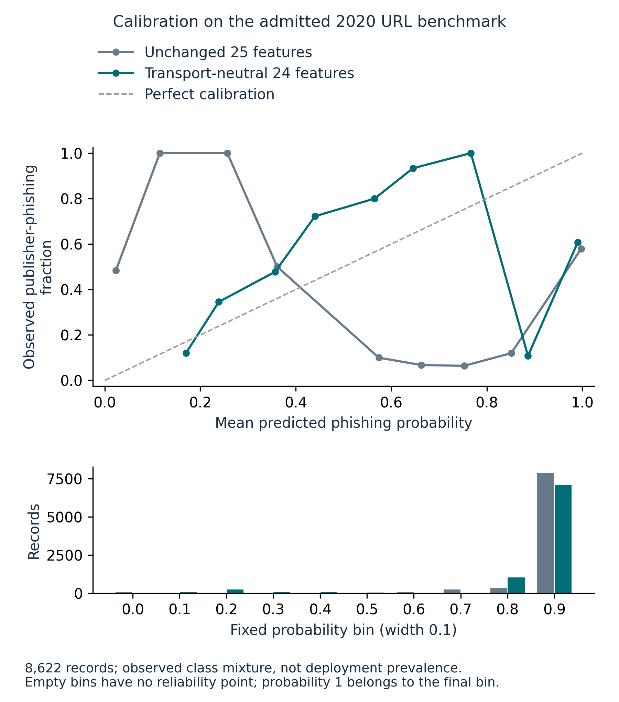

# Chapter 1—Introduction

## 1.1 Background

Frontier artificial-intelligence (AI) services increasingly receive and produce uniform resource locators (URLs) through application programming interfaces, retrieval pipelines, tool calls, and model-generated responses. A URL at this boundary may be legitimate, or it may direct a user or downstream system to a credential-harvesting site. An inference gateway therefore presents a useful point for a narrow control: inspect the raw URL before it continues through the application. This control does not replace browser, email, endpoint, or network defenses. It addresses the smaller question of whether a gateway can identify suspicious URLs with sufficiently low false-positive and operational costs to be useful inline.

Raw-URL detection is deliberately constrained. The detector in this study does not fetch the destination, render page content, query the Domain Name System (DNS) or the WHOIS registration-record service, or use private request content. It observes the URL string and features derived from that string. This boundary supports repeatable evaluation and avoids turning data collection into live interaction with suspected phishing infrastructure. It also makes the scientific question harder: the system must distinguish records using syntax, character sequence, and structural patterns that may vary across domains and data sources.

Two practical tensions motivate the work. First, a random row split can place related domains in both training and test sets, allowing domain-family overlap to contribute to an apparently strong generalization result. Second, a character transformer may recognize patterns unavailable to a linear structural model, but its potential detection benefit must be weighed against inference cost. Selective execution offers one way to manage that tradeoff, while distribution monitoring can identify circumstances in which the original routing rule may warrant reconsideration. The research problem is whether these established components, combined in one gateway, satisfy the same detection and service requirements across the declared evaluation populations.

## 1.2 Problem Statement

Published phishing-URL studies often optimize aggregate accuracy or report performance under dataset-specific splits. An inference-gateway operator instead needs evidence at a low false-positive operating point, on domains not shared with model fitting, and on an external source whose collection process differs from the development source. The operator also needs to know how often a more expensive model is invoked and what the complete Hypertext Transfer Protocol (HTTP) path costs under load. These concerns are related but are not answered by one accuracy value.

The evidentiary problem is equally important. A binary label in a public corpus is a reference classification supplied through the corpus's collection process. It is not automatically a contemporaneous, independently adjudicated fact about a live site. If the study silently changes labels, fills missing records, or selects thresholds after seeing test outcomes, its reported performance would be difficult to reproduce and easy to overstate. The protocol therefore uses staged freezes for mechanical label mapping, quarantine, development-domain allocation, transformer and cascade threshold selection, and hypothesis gates. Protocol v1.10 froze the separate Gaussian mixture model (GMM) development method before its run. Later amendments have distinct timing: the external URL amendment followed preparation and label-count exposure, and checkpointed recovery was proposed after partial execution. Those amendments and the actual access history are disclosed in Sections 3.10, 3.13 and 4.6; the study is not represented as a wholly pre-data specification.

## 1.3 Purpose of the Study

This study evaluates CyberSentinel, a two-stage URL-only detector designed for an inference-gateway boundary. Stage 1 uses L1-regularized logistic regression over locally derived structural features; Stage 2 uses a compact character-level transformer. A validation-selected uncertainty band determines escalation in the fixed cascade. A Gaussian mixture model monitors the structural features and stage-1 score. Its routing policy is evaluated through offline, ordered-stream replay: an alert changes routing for the next 256 requests, never for the records that generated it. The term prospective routing denotes this future-only action rule, not prospective field collection.

The evaluation links three questions: whether richer representations improve detection at a low false-positive-rate (FPR) operating point, whether distribution alerts guide useful escalation, and whether the resulting service meets its inline performance requirements. PhiUSIIL supplies development and registrable-domain-disjoint internal evaluation; PhishVN v3.1.0, Mendeley Data repository Version 4, supplies external source/domain evaluation. The completed investigation includes 125 operational cells, 25 groups, 22 primary checks and the declared secondary analyses, with explicit limits where a secondary control could not be identified or fully audited. None of the three joint hypotheses was supported under its unchanged decision rule. The preparation amendment, interrupted attempts and two-session completion are documented in Chapters 3 and 4, where their implications for interpretation can be assessed alongside the results.

The initial findings motivated two subsequent, bounded comparisons. Detection comparison D evaluated a transport-neutral structural representation, implemented by consistent scheme neutralization, on an additional admitted benchmark. Service comparison S evaluated client connection ownership while retaining the structural scorer. Together, these comparisons extend the account from design and evaluation through diagnosis, modification and measured comparison. They establish an exact representation property and a substantial service-latency improvement, while quantifying the conditions those improvements did not resolve. Their requirements were specified after the initial findings and remain distinct from H1–H3.

### 1.3.1 Thesis Statement

CyberSentinel will test low-FPR structural and character-level detection, GMM-guided escalation, and whether selective execution stays within two percentage points of transformer-only recall while invoking the transformer no more than 30%, keeping p95 at or below 200 ms, and holding errors below 0.1%.

The preceding statement preserves the working thesis on slide 5 of the August 20 advisor deck. Its future tense records the commitment at that stage of the project; it is not a statement of achieved performance. The three research questions and their conjunctive hypotheses operationalize that commitment. Chapter 4 reports each decision, and Chapter 5 explains the relationship between the demonstrated component benefits and the joint inline operating claim.

### 1.3.2 Research Objectives

The first objective is to quantify the incremental recall and false-positive behavior of structural and character representations on registrable-domain-disjoint internal data and external source/tier strata. The second is to measure distribution sensitivity, reference false alerts and the consequences of future-only escalation without treating an alert as proof of harmful drift. The third is to measure actual HTTP latency, throughput, transformer attempts and request errors against the frozen operational constraints. Together these objectives provide an end-to-end answer about the tested system, rather than separate favorable accuracy and speed claims.

## 1.4 Research Questions and Hypotheses

The National Cyber Security Center (NCSC) source designation below is the publisher's label for a PhishVN positive stratum, not an independent adjudication performed by this study.

### 1.4.1 RQ1 and H1

RQ1: What incremental value do structural URL features and character-level representations provide under registrable-domain-disjoint and external evaluation?

H1: At the validation-selected FPR ceiling, full structural features improve recall over a length-only baseline, and the character-transformer cascade improves recall over Logistic-L1.

H1 is supported only if each of length-only, Logistic-L1, and cascade has observed FPR <= 1% on both PhiUSIIL group-test negatives and certified trusted-registry negatives, and if the registrable-domain-clustered 95% bootstrap lower bounds exceed zero for all four prespecified recall differences. The differences are Logistic-L1 minus length-only and cascade minus Logistic-L1, each evaluated on PhiUSIIL group-test positives and NCSC gold positives. A positive difference in only one source, or an improvement accompanied by excess FPR, does not support H1.

These are the only two primary H1 contrasts. Transformer-only remains a comparator and operational reference, not a third primary H1 gate. The cascade-minus-Logistic-L1 contrast measures the selective system contribution, not a pure causal isolation of representation.

### 1.4.2 RQ2 and H2

RQ2: Can GMM-based monitoring detect an external source/domain shift and guide escalation without exceeding the low-FPR operating constraint?

H2: GMM detects at least 80% of prespecified external shift windows at no more than 5% false alerts, and prospective routing reduces the false-negative rate relative to the fixed cascade while retaining FPR <= 1%.

H2 is supported only if all four conditions hold: external-window detection is at least 80%; false alerts on the independent PhiUSIIL validation audit stream are no more than 5%; the alert policy's observed FPR on certified trusted-registry negatives is <= 1%; and the lower bound of the registrable-domain-clustered 95% bootstrap interval for false-negative-rate reduction on NCSC gold positives is greater than zero. The monitor measures departure in P(X). It does not by itself establish harmful drift, label shift, concept drift, or a causal change in model error.

### 1.4.3 RQ3 and H3

RQ3: What detection, escalation, throughput, and latency tradeoffs determine whether the fixed cascade is viable inline?

H3: For each system, observed FPR on certified trusted-registry negatives is <= 1%, and the Tranco reference-negative alert rate is <= 1% as a mandatory secondary safeguard. Cascade recall on NCSC gold positives is noninferior to transformer-only recall within 2 percentage points. On the 1%-prevalence benchmark reference, transformer invocation is at most 30%, real-HTTP p95 latency is at most 200 ms at concurrency 64, and the request-error rate is below 0.1%.

H3 requires both external-FPR safeguards for both the fixed cascade and transformer-only model. Exact one-sided 95% Clopper-Pearson upper confidence bounds accompany the two certified-registry FPR estimates and the two Tranco control alert-rate estimates. The domain-clustered 95% bootstrap lower bound for recall(cascade) minus recall(transformer-only) on NCSC gold positives must be at least -0.02. Stage 2 must be invoked for no more than 30% of the primary reference manifest. Pooled p95 latency across the measured concurrency-64 runs must be <= 200 ms, and the request-error numerator divided by all 50,000 measured concurrency-64 requests must be < 0.1%.

## 1.5 Contribution Boundary

The contribution is an implemented URL-only inference gateway and an integrated empirical account of its detection, routing and service behavior. The evaluation connects structural and character inference, future-only GMM-guided routing, domain-separated outcome strata and real HTTP measurements under common operating requirements. This design makes it possible to determine whether a benefit at one layer persists when the complete system is judged by external false-positive risk, escalation cost, tail latency and reliability. The resulting contribution is a systems-level evaluation with traceable component mechanisms, rather than a new classifier architecture.

The subsequent comparisons add mechanism-level evidence to that systems account. Consistent scheme neutralization removes the prescribed HTTP/HTTPS sensitivity from the structural representation, while an additional benchmark measures the detection tradeoff at frozen operating points. A paired client-topology experiment, including a no-model control, demonstrates a median paired p95 reduction of 79.68% for the structural workload at concurrency 64. Worker-owned clients meet that comparison's latency and error requirements, although exact response equivalence remains unmet because admission sequence is part of the specified contract. These results establish concrete improvements without treating representation conformance, external specificity and service correctness as interchangeable outcomes.

Prior work establishes structural and character URL models, domain-aware evaluation, selective cascades, source-shift analysis and security monitoring (Ahamed et al., 2026; Hussain et al., 2027; Li et al., 2021; Rashid et al., 2024; Tsai et al., 2024; Yang et al., 2021). This study does not claim invention of those components or of scheme normalization and connection reuse. Its technical value is the specific integrated artifact, controlled comparisons and traceable evidence that connect a diagnosed behavior to an implemented change and a measured engineering decision.

## 1.6 Scope, Delimitations, and Limitations

The detection unit of analysis is one retained URL record. The system produces allow or alert decisions; it does not automatically block requests, remove content or take down destinations. Only absolute HTTP and Hypertext Transfer Protocol Secure (HTTPS) URLs satisfying the declared parsing rules enter the retained development partitions. Here, raw-URL or URL-only detection identifies the information modality: the model receives a URL string without fetching its destination. It does not imply that every source supplies an untouched original spelling. The amended external evaluation uses the publisher's exact url_norm, as specified in Section 3.4. Private request content, rendered pages, DNS, WHOIS, reputation services and network telemetry are outside the study. Frontier-AI inference motivates the gateway boundary; the experiments evaluate the URL service, not a frontier model's reasoning, browsing behavior or field deployment.

The primary label limitation is explicit. PhiUSIIL and the external source provide publisher-provided, source-derived reference classifications, not independently verified ground truth. PhiUSIIL does not expose public per-row source, timestamp, snapshot, or independent-adjudication fields. This limits record-level forensic verification and temporal analysis. The study addresses the limitation through exact source preservation, mechanical mapping, quarantine, source/domain-separated evaluation, and bounded claims. Those controls improve reproducibility; they do not transform reference labels into independently proven facts. External parsing and model inputs use the publisher's exact `url_norm` under the disclosed amendment, with original raw cells preserved. Publisher-added schemes and domain-only records cannot establish the transport or page behavior of a live destination.

All numerical targets are study-defined operating requirements, not thresholds prescribed by the literature. They include the <= 1% FPR ceiling, >= 80% shift-window detection, <= 5% false alerts, -0.02 recall noninferiority margin, <= 30% transformer invocation, <= 200 ms real-HTTP p95 latency, < 0.1% request errors and 2,000 ms client timeout. These requirements were fixed before confirmatory outcomes were known and evaluated without outcome-driven relaxation.

Chapter 2 locates the work within URL learning, distribution shift, selective inference and systems measurement. Chapter 3 defines the artifact, populations, estimands and actual sequence of freezes and amendments. Chapter 4 presents the original evaluation and the two subsequent comparisons. Chapter 5 integrates those findings into direct research-question answers, technical contributions and implications for further design.

# Chapter 2—Review of the Literature

The literature review examines how evidence from URL classification, distribution monitoring and systems measurement can support an inference-gateway operating claim. It is organized around six connected concerns: raw uniform resource locator (URL) classification, structural and character representations, domain and source shift, low-false-positive-rate (FPR) operating points, selective execution and security drift monitoring. The review is focused and problem-driven rather than systematic. Its comparisons emphasize differences in available inputs, evaluation populations, decision rules and operational measurements, because those differences determine which findings can inform the present design.

This synthesis situates both the original investigation and its subsequent engineering comparisons. It does not imply that every cited publication informed the original freeze. Chapter 3 records when the development decisions and amendments were made; the literature supplies context and comparison, not retrospective prespecification.

## 2.1 Raw-URL Phishing Detection

Phishing detection can draw from page content, visual appearance, host infrastructure, reputation, email context, or the URL itself (Basit et al., 2021; Khonji et al., 2013). A raw-URL detector accepts less information than a full web classifier, but it can act before a page is fetched and can be applied consistently at an application programming interface (API) boundary. Lexical and structural indicators commonly include URL length, hostname and path lengths, punctuation counts, digit ratios, entropy, IP-literal use, port syntax, and suspicious authority forms. These variables are inexpensive and interpretable, but their usefulness depends on the source and period from which examples were collected.

PhiUSIIL was published as a large URL dataset assembled from phishing sources and an Open PageRank legitimate source (Prasad & Chandra, 2024a, 2024b). The associated work combined URL and webpage features. This study uses only the raw URL and features computed locally from it. That distinction matters because reported performance based on page-derived variables cannot be treated as an achieved raw-URL result. It also matters for labeling: the corpus's native class is preserved as a publisher reference rather than re-created from locally chosen heuristics.

The scope of the available signal is a central comparison dimension. Khonji et al. (2013) place detection within a wider set of phishing mitigations, including prevention and corrective action. Basit et al. (2021) review machine-learning, deep-learning, hybrid and scenario-based detection approaches. These surveys establish that a detector is one intervention in a broader security process. A URL decision alone cannot authenticate the operator of a page, establish the intention of a message sender or prove that a user will respond safely to a warning. The present gateway consequently evaluates URL classification and service behavior rather than claiming prevention of all phishing harm.

Earlier URL-learning work also differs in what it permits the model to observe. Ma et al. (2009) combine lexical and host-based properties to classify malicious web addresses; their task is broader than phishing alone. Sahingoz et al. (2019) compare classifiers using natural-language-processing-based URL features and emphasize independence from third-party services. Together, these studies establish learning from address structure as prior art, while distinguishing locally computed string features from infrastructure lookups. They support the feasibility of a lightweight first stage, not the assumption that its error rate will remain unchanged under another collection source.

Client-side execution is not synonymous with raw-URL-only detection. Jain and Gupta (2018) extract features from both the URL and page source without third-party dependencies. Rao and Pais (2019) combine URL, source-code and third-party features. Marchal et al. (2017) implement Off-the-Hook as a browser add-on and evaluate its warnings with users. These approaches can exploit evidence unavailable before page retrieval, or assess human outcomes absent from an inference endpoint. Comparing their headline accuracies directly with the present raw-string detector would confound feature access, population, labels and evaluation protocol. Their more useful contribution to this study is a set of design alternatives: richer evidence can justify additional fetching and interaction costs, whereas a pre-fetch gateway must demonstrate the value attainable from the restricted input it actually receives.

## 2.2 Structural and Character Representations

A sparse linear model provides a useful first stage because its inputs and coefficient path are inspectable. L1 regularization can suppress weak or redundant predictors while retaining a small set of nonzero coefficients (Tibshirani, 1996). It does not, however, directly model long character sequences or interactions among distant parts of a URL. A character-level transformer can learn sequence patterns without tokenizing the URL as natural language. That flexibility may improve recall, but it increases fitting and inference cost and can also learn collection-source shortcuts.

Ahamed et al. (2026) evaluate structural and character-based URL approaches under adversarial, domain-disjoint, and external conditions. Their principal PhishTank external check combines external phishing positives with held-out PhiUSIIL benign records, while a separate dual-source check uses an independent top-sites negative source. Their work therefore supports the need for cross-source evaluation without making every reported external result equivalent to a wholly independent two-class corpus. It also narrows what may be claimed here: combining structural and character models is not by itself new. The present RQ1 instead asks whether each added representation provides a prespecified incremental recall gain at a controlled FPR on both an internal domain-disjoint partition and external source/domain strata.

The Random Forest comparator examines a different source of representational capacity from a character encoder. Breiman (2001) constructs ensembles of randomized tree predictors and relates forest behavior to the strength and correlation of their component trees. Trees can represent nonlinear combinations of supplied features without learning a character representation. In this study, that comparison asks whether a richer decision function over structural variables is enough; it does not make tree performance a proxy for sequence-model performance. The sparse linear, tree and character models therefore address different mechanisms rather than forming an assumed ranking from simple to best.

Character-level learning predates the transformer used here. Zhang et al. (2015) investigate character-level convolutional networks for text classification. Le et al. (2018) introduce URLNet, which jointly learns character- and word-level convolutional URL representations for malicious-URL detection. Neither model is the present transformer. Vaswani et al. (2017) establish attention-based sequence modeling in machine translation; applying that architecture family to URL characters is an application choice, not an invention of attention. These distinctions prevent an architectural label from replacing the empirical question: does the additional sequence information improve recall at the locked low-false-positive operating point on the relevant populations?

Implementation provenance is also distinct from algorithmic novelty. Pedregosa et al. (2011) describe scikit-learn as a consistent interface to supervised and unsupervised learning methods. A library citation identifies the software lineage of classical-model development, but neither that citation nor a passing software test demonstrates predictive validity. Fitted parameters, feature definitions, package versions, partitions and frozen thresholds must still identify the executed artifact. The corresponding evidence in Chapter 3 supports that artifact-level account rather than implying that citing a standard implementation reproduces its original research evaluation.

## 2.3 Domain Leakage and Source Shift

Random row allocation is problematic when many URLs share a registrable domain. Related records in training and test data can make a model appear to generalize while it is partly recognizing domain-specific regularities. A registrable-domain group split is therefore used for PhiUSIIL. Each retained registrable domain belongs to one and only one partition, and the allocation is label-blind.

Domain separation does not eliminate source effects. A detector trained on one corpus may learn formatting, curation, or collection artifacts that do not transfer to another. Rashid et al. (2024) document cross-dataset degradation and study unsupervised domain adaptation for phishing URLs. Tsai et al. (2024) examine dataset bias in malicious-URL models and adversarial training for invariant representations. These findings support the need for an external source/domain evaluation, but they do not predetermine its outcome.

The external evaluation uses PhishVN v3.1.0 from Mendeley Data repository Version 4 under the staged freezes and disclosed representation amendment in Section 3.10. Vu (2026a) describes source records, confidence tiers, and registrable-domain-grouped splitting for that corpus. The current study does not treat all external records as equally strong outcome evidence. National Cyber Security Center (NCSC) gold positives and certified trusted-registry negatives form the primary external error strata. Tranco records are a popularity-based control rather than verified benign evidence. Le Pochat et al. (2019) show how the composition, stability and susceptibility to manipulation of popularity rankings can affect samples used in security research. Their findings support keeping popularity-based controls separate from independently verified negative labels.

Mechanical validity and conflict rules are applied before routing to define the retained external stream. Among retained records, source and confidence designations are applied only after label-blind routing to form analytic outcome strata; they do not change routing membership.

The reason for grouping is dependence, not a presumption that every domain has one label. Roberts et al. (2017) examine blocked validation for temporally, spatially and hierarchically structured ecological data. Their application is not phishing, but the methodological warning is relevant: random allocation can underestimate predictive error when related observations cross the train–test boundary. They also show why blocking changes the prediction problem and can introduce extrapolation. A domain-disjoint score should therefore be interpreted as performance on the chosen held-out domain population, not as a universally more accurate estimate of every deployment setting. Grouping controls a named leakage route; it does not certify labels or remove all collection artifacts.

Pan and Yang (2010) distinguish transfer-learning settings and relate them to domain adaptation and sample-selection bias. Ben-David et al. (2010) bound target error using source error and a classifier-induced divergence under an assumption that a hypothesis can perform well in both domains. This establishes why small source error alone is insufficient and why a distribution comparison requires assumptions before it becomes a performance guarantee. The present study does not estimate that theoretical bound. Its external strata instead test the behavior of the unchanged fitted detector on a specified source mixture.

Covariate shift is a narrower condition than arbitrary source change. Sugiyama et al. (2007) study importance-weighted cross-validation when the input distribution changes but the conditional output distribution given the input remains unchanged. A new phishing feed may violate that condition through changes in labeling, collection practices or the relationship between URL structure and reference class. Importance weighting therefore cannot be invoked as an automatic remedy without checking the assumptions and defining a new development procedure. This study implements neither importance-weighted model selection nor target-domain adaptation. Its source-separated results identify where a frozen model transfers and where further development would require a new evaluation, rather than silently turning the external test into training data.

## 2.4 Calibration at Low False-Positive Rates

An inline alerting system can be unusable even with high aggregate accuracy if its false-positive rate is too large. Axelsson's (2000) base-rate analysis of intrusion detection explains why rare events can make false alarms dominate the alert population despite high detection sensitivity. That analysis motivates examining low-FPR behavior, but does not prescribe the particular 1% ceiling adopted here. Threshold selection therefore belongs to the validation phase rather than the test phase. In this protocol, a model threshold maximizes validation recall only among thresholds whose exact one-sided 95% Clopper-Pearson FPR upper bound is <= 1% (Clopper & Pearson, 1934). Ties favor the smaller upper bound and then the higher threshold. If no threshold satisfies the constraint, the study records that outcome rather than weakening the rule.

This design distinguishes an observed rate from uncertainty about that rate. A point estimate of 1% based on a small negative sample does not carry the same evidentiary weight as the same estimate based on a large sample. Exact binomial bounds make the sample denominator visible. The 1% ceiling remains a study-defined risk choice rather than a universal threshold derived from earlier work.

Different metrics answer different operational questions. Saito and Rehmsmeier (2015) show why precision–recall views are important when class imbalance can obscure the practical meaning of receiver operating characteristic (ROC) plots. Precision depends on the proportion of positive examples in the evaluated population; a favorable value on a balanced benchmark cannot be transferred unchanged to a stream containing far fewer phishing requests. Conversely, a ROC area summarizes ranking across thresholds and does not establish the recall available at one low false-positive rate. Reporting both broad discrimination and the frozen operating point makes these interpretations distinguishable.

Chicco and Jurman (2020) explain how accuracy and the F1 score can conceal poor binary-classification behavior and discuss the Matthews correlation coefficient (MCC) as a summary that incorporates all four confusion-matrix categories. That motivates reporting complementary summaries and the underlying counts rather than declaring one scalar sufficient. MCC still does not encode this gateway's false-positive ceiling or service budget. The primary decision follows the specified constraint, even when another descriptive metric improves.

Probabilistic scores introduce another distinction. Gneiting and Raftery (2007) develop proper scoring rules for evaluating probabilistic forecasts, including quadratic and logarithmic scores. Such rules assess the quality of probability assignments against observed outcomes; they do not by themselves select an operational action threshold. Calibration diagnostics, ranking metrics and confusion counts at the locked threshold are therefore complementary, not interchangeable. This distinction is particularly important when a representation modification produces more stable scores but a different recall–specificity tradeoff. Improved behavior under one diagnostic must not be restated as satisfaction of a separate low-FPR requirement.

Prevalence projections require a further distinction between changing class proportions and changing class-conditional behavior. Lipton et al. (2018) study label shift, in which P(Y) changes while P(X|Y) remains fixed, and develop a method for estimating the changed class proportions. The prevalence projections reported here hold the measured class-conditional rates fixed and vary an assumed phishing proportion; they neither estimate a deployment prevalence nor implement that paper's shift-correction method. Their value is to show how the alert burden depends on the assumed class mixture, separately from the measured source-transfer problem.

## 2.5 Selective Cascades

A selective cascade applies a less expensive model first and invokes a more expensive model for a defined subset of inputs. CascadeBERT demonstrates calibrated language-model cascades as a way to exchange computational cost for prediction quality (Li et al., 2021). Alajaji (2026) evaluates a validation-selected classical-first cascade with transformer deferral for phishing email-body detection; that result establishes modality-specific deferral prior art, not raw-URL or inference-gateway performance. Hussain et al. (2027) combine calibrated URL experts through confidence- and uncertainty-aware routing and evaluate cross-dataset shift with registered-domain-stratified splits. Their routing combines expert decisions rather than implementing a cheap-first deferral policy, so it does not establish transformer-call savings for the present cascade. Together, these studies establish model deferral and calibrated expert combinations as prior art while leaving the present operating claim to be tested.

The fixed cascade in the present study uses a symmetric uncertainty band around the locked Logistic-L1 threshold. Validation candidates consist of unique absolute distances from that threshold. The selected band is the one with the fewest escalations whose validation cascade recall is at least transformer recall minus 0.02 and whose FPR upper bound is <= 1%. Test data do not select or revise the band.

Confidence-based deferral is attractive only if the selected cases are ones for which additional computation helps. Ovadia et al. (2019) evaluate predictive uncertainty under dataset shift and find that conventional post-hoc calibration can fall short outside the original distribution. Their benchmark is not a URL cascade, and the present system does not implement the ensemble methods they compare. The relevant implication is that low confidence, high error probability and useful escalation cannot be treated as synonyms under shift. A confidently wrong first-stage decision may fall outside an uncertainty band; a deferred case may remain wrong after the second stage. The present evaluation therefore accounts separately for transformer invocations, final reference-label errors and service cost. A reduction in calls has value only in relation to the detection behavior retained at that call rate.

## 2.6 Distribution Monitoring and Routing

A Gaussian mixture model (GMM) represents the development feature distribution as a weighted combination of Gaussian components. In the expectation–maximization formulation, component membership is unobserved; estimation alternates between conditional membership weights and parameter updates (Dempster et al., 1977). The primary monitor uses standardized structural features plus the stage-1 score and selects one through six diagonal-covariance components by the Bayesian information criterion (Schwarz, 1978). Window scores are mean negative log-likelihood. The alert boundary is calibrated on one PhiUSIIL validation stream, while false alerts are measured on a separate validation audit stream.

Security drift research shows the value of detecting and explaining distributional changes. CADE, for example, detects and explains individual drift samples through a learned low-dimensional representation in malware and network-intrusion settings (Yang et al., 2021). It does not validate the present diagonal-GMM likelihood, overlapping-window, alert-boundary, or next-256 routing rules. The inference supported by the present GMM is narrower. A high negative log-likelihood signals that observed X values differ from the fitted P(X) reference. The alert does not reveal why the distribution changed and does not prove that labels or prediction errors changed. Comparing fixed-cascade errors with future-only alert-policy errors is therefore necessary to test routing value.

Drift literature separates recognizing change from responding successfully to it. Gama et al. (2014) review adaptive learning under changes in the relation between inputs and targets. Lu et al. (2019) organize learning under concept drift around detection, understanding and adaptation. These distinctions are essential here because an unlabeled feature monitor cannot directly observe the conditional error process. A signal that inputs are unusual may justify investigation, but automatically routing future traffic to a more expensive model adds a separate intervention whose benefit must be measured. The fixed detector and future-only routing policy deliberately keep the observation and the action distinguishable.

Chandola et al. (2009) organize anomaly-detection methods by their assumptions about normal and anomalous behavior. A low density under a fitted reference distribution is consequently model-relative, not a declaration that a URL is malicious. Common benign inputs may look unusual to a reference fitted on another source, while harmful inputs may resemble that reference. This is why the monitor has both a false-alert audit and a downstream error comparison. Counting detected external windows without those checks would answer only the easier distribution-recognition question.

Gretton et al. (2012) introduce maximum mean discrepancy (MMD) as a kernel statistic for comparing distributions. It provides a different reference for asking whether feature samples differ, whereas the Gaussian mixture monitor scores observations against an explicitly fitted density. The MMD comparison in this study is a distribution diagnostic; the kernel-test literature does not confer a phishing-error guarantee on it or on the mixture monitor. Overlapping windows and a future-only action horizon further require attention to the actual unit of observation. Window detection, request classification and additional model execution have different denominators, which are kept separate in the results.

## 2.7 Gap Addressed by the Study

The reviewed studies establish URL representations, calibrated deferral, cross-source analysis and distribution monitoring as substantive research areas. Their evidence differs, however, in the inputs available to the detector, the populations on which it is evaluated and the costs included in measurement. The problem addressed here is their joint operation at a gateway boundary: whether a compact two-stage URL-only detector can retain low-FPR recall across internal and external evaluation, limit transformer invocation and satisfy an end-to-end HTTP budget under fixed procedures. This question requires paired detection outcomes, explicit routing traces and service measurements for the same implemented system. Table 2.1 identifies how the closest studies inform that problem and where their evidence does not substitute for its evaluation.

Table 2.1. Closest prior work and the boundary of the present contribution.

| Closest work | Setting and contribution | Boundary relative to this study |
|---|---|---|
| Ahamed et al. (2026) | Raw-URL robustness across structural, character, adversarial, domain-disjoint, and external checks | Does not evaluate the present frozen cascade, future-only routing policy, or HTTP gates; its principal external check does not use an independent negative source. |
| Rashid et al. (2024) | Cross-dataset phishing-URL generalization through unsupervised domain adaptation | Adapts across sources, whereas this study freezes the detector and prohibits external refitting or recalibration. |
| Tsai et al. (2024) | Diagnosis and adversarial mitigation of dataset bias in malicious-URL models | Studies invariant representation learning rather than a low-FPR cascade, monitor, or service evaluation. |
| Li et al. (2021) | Calibrated complete-model cascades for general language-model inference | Establishes cascade prior art outside phishing and does not test the present URL or gateway constraints. |
| Alajaji (2026) | Validation-selected classical-first transformer deferral for phishing email bodies | Uses a different modality and does not establish raw-URL or measured inference-gateway behavior. |
| Hussain et al. (2027) | Calibrated URL-expert fusion under cross-dataset and target-prior shift | Uses decision-level expert fusion rather than cheap-first selective transformer execution or future-only shift-triggered routing. |
| Yang et al. (2021) | Detection and explanation of individual security drift samples | Does not establish the present GMM, window construction, false-alert audit, or routing rule. |

The contribution therefore lies in the evaluated relationships among these components. A representation can improve recall without transferring its false-positive behavior; an alert can recognize source departure without selecting requests that benefit from escalation; and avoided inference calls need not produce acceptable HTTP latency. The following sections establish the methodological basis for examining those relationships and for testing specific modifications after the initial evaluation.

## 2.8 Evaluation-Guided Engineering Iteration

An engineering evaluation has to distinguish a correct implementation from a useful operating point. Arp et al. (2022) describe how spurious correlations, inappropriate evaluation sets and test-informed development can produce misleading security-machine-learning conclusions. Their analysis motivates two decisions here. First, a diagnostic observation is used to formulate a mechanism to test, rather than to declare its cause established. Second, observations already used to diagnose a model are treated as development evidence for any revision. They do not become untouched evaluation data merely because a new model is fitted or a different split is selected.

The distinction between domain, source and temporal separation is equally important. TESSERACT formalizes spatial and temporal evaluation constraints for malware classification (Pendlebury et al., 2019). Its application differs from phishing URLs, but the methodological distinction transfers: excluding overlapping registrable domains does not establish forward-in-time performance. The additional URL benchmark in this study was collected in 2020, before the reported phishing collection period of PhiUSIIL. It therefore supports a retrospective cross-dataset comparison, not a claim of resilience against later attacks. Shared upstream phishing feeds also prevent treating different dataset titles as proof of independent collection mechanisms.

Calibration, discrimination and action are separate properties. Guo et al. (2017) calibrate confidence using validation data; their temperature-scaling method does not alter the predicted class ranking in the manner required to cure arbitrary discrimination failures. In a binary setting, a positive-temperature monotone transformation cannot improve ROC ranking. It would therefore be unjustified to infer that recalibration alone must repair poor low-FPR external behavior. Similarly, SelectiveNet studies risk subject to coverage constraints with an explicit reject option (Geifman & El-Yaniv, 2019). It supports reporting the decisions and coverage produced by selection, rather than counting deferred cases as corrected predictions. Neither temperature scaling nor SelectiveNet is introduced as an implemented algorithm in this study.

These principles organize a bounded engineering iteration. The initial evaluation identifies a representation sensitivity and a possible client-side cost mechanism. The follow-up tests one representation change and one connection-management change while retaining their respective comparators. Representation stability, labeled detection performance and HTTP performance remain separate measured outcomes. The value is the traceable progression from an observed behavior to a constrained modification and a comparison capable of showing whether that modification addresses the intended requirement.

Metamorphic testing makes one part of that iteration more precise. Chen et al. (2018) describe relations between multiple inputs and their expected outputs as a means of testing systems when an ordinary output oracle is difficult to supply. The prescribed HTTP/HTTPS companion transformation here tests a declared representation relation: changing the transport scheme alone should not change the transport-neutral feature vector or its score. It does not assert that two live pages served over different schemes have identical content or security. No page is fetched to establish such equivalence. Exact invariance under the prescribed transformation is therefore a conformance result with its own value, while labeled detection performance remains a separate empirical test. Keeping these two claims apart allows the study to document a successful implementation repair without concealing the tradeoff observed against publisher reference labels.

## 2.9 Operational Measurement and Evidence Units

An inference endpoint includes more than a classifier. Connection management, request scheduling, validation and response processing can affect observed latency even when model parameters are unchanged. Dean and Barroso (2013) explain why latency variability matters for the responsiveness of large interactive services. Their scale differs from this local gateway, but the distinction supports examining the slow tail rather than average service time alone. Kalibera and Jones (2013) emphasize repetition and uncertainty estimation in systems benchmarking because execution varies across runs and other experimental levels. Their work motivates identifying the level at which comparisons are replicated rather than treating a large request count as a large number of independent experiments. The present service comparison uses paired runs for the latency-ratio interval and separately reports pooled request-level quantiles. These summaries describe different quantities and must not be substituted for one another.

The workload generator also determines what a throughput or latency result means. Schroeder et al. (2006) distinguish closed workloads, in which completions govern subsequent submissions, from open workloads with arrivals independent of completion. Their experiments show that these choices can produce materially different response times and scheduling behavior. The present fixed-concurrency replays therefore characterize the tested closed-loop service path. They support a controlled comparison of client designs, rather than a capacity claim for an externally imposed production arrival rate.

Service correctness also has multiple layers. Agreement of predictive fields answers whether the two client paths return the same classification information on comparable requests. Exact response agreement tests the wider response contract, including the admission sequence retained by the frozen rule. Concurrent clients can preserve predictions while changing that sequence. A timeout creates an additional noncomparable pair rather than a correct prediction. The service experiment consequently reports the full attempted denominator, errors, exact agreement and prediction-only agreement. The literature supports careful measurement; the particular agreement rule and latency budget remain study-defined requirements, not thresholds borrowed from a benchmark paper.

Across these literatures, the contribution is the connection among explicit boundaries: what information the detector receives, which population it is asked to generalize to, how its operating point is selected, what the monitor can observe, what routing changes and what the service timer includes. The experiment exposes these boundaries through common artifacts and preserved decisions. That approach yields interpretable positive engineering findings and identifies the conditions under which they do not establish the larger deployment claim.

# Chapter 3—Methodology

## 3.1 Research Design

The research used a staged-freeze design to evaluate three aspects of one artifact. RQ1 compared representations at validation-selected thresholds; RQ2 assessed distribution monitoring and future-only routing; RQ3 measured the real Hypertext Transfer Protocol (HTTP) path. This chapter first specifies the information flow, source preparation, models and estimands, then distinguishes the original protocol from later execution amendments and follow-up comparisons. The completed original matrix combines unchanged source results and cells 1–72 from the fourth amended attempt with cells 73–125 from the October 1 continuation. It is a disclosed two-session evaluation rather than a single uninterrupted experiment. No accepted adverse cell was replaced; the preparation hold, interruptions and acceptance decisions remain in the accompanying history supplement.

The unit of analysis for detection is a retained uniform resource locator (URL) record. The clustering unit for primary recall intervals is the registrable domain. The unit for monitoring is a 256-request window with stride 64. The unit for the H3 operational error rate is one measured HTTP request under the frozen request construct.

### 3.1.1 Architecture and Information Flow

The architecture separates four functions: preparation, inference, monitoring and evaluation. Preparation determines record eligibility and preserves source identities. Inference maps an eligible URL to a score and an allow/alert decision. Monitoring observes the feature distribution and may alter future routing, but does not change reference labels or earlier decisions. Evaluation joins saved decisions to the declared outcome strata and separately measures service execution. This separation prevents model scores, routing actions and publisher-assigned labels from being treated as the same form of evidence.

Figure 3.1 shows the implemented dataflow. Each URL produces 25 structural features and a Logistic-L1 score. The fixed uncertainty rule either retains the first-stage decision or requests character-transformer inference. The Gaussian mixture model (GMM) observes the structural features and first-stage score in complete windows; an alert affects only the next 256 requests. Paired outputs support internal and external detection comparisons, while HTTP replay measures service execution. The distinction between logical routing and physical inference is retained in the recorded counters.

Figure 3.1. Frozen inference, future-only routing and separate evaluation boundaries.

Table 3.1. Reading map from technical component to experiment and evidence.

| Plane | Technical operation | What its evidence establishes |
|---|---|---|
| Preparation | Preserve source fields; apply declared parsing, quarantine, domain allocation and overlap checks | Which records and domains enter each denominator; not independently adjudicated labels |
| Representation | Length-only, 25-feature Logistic-L1, character transformer and fixed cascade | Paired recall differences and specificity at unchanged thresholds; RQ1, Tables 4.2–4.3 |
| Monitoring and policy | Training-fixed GMM; validation-calibrated windows; next-256 escalation | Distribution sensitivity, reference false alerts and the policy's separate error consequences; RQ2, Tables 4.4–4.5 |
| Service | Real HTTP client/service processes; physical inference attempts; terminal outcomes and latencies | End-to-end cost, failures and throughput for every scheduled repeat; RQ3, Tables 4.6–4.7 |
| Verification | Bound artifacts, retained-cell eligibility, process exits and saved-evidence recomputation | Traceability from accepted execution to all 22 decisions; not independent replication or institutional approval |

The decisive information-flow restriction is that evaluation strata do not select routing. After mechanical validity and conflict exclusions, every retained external record participates in the same ordered stream; gold, certified and other outcome groups are applied to its saved outputs afterward. Thus a reported certified-negative error rate answers how the common policy treated that stratum, rather than how a separate source-aware policy performed. The distinction is especially important here because source composition and operational behavior differ sharply from the internal evaluation.

## 3.2 Outcome-Label Contract

The local binary field is_phishing records the source's reference designation. A local value of 1 means phishing and a local value of 0 means legitimate. For PhiUSIIL, Native label 0 maps to local is_phishing=1. Native label 1 maps to local is_phishing=0. The transformation is a deterministic lookup identified as phiusiil-native-label-map-v1. Neither the investigator nor another individual assigns, overrides, or changes a retained confirmatory outcome.

These labels are publisher-provided, source-derived reference classifications rather than independent forensic judgments. They define reproducible evaluation outcomes under the source contract. Unknown, missing or unmapped labels are quarantined and reported mechanically, never inferred from URL appearance.

The external preparation protocol requires the PhishVN schema and categorical values to be verified before mapping. National Cyber Security Center (NCSC) gold phishing designations map to is_phishing=1, and certified trusted-registry designations map to is_phishing=0 for primary external inference. Other tiers retain only their frozen secondary roles. Tranco remains a separate reference-negative control and is not promoted to verified benign ground truth.

An external record must have a valid URL, source, source class, confidence tier, published split, and stable published record ID. The verified source-class and confidence-tier pair must be one of the combinations allowed by the frozen mapping: NCSC gold and certified trusted-registry records for the primary strata; NCSC silver and ChongLuaDao or OpenPhish bronze records for secondary or sensitivity analysis; and Tranco only as the separately designated reference-negative control. A missing, unknown, or undefined combination is quarantined rather than interpreted.

The common conflict rules operate at group level. A canonical URL with conflicting normalized mappings, including conflicting source classifications when those fields are present, is quarantined as a whole. A registrable-domain group assigned to more than one development split or more than one published external split is also quarantined as a whole. The same rule applies when an external registrable domain overlaps a PhiUSIIL registrable domain. For exact duplicates with the same mapping, the retained record is the one with the lexicographically smallest stable identifier, whether that identifier was published or deterministically derived. If no stable identifier exists, the entire duplicate group is quarantined. No numeric label encoding is assumed for the external source. No personal exception or discretionary override is permitted.

These schema, validity, duplicate, and conflict rules define quarantine before routing. Once the retained stream is fixed, source and confidence designations are used after label-blind routing only to form analytic outcome strata; they do not remove retained records from routing.

## 3.3 Development Source and Preservation

PhiUSIIL, UCI Machine Learning Repository dataset 967, is the sole source used for fitting, validation, and the internal held-out evaluation (Prasad & Chandra, 2024b). The source is distributed under CC BY 4.0 and is associated with DOI 10.1016/j.cose.2023.103545. The preserved archive's 256-bit Secure Hash Algorithm (SHA-256) digest is 0a639fd03aea6308c5b1c10c92aa23c2ce1505447a9137271865cd0badc9a59a. The embedded comma-separated values (CSV) file's SHA-256 is a236549cd369cd80bd478ff8e1779cbf44c58d5c3f79f7a51a1adbed7d06d1c6.

The publisher reports Open PageRank as the legitimate source and PhishTank, OpenPhish, and MalwareWorld as phishing sources. It reports phishing retrieval from October 1, 2022, through May 21, 2023 (Prasad & Chandra, 2024a). No corresponding legitimate collection window is established in the public record used here. Public per-row source, timestamp, snapshot, and independent-adjudication fields are not available. The preserved source, DOI, source description, mechanical mapping, and this limitation together define the development-data provenance statement.

## 3.4 Canonicalization and Quarantine

Preparation accepts absolute HTTP or Hypertext Transfer Protocol Secure (HTTPS) URLs. It lowercases the scheme, normalizes the host using Internationalizing Domain Names in Applications (IDNA), normalizes numeric ports, removes default ports, represents an empty path as a slash, and uppercases percent-escape hex without decoding it. User information, path spelling, query order, and fragments are preserved. A canonical key is used only for duplicate handling and group consistency; it is not passed to the detector as a substitute label.

An invalid or unsupported URL is quarantined. Records that reduce to the same canonical key and the same mapped label are treated as a same-label duplicate group, from which one record is retained according to the frozen rule and the remainder are quarantined. If one canonical group contains conflicting mapped labels, the entire group is quarantined. Every exclusion receives a mechanical reason. No visual review or personal judgment resolves conflicts.

The original external preparation applied these rules to the publisher's raw `url` cells and reached the September 28 whole-study hold. The separately authorized external amendment uses the publisher's exact `url_norm` for both parsing and model inputs, retaining the original raw cells as provenance. It permits no local scheme repair, trimming or raw-value fallback and leaves mapping, overlap and quarantine rules otherwise unchanged. Section 4.6 records the preparation counts that informed the amendment and the later execution history.

## 3.5 Registrable-Domain Allocation

Registrable domains are computed with a commit-pinned Public Suffix List whose SHA-256 is 65365c4c9a4a6f746d53aadc758ab6b08aa10bb1379fea8ac353e381bca4b62e. Retained domain groups are ranked by SHA256 of the fixed allocation identifier, the seed 20260816, and the domain. Hamilton largest-remainder apportionment converts target shares of 70%, 15%, and 15% to integer counts for train, validation, and group test. Ties are ordered train, validation, group test. The allocation is label-blind and is not stratified, rerolled, or rebalanced.

The train partition may fit preprocessing and models. The validation partition may select thresholds, early stopping, the cascade band, and the GMM alert threshold under its separate frozen development contract. The group-test partition remains excluded from all fitting and selection. On September 3, 2026, a broad repository text search displayed row content from its ignored local file after the baseline contract and implementation were frozen. On September 9, 2026, a second broad local wording search displayed row content from the same ignored file. These displays established analyst exposure while the partition was still model-unscored; it cannot be described as unseen. The displayed rows informed no model, threshold, gate, routing, or scientific-procedure change; the separate v2 transformer publication correction arose from code review and changed no scientific field. No fit, score, metric, or PhishVN access occurred in those displays. The original protocol specified one noninteractive processing pass after all four RQ1 models, thresholds, evaluator, manifest specifications, selection rules, environment and hashes were frozen. Later interrupted study attempts repeated source scoring under unchanged scientific rules, as recorded in Section 4.6. The partition is now model-scored as well as analyst-exposed, and the realized study cannot be described as one lifetime pass over an unseen test set.

## 3.6 Detection Models

The historical protocol v1.4 froze the first RQ1 machine-readable feature contract as `rq1-baselines-v1`, SHA-256 `594a66769dee3bf23c4133020dcf9b7d57c105590e5007832ac4249def6a33d4`. Its matrix SHA-256 was `2c2956e7cf958f9d2d948a2b1b665e214e12b175d84e4b73c766cc0a6e3be4de`. The active baseline contract, frozen under protocol v1.7, retains the same feature vector in `rq1-baselines-v2`, SHA-256 `05d6d0831def7d26448c8dbdc8117800ea2448cdfc2aca2ad95489f22d2d11ba`; its matrix SHA-256 was `ebd5b9f90157d6d21e8f22b7e1937c16dbaf60a577ec4f55cefc4709b604caef`. The extractor returns an ordered 25-element float64 vector. Each value has one of three stated bases: the supplied URL string, `urlsplit` component text, or the existing IDNA-normalized ASCII hostname. It does not fetch a destination or substitute a canonical URL for the supplied string. The contract fixes feature order and input interpretation for the evaluated extractor.

Positions 1 through 6 are `raw_url_codepoint_length`, `raw_url_utf8_byte_length`, `hostname_ascii_length`, `path_codepoint_length`, `query_codepoint_length`, and `fragment_codepoint_length`. Positions 7 through 12 are `hostname_label_count`, `hostname_ascii_digit_count`, `hostname_hyphen_count`, `hostname_punycode_label_count`, `path_segment_count`, and `query_parameter_count`. Positions 13 through 20 are `raw_url_ascii_letter_count`, `raw_url_ascii_digit_count`, `raw_url_other_codepoint_count`, `raw_url_ascii_digit_ratio`, `raw_url_other_codepoint_ratio`, `raw_url_unique_codepoint_count`, `raw_url_utf8_byte_entropy_bits`, and `percent_escape_count`. Positions 21 through 25 are `is_https`, `has_userinfo`, `has_explicit_port`, `has_query_delimiter`, and `has_fragment_delimiter`.

These features provide a reproducible local structural baseline, not an optimal feature set. Several are dependent, so individual coefficients are not causal feature importance. Reusing the accepted Logistic-L1 model fixes the first-stage comparison; reconstruction must preserve its authoritative scoring procedure because even mathematically equivalent formulas can alter floating-point ties.

The contract accepts only the local `raw_url` field under the existing `canonical-url-v1` preparation rules. For amended external evaluation, that local input contains the publisher's exact `url_norm`; the original publisher `url` cell remains separate provenance, as described in Section 3.4. A missing or invalid value raises the fixed error, "raw_url is missing or invalid under canonical-url-v1." Values are not imputed. The forbidden predictors comprise label and outcome fields; split membership; record, canonical-URL, and registrable-domain identity; and all source, source-class, confidence, published-split, publisher, and publisher-label fields. These exclusions prevent the baseline from learning the prepared label or collection metadata instead of URL structure.

Length-only and Logistic-L1 use the same fitted pipeline. `StandardScaler(with_mean=True, with_std=True)` is followed by `LogisticRegression(solver="saga", penalty="l1", C=1.0, class_weight="balanced", fit_intercept=True, max_iter=5000, tol=1e-4, random_state=42)`. Length-only uses only `raw_url_codepoint_length`; Logistic-L1 uses all 25 features in contract order. The variance-reduced stochastic solver SAGA uses an unpenalized intercept. A convergence warning is an error, every fit must stop before `max_iter`, and fitted state must be finite. There is no hyperparameter or feature search. Training data alone fit the scaler and classifier; validation data alone select the threshold.

The original v1 pipeline used `liblinear`, `tol=1e-8`, and a penalized synthetic intercept with `intercept_scaling=1.0`. Its full-feature fit reached `max_iter=5000` and stopped as nonconverged. A later tolerance observation was not accepted because its command and executed configuration could not be reconstructed. The v1.5 SAGA diagnostic then stopped on a platform scoring warning. The v1.6 training-only diagnostic added a prespecified scoring audit and passed its reproducibility checks; it established training feasibility, not generalization. Protocol v1.7 froze that SAGA configuration before the validation run.

The scoring-integrity policy `rq1-scoring-integrity-v1` permits only three exact `RuntimeWarning` messages emitted during `decision_function` or `predict_proba` on macOS arm64 with Accelerate. The warnings are recorded, the returned values must be finite, and scikit-learn decision values and the full two-column probability matrix must agree with independent float64 calculations at `rtol=1e-12` and `atol=1e-12`. Warnings during scaling, fitting, threshold selection, or any other stage remain fatal.

Protocol v1.8's `rq1-transformer-cascade-v1`, SHA-256 `aeaa84534c4cadf0459cf6d2f010dc802684d4801cce563ce18242f36359fb54`, remains byte-preserved with status `superseded_unrun`. Protocol v1.9 froze `rq1-transformer-cascade-v2`, SHA-256 `686c0d86b33b8a6c2e09cd6e174003db0bd2f7c30b087faf5470e6a270524213`. The v2 contract retains its freeze-time status `frozen_not_run`; dated execution records describe subsequent work. Version 2 changed only contract identity, schema version, protocol version, and publication semantics. Its date, scientific rules, and artifact-content rules were unchanged.

Stage 2 implements `rq1-transformer-cascade-v2`. Each raw URL is normalized under `canonical-url-v1`; remaining characters outside the American Standard Code for Information Interchange (ASCII) are percent-encoded as Unicode Transformation Format—8-bit (UTF-8) bytes while existing percent escapes and Request for Comments (RFC) 3986 reserved characters are preserved (Berners-Lee et al., 2005). The resulting ASCII sequence is limited to 256 characters by retaining the first 192 and last 64. The vocabulary is derived from training data only and ordered by ascending ASCII code point. It reserves `PAD=0`, `UNK=1`, and character IDs beginning at 2 and adds no other special token. Sequences are right-padded, and PAD positions are masked.

The model runs in PyTorch 2.7.1 in float32. It uses learned token embeddings of width 192 with `padding_idx=0` and learned position embeddings of width 192 for absolute positions 0 through 255. Four pre-normalization encoder layers each use six attention heads, feed-forward width 768, Gaussian error linear unit (GELU) activation, and dropout 0.1. A final LayerNorm precedes masked mean pooling over non-PAD positions and a linear-logit head. Embeddings are initialized from a normal distribution with mean 0 and standard deviation 0.02. Linear and attention weights use Xavier-uniform initialization, biases are zero, LayerNorm weights are one with zero bias, and the PAD embedding row remains zero through `padding_idx`.

The official transformer runtime uses Apple's Metal Performance Shaders (MPS) backend. Automatic mixed precision is disabled, the data loader uses zero data-loader workers, deterministic algorithms are enabled with `warn_only=False`, and the primary seed is 42. Training minimizes binary cross-entropy with logits using `pos_weight=train_negative_count/train_positive_count`. Optimization uses AdamW's decoupled weight-decay formulation (Loshchilov & Hutter, 2019). One AdamW parameter group contains every trainable parameter with learning rate 1e-4, betas (0.9, 0.999), epsilon 1e-8, weight decay 0.01, and no scheduler. Training batch size is 256, validation batch size 512, training runs for a maximum of 40 epochs, and clipping limits the gradient norm at 1.0. One generator is seeded 42 once before epoch 1 and advances across epochs; training shuffles, validation remains in pinned source order, and neither loader drops its final batch.

Validation average precision is measured after every epoch with dropout disabled. Epoch 1 establishes the recorded best and checkpoint. A later epoch qualifies only when its average precision is strictly greater than the recorded best plus `min_delta=1e-4`. A qualifying epoch resets patience to zero; each consecutive nonqualifying epoch increments it, and training stops immediately after the fifth consecutive nonqualifying epoch. The earliest qualifying best is preserved and restored. Any warning during transformer training or validation, nonfinite value, missing class, or deterministic-algorithm error stops the run without publication. The separately audited stage-one scoring exceptions remain limited to the policy stated above.

The constrained `fit-transformer-cascade` command-line interface (CLI) accepts only the pinned training, validation, preparation-summary, baseline-contract, Logistic-L1 artifact, and transformer-contract inputs plus the two output paths. It exposes no group-test, external, PhishVN, test-path, or runtime-tuning argument. Stage 1 is reconstructed from the pinned Logistic-L1 artifact and is never refitted. Each destination is staged at a temporary path in its own parent and installed with atomic no-replace semantics. After the private files and temporary directory pass the platform durability barrier, `F_FULLFSYNC` on the official macOS/MPS runtime, the private output directory is installed first and its parent is flushed. The public summary is installed last as the completion marker, and its parent is then flushed. A completed result requires both destinations and verification of their installed identities. A caught in-process `BaseException` removes only destinations created by that run, attempts each removal independently, and attempts parent flushes without obscuring the original publication failure. Publication is not cross-destination atomic. Abrupt process or host failure can leave private output without the public summary. Either one-sided state is `incomplete_not_result`; the pipeline leaves it unchanged until an operator verifies it is stale and removes it before rerun. A run with both destinations already present is refused rather than replaced.

The private output directory has mode 0700. Its `vocabulary.json`, `transformer-weights.npz`, `transformer.json`, `cascade.json`, and `SHA256SUMS` files have mode 0600. JavaScript Object Notation (JSON) is canonical UTF-8 with sorted keys, compact separators, a terminal newline, and nonfinite values rejected. The weight archive stores the complete state dictionary as lexicographically ordered, C-contiguous little-endian float32 tensors in uncompressed NPY 1.0 members with fixed metadata. `SHA256SUMS` lists the other four files in lexical order and does not include itself. The public summary may contain only counts, rates, configuration, versions, hashes, warnings, and status. It excludes URLs, records, domains, sequences, predictions, coefficients, and weights.

The implementation included the fitting procedure, tests, command-line interface and private/public artifact publication controls. Commit `c3a5c815b20121f1ddd06a2f316f904077c00c4f` was published on September 17, 2026, and its CI run passed: https://github.com/KrtiT/automated-phishing-detection-public/actions/runs/35257955477. The official MPS attempt began at `2026-09-17T18:21:12Z` from a clean detached checkout of that commit, using only the pinned training and validation inputs. It stopped at `2026-09-17T19:24:27Z` with exit code 2 after 3,795.28 seconds: "stage-one artifact threshold does not match the supplied scores." Neither output destination was present, and there are no accepted transformer or cascade artifacts from that attempt. The subsequent controlled retry and its accepted artifacts are reported in Section 4.2. CI verifies code checks, not scientific outcomes. Seeds 42 through 46 supplied the declared sensitivity analysis, and Random Forest supplied a secondary benchmark. Their results are reported in Section 4.5 and do not determine a primary hypothesis.

## 3.7 Threshold and Cascade Calibration

For each detector, the model-assigned probability score is `P(is_phishing=1)`, and `score >= threshold` produces an alert. This notation does not imply that the score is calibrated to deployment risk. Candidate thresholds are the unique validation scores plus the finite no-alert value `nextafter(maximum validation score, +infinity)`. Selection maximizes validation recall subject to the exact one-sided 95% Clopper-Pearson false-positive-rate (FPR) upper bound being <= 1%. Ties use the smaller FPR upper bound and then the higher threshold. If no candidate qualifies, the recorded outcome is `target_not_met`; the rule is not relaxed.

The cascade is calibrated only if both the stage-1 and transformer thresholds have status `selected`. If either threshold is `target_not_met`, no cascade is calibrated or accepted and the cascade also records `target_not_met`. Otherwise, it considers symmetric uncertainty bands around the locked Logistic-L1 threshold. A record is inside the band when `abs(stage1_probability - stage1_threshold) <= half_width`; the boundary is inclusive. Inside the band, both probability and decision come from the transformer. Outside it, both come from Logistic-L1. Candidate half-widths are the sorted unique absolute distances between the Logistic-L1 validation probabilities and its threshold.

Among candidates satisfying `cascade_recall >= transformer_recall - 0.02` and an exact one-sided 95% Clopper-Pearson FPR upper bound <= 1%, selection first minimizes transformer invocations and then chooses the smaller half-width. If no candidate qualifies, the cascade records `target_not_met` and is not accepted. Once selected, the band is applied unchanged to internal test, external, and replay records.

## 3.8 RQ1 Analysis

The September 21 inference-method amendment adopted the previously specified singleton OpenBLAS/MPS convention for subsequent no-fit evaluation and serving. The development comparison did not establish exact equivalence with the original batch-scoring convention: one transformer decision differed. Adoption was therefore a development-informed methodological change before protected evaluation, not a passed compatibility test. Historically selected weights, thresholds and the cascade band were carried forward without recalibration. Their optimality or checkpoint-selection equivalence under singleton scoring is not claimed. The accepted paired predictions use the common convention; historical development summaries retain their original meaning. The amendment did not authorize an alternative-runtime search or additional compatibility execution.

Length-only, Logistic-L1, transformer-only, and cascade predictions are paired by retained record. The original RQ1 plan specified one noninteractive group-test pass and one external pass after their respective freezes. Source scoring subsequently occurred in repeated interrupted study attempts; the first, second and fourth amended attempts accepted both source outputs. Each attempted source evaluation used the same frozen models and thresholds, with external source and confidence filters applied after routing to form the outcome strata. Final synthesis uses the authenticated evidence selected under the disclosed recovery protocol, without choosing among attempts by their outcomes. Repeated execution does not restore test-set blindness or establish compliance with the original single-pass intention.

Bootstrap resampling follows the general framework of Efron (1979), with the domain-clustered estimand specified below. Primary recall differences are estimated with a registrable-domain-clustered percentile bootstrap using 2,000 replicates and seed 20260816. H1 uses the lower confidence bounds for the four prespecified differences and the observed FPR gates in Section 1.4.1. Average precision (AP), precision, F2, Matthews correlation coefficient (MCC), balanced accuracy, receiver operating characteristic area under the curve (ROC-AUC), Brier score, and calibration error are secondary descriptions.

The paired-recall implementation operates on saved binary predictions for the declared positive stratum. Record identifiers must be unique and match in the same order across both prediction vectors. Let D be the number of registrable domains represented in that stratum. Domains are ordered by canonical ASCII spelling, and each replicate samples D domains uniformly with replacement. Every occurrence of a selected domain contributes all its eligible positive rows. The replicate statistic is the sum of candidate-minus-reference decisions divided by the sampled row count. This preserves URL weighting when domains have unequal sizes; averaging domain-level recall would estimate a different quantity.

Each contrast uses a fresh NumPy 2.2.6 `Generator(PCG64(20260816))`, with one `integers(0, D, size=D, dtype=int64)` call for each of 2,000 replicates. Contrasts on the same positive stratum therefore use the same domain draws. The 2.5th and 97.5th percentiles use linear interpolation. An empty stratum has no estimate or interval. A stratum containing one domain retains its point estimate but has no estimable clustered interval. With at least two domains, any degenerate interval is reported as calculated, alongside the domain and row counts; it does not establish population certainty. The procedure is implemented and checked on synthetic known-answer fixtures in `paired_evaluation.py`. Runtime, manifest, operational and secondary-analysis specifications were subsequently bound to the execution profile used for the attempts in Section 4.6; Chapter 4 reports the completed, verified evidence under the disclosed recovery boundary.

## 3.9 GMM Monitoring and Future-Only Routing

The GMM development method is frozen in `rq2-gmm-development-v1` under protocol v1.10. Its 26 inputs are the 25 structural features in Section 3.6, in contract order, followed by the frozen Logistic-L1 phishing probability. Stage 1 is reconstructed from its accepted artifact and is not refitted. The GMM's portable stage-one probability path is unchanged; the separate RQ1 scoring diagnosis does not rescore or revise the GMM result. A separate `StandardScaler` fits the entire 26-column training matrix only, using population variance (`ddof=0`) and a scale of one for constant columns. Fitting and scoring use central processing unit (CPU) float64 with one numerical-library thread and pinned NumPy 2.2.6, SciPy 1.15.3, and scikit-learn 1.7.2. The contract pins the NumPy wheel and requires its `scipy-openblas` 0.3.29 backend; a different backend is rejected before research inputs are read.

Validation domains are allocated without labels, class counts, or rerolls. Let D be the number of unique normalized ASCII registrable domains. Each domain is keyed by SHA-256 of the UTF-8 namespace `rq2-gmm-validation-v1`, a NUL byte, the ASCII seed `20260816`, another NUL byte, and the ASCII domain. Domains are sorted by digest bytes and then domain bytes. The first floor(D/2) domains form monitor calibration, and the remainder form the independent false-alert audit. Within each stream, rows retain their pinned validation source order.

Six diagonal-covariance Gaussian mixtures, with one through six components, are fitted on training data only. Each uses five k-means initializations, random state 42, tolerance 0.001, covariance regularization 0.000001, and a maximum of 500 iterations. The model with minimum training Bayesian information criterion (BIC; Schwarz, 1978) is selected; an exact tie favors the smaller component count. All candidates must converge with finite parameters, positive variances and weights, and normalized weights. A failed candidate stops the whole run rather than being skipped or retried. Warnings, overflow, invalid arithmetic, division errors, and nonfinite values are fatal. Numerical underflow is ignored only within mixture fitting, BIC, and likelihood scoring, where negligible mixture contributions may become zero; it remains strict elsewhere.

Complete windows contain 256 requests with stride 64 and are scored by the float64 mean negative log-likelihood. Each stream must provide at least one complete window. The calibration boundary is the 95th percentile of calibration-window scores using NumPy's `linear` quantile method; a score strictly greater than the boundary is an alert. The independent audit passes the false-alert gate only if `20 * alert_windows <= complete_windows`. Its overlapping windows are counted separately, so no independent-binomial confidence interval is assigned to that fraction. The boundary cannot be retuned after the audit. Failure of this gate remains a completed development observation with the gate marked false, not a runtime error or a reason to change the method. The observed development result is reported in Section 4.3.

Training BIC selects only among the six prespecified candidates; neither convergence nor minimum BIC establishes useful monitoring. Disjoint calibration and audit domains separate boundary selection from its assessment, but both streams remain development-source data. Selecting a calibration percentile does not guarantee the audit fraction, and overlapping windows are not independent trials.

Every complete 256-request window of the retained external stream is a prespecified external-shift window. The detection-rate numerator is windows with score strictly greater than the frozen boundary; the denominator is all complete windows. Overlapping windows count separately. A terminal incomplete window is excluded from the rate, but its requests can still be routed by an alert from a prior complete window. The independent validation-audit false-alert fraction uses the same complete-window numerator and denominator rule.

External records remain in published file order after the applicable frozen quarantine. The first 256 requests use the fixed cascade. Windows then end at request 256 and every 64 requests thereafter. An alert routes exactly the next 256 requests through the transformer, without rerouting the records that generated it. Overlapping activations are unioned, terminal activations are truncated at stream end, and each request invokes the transformer at most once. This is offline replay with a prospective, future-only action rule. Its paired outcomes assess routing utility conditional on the observed source/domain shift and stream order, not a causal effect in a prospective field trial.

For that comparison, the reduction in false-negative rate is recall(policy) minus recall(fixed cascade) on the same NCSC gold positive rows. Bootstrap resampling uses the saved, already-routed outcomes; it never replays routing on resampled rows. The domain-clustered interval is conditional on the realized stream and order. It does not capture cross-domain temporal dependence from shared routing activations or uncertainty over alternative stream orders.

The primary monitor claim remains limited to P(X). A GMM window alert is evidence of distributional departure under the chosen representation. It does not by itself establish harmful drift or a change in P(Y|X). Maximum mean discrepancy (MMD), population stability index (PSI), and controlled string perturbations are secondary checks and cannot satisfy H2.

## 3.10 External Evaluation Freeze

The external evaluation uses Mendeley Data repository Version 4 (PhishVN v3.1.0; Vu, 2026b). The repository metadata identifies Version 4 as a documentation-only update to Version 3: every data file is byte-identical, while the datasheet adds the completed inter-annotator label-audit results. The external population is the full published test split in published file order after only the common and source-specific quarantine rules, applied to the representation specified for each recorded attempt. Every retained record participates in label-blind routing. Outcome filters are applied afterward. The models are neither refit nor recalibrated.

The original pre-access procedure required the protocol, software environment, source contract, model artifacts, vocabulary, feature schema, fitted preprocessing, model parameters, thresholds, cascade band, GMM, alert boundary, statistical code, full-test population and ordering rules, routing and outcome denominator rules, and manifest specifications to be frozen and hashed. First access verified schema metadata, categorical values, license, provenance and encoding before applying the mapping and quarantine rules without model scoring. Realized preparation identities and manifests preceded prediction. The September 28 preparation reached the whole-study hold; both source scorers and all operational cells were unattempted in that original root. A missing or inconsistent required field remains a reason to stop rather than impute a replacement.

The publisher-URL amendment was adopted after the hold exposed preparation and label counts, including exclusions of gold and Tranco records lacking schemes in the raw field. It authorized exact `url_norm` inputs and preserved original raw cells, without reopening the original sources. That decision preceded model predictions under the amendment and was prediction-blind in that limited sense; it was not before test-data access. The subsequent full attempts repeated source evaluation. A later checkpoint proposal followed those predictions and partial operational execution and cannot inherit the earlier prediction-blind description. Operator authorization does not establish advisor approval or personal review of later implementation hashes.

## 3.11 RQ2 Analysis

The GMM is applied without labels to the full retained external stream. Prespecified windows determine the external-window detection fraction. The independent validation audit determines the reference false-alert fraction. Paired fixed-cascade and alert-policy outcomes are then computed for primary external strata. The error comparison uses a registrable-domain-clustered 2,000-replicate percentile bootstrap. H2 is decided only by the four gates in Section 1.4.2.

Because the policy is evaluated on an observed ordered stream rather than a randomized intervention, its result is an evaluation of the specified routing policy. The analysis does not attribute any error change solely to the GMM alert or describe the replay as proof of causal remediation.

## 3.12 RQ3 Operational Replay

The primary benchmark manifest contains 10,000 URLs drawn without replacement from the PhiUSIIL group-test partition at a declared 1% phishing prevalence using seed 20260816. The declared prevalence is a measurement reference, not an estimate of production prevalence. Manifests at 0.1% and 5% are sensitivity analyses. The primary H3 replay uses the fixed cascade with no alert-triggered routing expansion. Future-only shift-period routing is evaluated separately under H2, and transformer-only worst-case load is reported separately.

The real-HTTP harness evaluates concurrency 1, 8, 16, 32, 64, and 128. Each setting uses 1,000 warm-up requests and 10,000 measured requests in each of five runs. H3 evaluates latency and errors at concurrency 64. The request-error denominator is all 50,000 measured concurrency-64 requests. Warm-ups are excluded. Success requires exactly HTTP 200 and a valid, identity-matched JSON response within 2,000 ms. Other status codes, invalid responses, timeouts and transport failures remain in the numerator and denominator. Pooled p95 uses the linear NumPy quantile over all individual measured concurrency-64 latencies, including failures, rather than averaging per-run p95 values.

The prospective manifest supplement sorts prepared candidates by stable source-row ID, samples each class without replacement, then permutes the combined selection. Separate PCG64 streams use seed components [20260816, 1, prevalence in basis points, purpose], where purpose distinguishes negative selection, positive selection and final order. Every repeat and concurrency uses that same order. The first 1,000 rows are replayed as warmup before the full measured manifest. An insufficient class count is reported without replacement sampling or a revised target. A canonical private-payload SHA-256 binds all selected record fields, including original raw URL spelling.

The HTTP supplement specifies one inference owner and a first-in, first-out (FIFO) queue for at most 128 waiting requests, excluding the active request. Each run starts a fresh service and client. Closed-loop workers time requests from submission through body reading and response validation, excluding unsent local backlog; there are no retries. This is a closed workload in the sense of Schroeder et al. (2006): each worker submits another request only after its preceding request terminates. The total deadline includes all connection, queue and processing time. Observed terminal latency is retained rather than clamped at the deadline. Admitted work continues after a client timeout. Between phases, a control request closes the previous phase's IDs to late admission and drains the owner queue before recording counters. Warmup failures are recorded without rerunning warmup. Physical invocation evidence comes from the first concurrency-1 run of the primary 1% manifest, designated before results; it is not selected from the most favorable repeat. Source/artifact authentication, hardware binding, separate worst-case workloads and execution controls were integrated for the study attempts recorded in Section 4.6.

The fixed schedule contains 125 cells in 25 five-repeat groups: ninety fixed-cascade cells across three prevalences and six concurrencies, thirty transformer-only cells on the 1% manifest, and five serialized live-shift repeats. Each fixed/transformer repeat measures 10,000 requests; each live-shift repeat measures the actual 8,701-row external stream after its separate 1,000-request warmup and phase reset. The original single-session policy was amended after four interruptions. Both source results and cells 1–72 from attempt four passed the all-or-none historical review; the October 1 segment completed cells 73–125. The stopped cell 73 was measured afresh in full, without splicing its partial requests. All 125 accepted cells retain their original ordinal, request/deadline rules and manifests. Primary H3 reference cell 1 and latency/error cells 21–25 remain in the historical session; descriptive group 71–75 spans sessions. Session effects cannot be separated from fixed workload order.

For both the fixed cascade and the transformer-only model, external observed FPR on certified trusted-registry negatives must be <= 1%. In addition, the Tranco reference-negative alert rate must be <= 1% for each system as a mandatory secondary safeguard. Exact one-sided 95% Clopper-Pearson upper bounds are reported for all four rates. H3 also uses the clustered recall-noninferiority bound, invocation, latency, and request-error gates stated in Section 1.4.3.

## 3.13 Reproducibility and Integrity Controls

The governing research record is protocol v1.10, with matrix SHA-256 `aad6b7cf8d8416bfb37ec19503dbed031c15767ea96d9b76486ca3f3fedebe1b`. Its GMM development contract is `rq2-gmm-development-v1`, SHA-256 `22d32088b05e74432704f9671ab76ba28b4f573ead418846b23bc366315cb393`. This prospective method freeze does not change the RQ1 procedure or any H1, H2, or H3 gate. The preceding v1.9 matrix has SHA-256 `f24eac919cb79d24d2248a94b3a74208f7b4d809ad778b963ad2e62315d78a38`. Repository commits `7205e5630c5d7805d9bf6d293ead14b89cfe10a5` and `0d45625527040632d444e552f9a25ccf39a3fabf` record the v2 publication amendment and clarification, and `c3a5c815b20121f1ddd06a2f316f904077c00c4f` is the published, CI-verified first-attempt commit. The active transformer/cascade contract SHA-256 is `686c0d86b33b8a6c2e09cd6e174003db0bd2f7c30b087faf5470e6a270524213`. The September 3 advisor report SHA-256 is `b72da89a4cc8a5b06f6ca88d79fe78dd54e3199a96b7450209ea53b4a4c04215`. The aggregate baseline-validation record was added at commit `3078e39515513df398392be625a3ee21f1ef5b4b`; its summary SHA-256 is `bf5b3a6f0fc705d26852da4dd0053c6111ffc3e500d7a2e95dfba5ad859b279c`. Code, contract, and CI records establish provenance rather than performance.

The controlled retry completed at `2026-09-17T22:19:28Z` from commit `e866441f2ff858472d031b8d358fd469897c6a65`. Its accepted summary has SHA-256 `41499aa388babe60442de7231b4087f67a53f96f340568a7cc58a3268606a2fd`. The separate GMM development run completed with `false_alert_gate_met=false`. Those development commands used only the pinned training and validation inputs; group-test and PhishVN records were excluded from those commands, then accessed under the separate study authorization described in Section 4.6. H1 and H3 are not supported by the complete results in Chapter 4. H2 is not supported under its original conjunction because a required component failed; favorable external results cannot reverse that conclusion. Historical summaries retain their original status fields rather than being rewritten.

The linked public evidence records collectively identify the source, license, archive hash, embedded-file hash, Public Suffix List hash, software commit, environment lock, split algorithm, seed, quarantine counts, and output hashes. The baseline record adds feature schema, private model-artifact hashes, convergence status, validation thresholds, validation counts, and numerical scoring audits. Transformer, cascade, and monitor records retain their corresponding configuration, input and artifact bindings, and development results. Prediction, routing and operational evidence from the interrupted study attempts is retained under their original identities. Its use in the checkpointed continuation required historical custody, scientific and physical eligibility verification, not merely a matching checksum or accepted label. Rates retain their numerator and denominator. Confidence intervals identify the interval method, clustering unit, replicate count, and seed.

Source-only, formatting-only, and label-permutation checks assess shortcut learning. Seed sensitivity, Random Forest, MMD, PSI, controlled perturbations, exact McNemar tests, and Holm-adjusted ablations are secondary. They may qualify interpretation but do not replace a primary decision rule. Test-informed retuning is prohibited. Negative and mixed outcomes remain part of the record.

The September 21 secondary-analysis supplement records the remaining conventions before protected evaluation. Implemented score summaries include AP, ROC AUC, recall at observed FPR <= 1% without interpolation, Brier score and ten-bin expected calibration error (ECE). Binary operating-point decisions are supplied separately from probabilities because the cascade uses different stage thresholds. The four paired contrasts use the exact conditional form of McNemar's (1947) test with Holm's (1979) familywise adjustment. The four McNemar contrasts compare Logistic-L1 with length-only and cascade with Logistic-L1 in the internal and external gold populations; Holm adjustment retains all four slots even if a contrast is unavailable. These nominal paired tests do not account for domain dependence and do not replace the primary clustered intervals. PhiUSIIL lacks the per-row source identifiers needed for a source-only comparator; those identifiers were not inferred from the labels.

The September 22 secondary-development contract specifies the comparator and tabular-model procedures separately from the primary models. MMD/PSI training references use the accepted GMM scaler and portable monitor probability and are constructed before validation rows are received. The procedure preserves the original domain-based calibration/audit allocation and strict 95th-percentile calibration rule, with a separate boundary for each comparator.

The tabular models comprise the five-indicator formatting model, five training-label permutation controls and the fixed Random Forest. Each label permutation uses a fresh PCG64 seed from 42 through 46; the Logistic-L1 solver seed stays 42, and validation labels are unchanged. Each model has a separate Clopper–Pearson (CP) validation cutoff. CPU singleton scoring must agree exactly with probabilities reconstructed from the serialized numeric state. No primary artifact or cutoff is replaced. Random Forest (RF) uses the direct-leaf arithmetic specified in the prospective correction described in Section 4.6. Section 4.5 reports the accepted secondary evidence.

The development runner verifies the accepted training and validation identities, reviewed code and fixed runtime. It reserves the run before reading inputs and records each comparison separately. Training references are constructed before validation access, and each completed comparison is saved before the next begins. A failed computation stops the run without retrying. Earlier outputs are retained, and the remaining comparisons are marked as unattempted. The parent process requires a successful worker exit and checks receipts, output hashes, model identities, and saved CP, AP, AUC and drift-calibration calculations. It neither refits a model nor reopens the source records. Tests use invented data; the research runs are reported separately.

The September 23 seed/probe supplement specifies a separate training entry for seeds 43-46, reusing the accepted training-only vocabulary. Seed 42 is not refitted. Training retains batches of 256, checkpoint AP scored in batches of 512, and the original stopping rule. Each epoch's ordered validation probabilities and AP are exposed for retention, along with every qualifying fitted checkpoint before later epochs or checks. All five weight sets use the same singleton secondary scoring procedure and the accepted stage-one model and historical cutoff. Each transformer receives its own secondary CP cutoff and cascade band; no primary artifact or operating point is overwritten. The historical seed-42 fit used its recorded earlier runtime, so these comparisons assess seed/runtime sensitivity rather than an isolated random-seed effect.

Probe replay uses the original validation audit stream and three separately transformed copies. Each copy retains the exact original URL, eligibility, changed status and row position, including ineligible rows and no-ops. The four primary detectors and GMM routing policy are scored, while GMM, MMD and PSI use their saved references and boundaries on complete 256-row windows at stride 64. Monitor and routing history start empty for each stream. Results are paired score, decision and alert changes, not correctness or adversarial-success rates: transformed strings do not inherit outcome labels. The saved-reference loader and development adapter check retained evidence, the original audit allocation and model/scaler identities without refitting or recalibrating.

The separate seed/probe runner uses one fresh worker for seed-42 calibration, each new seed, and the probe replay. It reserves each stage before reading its inputs. Consumed training identities and labels, epoch probabilities, qualifying checkpoints and restored state are retained before later checks; shared stage-one predictions are stored once. The verifier recomputes label digests, checkpoint selection, calibration and decisions from saved evidence. It checks token/mask descriptor structure, but does not re-encode those arrays without source URLs. Probe records distinguish scored rows from completed routing and window results. A stopped process preserves its evidence and actual exit, while the remaining stages stay unattempted.

These procedures were tested on invented inputs, including fresh subprocesses, abrupt worker termination and altered evidence. The later v2 execution retained five completed seed-stage summaries but stopped before probe replay, as reported in Section 4.6. Those summaries were preliminary at that stop. Section 4.5 records their later all-or-none acceptance by a separate no-fit retained-stage audit and the separately authorized probe correction; that acceptance neither promotes the failed v2 root nor selects, refits or drops a seed. Saved-evidence verification is not an independent refit or primary-model rescoring of the original sources. The method choices were made after earlier development observations and are not represented as having preceded them.

The September 30 completion directive authorized bounded checkpoint implementation, retained-evidence verification and conditional continuation, not waiver of scientific or physical gates. The exact continuation code was frozen at 77d128377ce5b401437d7179f5cd78fb4294b72c with a hash-bound study-only profile and execution envelope. The sealed history selected only attempt four; attempts one through three supplied no substitute observations. Both scientific source worker exits, all accepted cells, preparation ancestry and stop history were checked before continuation. The final verification reauthenticated that evidence and recomputed saved-outcome counts, primary intervals and pooled latency reductions without fitting or executing a model. It observed all 250 owned service/client exits as successful. In the October 1 segment, 1,945 retained condition samples recorded AC, sleep inhibition, no thermal/performance warning and no detected known competing workload. Sampled known-command checks cannot exclude every possible workload or establish uninterrupted conditions between samples. Root exit was zero with no recorded session violation. This procedural verification is not independent external replication or advisor approval.

## 3.14 Ethical and Safety Considerations

The study does not fetch URLs or interact with destination infrastructure. Raw public records remain outside Git history and are handled under their documented licenses. Published repository evidence contains aggregate counts, hashes, protocols, and code rather than redistributed processed row-level outputs. The system returns an alert for review rather than performing automatic blocking or takedown. These choices reduce operational risk while preserving the ability to audit the research decisions.

Manual review is permitted only as separately reported post hoc descriptive error analysis. It cannot assign or override labels or change quarantine, inclusion, thresholds, features, models, gates, or hypothesis decisions.

## 3.15 Bounded Follow-up Design and Evaluation

### 3.15.1 Sequence and Scope

The follow-up proceeded from the initial evaluation to diagnostic investigation and bounded comparison. On October 1, 2026, after inspection of the initial results, requirements D and S were specified before retrieval of the additional benchmark CSV, fitting of the revised detector or measurement of the final client comparison. The extension was therefore development-informed, not specified before the original results. It added two distinct comparisons without replacing H1–H3, their thresholds or their completed decisions. Operator authorization did not constitute advisor or institutional approval; the original manuscript, experiment records and result package remain preserved.

Two mechanisms define the scope. Detection comparison D tests whether removing scheme spelling consistently from the structural representation improves external recall under a low-FPR constraint. Service comparison S tests whether worker-owned persistent HTTP clients reduce tail latency relative to the original shared pool. The character transformer, GMM and future-only routing policy are not retrained or retuned. The extension does not test a new drift-remediation policy and cannot supply new support for H2. Each primary follow-up comparison uses a two-sided 97.5% interval, allocating the familywise error budget across two comparisons without assuming independence. The intervals are approximate bootstrap intervals, not exact guarantees of coverage.

### 3.15.2 Additional Benchmark and Eligibility

Hannousse and Yahiouche's Web page phishing detection dataset, Mendeley Data Version 3, supplies the additional benchmark (Hannousse & Yahiouche, 2021b). Its associated study addresses reproducible benchmark construction and feature evaluation (Hannousse & Yahiouche, 2020, 2021a). The retained publisher CSV contains 11,430 URLs, with 5,715 publisher-phishing and 5,715 publisher-legitimate labels. The file is distributed under CC BY 4.0. Only its URL index and explicit class strings are used. None of its 87 publisher-computed features, stored page objects, or live destinations enters this experiment. No URL is fetched. Publisher classifications remain reference labels, not independently adjudicated truth or the original PhishVN gold/certified tiers.

Metadata reports May 2020 collection, whereas Section 4.3 of the inspected preprint states March 2020. The analysis therefore refers to the 2020 benchmark without asserting a verified exact collection month. Its described source mechanisms include Alexa-seeded crawling and Yandex for legitimate examples and PhishTank/OpenPhish for phishing examples. These mechanisms differ in part from the development source but share upstream phishing feeds. The benchmark is neither a representative production prevalence sample nor a fully independent source mechanism. The local research-record search found no previous use of this benchmark; that search is not proof of the absence of every historical exposure.

Eligibility reuses canonical-url-v1 and the original pinned Public Suffix List, including its private-suffix policy. Before any model prediction, the procedure quarantines invalid URLs, mixed-label canonical duplicates and registrable domains observed anywhere in the retained valid-source PhiUSIIL manifest or complete PhishVN publisher manifest. Both raw and publisher-normalized PhishVN fields across all splits contribute available domains. There are 50,832 unparseable field instances in that comparison source; they are not 50,832 missing records, because raw and normalized fields can differ in parseability. No guessed domain is assigned to a malformed field. Same-label canonical duplicates retain their first source-order occurrence. All raw rows and exclusion reasons remain preserved.

Admission requires at least 1,000 retained rows and 250 distinct registrable domains in each class. These are minimum-information requirements, not a power guarantee. Failure of either class would hold the whole final extension comparison rather than trigger a search for another favorable dataset. The admitted population contains all 8,622 eligible rows: 4,651 phishing records in 2,897 domains and 3,971 legitimate records in 3,377 domains. There are 6,273 distinct domains overall because one domain has distinct eligible records in both classes. Domain grouping retains this dependence. No balancing or outcome-based sampling is performed.

Figure 3.2 separates the roles of development, diagnosis and additional evaluation. Previously exposed evaluation outcomes inform the mechanism-directed design; the unchanged training and validation partitions supply coefficient estimation and threshold selection. Retained full-source domain manifests are used only for overlap screening of the additional benchmark. They are not new fitting observations. The admitted benchmark supplies the final paired comparison and does not select the candidate or its operating point.

Figure 3.2. Source and partition roles in the bounded detection comparison. Arrows show permitted information flow; domain exclusion does not establish temporal or source-mechanism independence.

### 3.15.3 Transport-Neutral Structural Representation

The unchanged comparator is the accepted 25-feature Logistic-L1 model at threshold 0.2670846328466124. It is not refitted. The revised detector validates the original absolute HTTP(S) string, replaces only the scheme prefix with the fixed spelling http, preserves the remainder of the string and computes the original structural features except is_https. It therefore has 24 features. Scheme spelling is removed from all affected lengths, character counts, ratios and entropy, not only from the explicit indicator. This operation changes model inputs; it does not edit the retained raw URLs or describe the security of a live transport connection.

The candidate was fitted once using the unchanged 166,248-row PhiUSIIL training partition. StandardScaler used training data only. The LogisticRegression configuration retained L1 regularization, the saga solver, C=1, balanced class weights, an intercept, a maximum of 5,000 iterations, tolerance 0.0001 and seed 42. Numerical execution used one thread. The existing maximum-recall threshold rule was applied only to the original validation partition of 32,695 records: candidate thresholds required a one-sided 95% Clopper–Pearson FPR upper bound at or below 1%, with the existing exact tie rules. The fit and operating-point artifacts were frozen before external scoring. The stopping policy permitted no solver, seed or tolerance search after nonconvergence or numerical-integrity failure.

The fit converged in 4,971 iterations and selected threshold 0.6815549262616749. On development validation, it detected 7,588 of 12,486 positives and alerted on 178 of 20,209 negatives: recall was 60.77%, observed FPR was 0.8808%, and its one-sided upper bound was 0.9968%. These quantities defined the operating point; they were not external efficacy evidence. The lower development recall is a measured cost of the revised fitted representation at that threshold. The comparison does not isolate the contribution of one coefficient or establish that all information removed by scheme neutralization was spurious.

Each eligible benchmark URL is evaluated in its original form and with one opposite-scheme companion, preserving the remainder. The candidate must produce exactly equal feature vectors, scores and decisions for the two forms. These companions are metamorphic representation checks, not independently labeled websites or evidence that changing a live site's transport leaves its phishing status unchanged. Both models use singleton sklearn prediction with the existing independent float64 reconstruction audit. Models and thresholds are not selected on the additional benchmark.

### 3.15.4 Detection Estimands and Uncertainty

The primary D estimand is candidate recall minus unchanged-comparator recall on the original eligible URL strings. D requires a point gain of at least five percentage points, a positive lower endpoint of the two-sided 97.5% domain-cluster interval, and candidate observed FPR at most 1%. Exact candidate scheme invariance is a separate required representation-conformance check, not an additional efficacy endpoint. The effect target is a follow-up engineering requirement rather than an original hypothesis or a literature-derived threshold. All conditions must hold; ranking or calibration improvements cannot substitute for them.

The analysis resamples the 6,273 lexicographically ordered registrable domains with replacement in 10,000 paired PCG64 replicates with seed 20261001. A selected domain contributes all of its rows with the domain's sampled multiplicity. Recall and FPR are row-weighted ratios within each replicate, not equally weighted averages of per-domain rates. Undefined positive or negative denominators are counted and excluded only from the corresponding interval calculation. The same resamples produce the candidate FPR interval. The observed 1% decision rule is distinct from uncertainty about population risk. Confusion matrices, precision, ROC AUC, average precision, Brier score and ten fixed equal-width calibration bins are all retained. Empty bins and zero-alert precision are undefined where appropriate, not assigned fabricated values.

### 3.15.5 Service Comparison and Its Boundary

The service comparison varied client connection ownership while retaining the HTTP endpoint, input sequence, response contract, two-second deadline, no-retry rule and latency boundaries. A shared persistent pool was compared with one persistent client per closed-loop worker. Both topologies were evaluated on a no-model response control and the unchanged singleton structural detector; neither workload invoked the transformer. The control assesses the client/service path without classifier work, but does not independently identify each scheduling, queueing or connection-pool cost. The fixed synthetic manifest contains 10,000 unique occurrence IDs with reserved .example hosts, alternating schemes and distinct paths. It has no outcome labels or asserted phishing prevalence.

The schedule specifies concurrency 1 and 64, ten paired repetitions per workload/concurrency combination and a fresh separate-process service for each arm: 80 arms in total. Odd pairs use shared then worker clients; even pairs reverse that order. Each arm has 1,000 warmups, 10,000 measured requests, phase drains and retained request-level outcomes. The endpoint uses one serialized scoring owner. An environment, startup or cleanup interruption stops the remaining schedule; partial results are preserved rather than selectively pooled or retried for a favorable outcome.

The primary S estimand is the median of ten paired per-run p95 ratios, worker divided by shared, for the structural workload at concurrency 64. Ten thousand paired run-bootstrap resamples use PCG64 seed 20261002 and a two-sided 97.5% percentile interval. S requires median ratio at most 0.8, upper interval endpoint below 1, pooled successful worker-request p95 at most 200 ms, fewer than 0.1% errors among all 100,000 primary worker requests and exact paired response agreement excluding request IDs only. Admission-sequence differences remain part of this strict agreement condition. Prediction-field agreement is reported separately so that response-order differences are not misrepresented as changed model decisions. With only ten pairs, bootstrap uncertainty has limited resolution.

Final timing requires observed AC power, normal available thermal/performance reports, owned sleep inhibition and a reserved host without concurrent tests, training, builds or benchmarks. Conditions are sampled before and after arms and approximately every five seconds during execution. This is sampled observation with operator reservation, not proof of continuously idle hardware. Successful, failed and all-request latency denominators, throughput, physical counters and process exits remain distinct. The new synthetic workload and altered client cannot replace the original H3 measurements or establish a transformer speedup.

A dated October 2 recovery amendment superseded only the initial no-additional-schedule rule after an observed power interruption. The first 45 complete arms and interrupted 46th arm were preserved; no primary structural c64 arm had begun. Following the operator's explicit approval, a separate hash-bound launcher reused the unchanged frozen source, all 80 arms, thresholds, deadlines and strict response semantics. It required at least 180 seconds of sampled stable AC and retained the original continuous guard loop during one new complete schedule. No partial arm or complete arm from the first attempt contributes to the primary S result. The amendment was made after partial nonprimary observations, not backdated, and asserted no advisor or institutional approval.

# Chapter 4—Results

The results are presented in the order of the research argument. Sections 4.1–4.7 establish the evaluation populations, answer the three original questions and adjudicate every primary requirement. Secondary analyses distinguish operating-point behavior from ranking, calibration and sensitivity. Sections 4.8–4.9 then report the representation and service modifications motivated by the initial findings. The original study and follow-up comparisons retain separate populations, estimands and decision rules.

## 4.1 Completed Evaluation and Populations

The completed primary matrix contains 125 operational cells in 25 five-repeat groups, both source evaluations and all 22 hypothesis checks. Seventy-two eligible complete cells were retained from the fourth attempt; the October 1 continuation supplied the remaining 53 in their original order. Eligibility, rather than outcome, determined retention. The declared secondary program is also reported, including its source-identifiability and audit limitations. Under the original conjunctive rules, H1, H2 and H3 were not supported; the component results explain which requirements were and were not met.

Final saved-evidence verification checked 7,340 file-hash comparisons and 238,159 assertions, authenticated both historical scientific worker exits and 250 actual service/client exits, and independently recomputed primary counts, six clustered contrasts and pooled terminal latency reductions. The continuation completed at 2026-10-01T22:05:09Z with root exit 0 and no recorded session violation. “Independent recomputation” means a separate read-only calculation from saved observations, not an independent investigator or replication. No model was refitted, no new predictions were made for synthesis and no original dataset was reopened.

PhiUSIIL preparation retained 233,536 of 235,795 rows across 197,105 registrable domains. The 2,259 exclusions comprise 1,380 invalid or unsupported uniform resource locators (URLs), 877 same-label canonical duplicates and two rows from one conflicting canonical group. The train, validation and group-test partitions contain 166,248, 32,695 and 34,593 rows, respectively, with 137,973, 29,566 and 29,566 domains. The group-test has 14,326 positives and 20,267 negatives. Its positive stratum contains 9,757 domains. These are publisher reference outcomes, not newly adjudicated labels.

The amended external preparation retained 8,701 of 8,941 published test records, with 240 test exclusions and 4,150 distinct retained domains. The primary outcome strata comprise 69 National Cyber Security Center (NCSC) gold-positive records in 69 domains and 2,497 certified-registry negative records in 234 domains. Secondary strata comprise 417 NCSC silver positives in 412 domains, 4,555 Chongluadao/OpenPhish bronze positives in 2,294 domains, and 1,163 label-free Tranco controls in 1,163 domains. Stratum domain counts need not add to the overall distinct-domain count. The entire retained external stream participates in routing before these outcome strata are applied. The source contingency is shown below; it must not be interpreted as deployment prevalence.

Table 4.1. Retained external source, tier and outcome composition.

| Source / tier | Role | Rows | Domains | Reference outcome |
| ------------------------------ | ---------- | ---------- | ---------- | ----------------- |
| chongluadao openphish / bronze | secondary | 4555 | 2294 | phishing (1) |
| ncsc / gold | gold | 69 | 69 | phishing (1) |
| ncsc / silver | secondary | 417 | 412 | phishing (1) |
| tranco / control | tranco | 1163 | 1163 | unlabeled control |
| trusted registry / certified | certified | 2497 | 234 | legitimate (0) |

The complete preparation package covers 53,116 publisher rows; its overall 38 invalid-URL and 1,423 PhiUSIIL-overlap exclusions are not test-only counts. Test exclusions, split membership, canonical-overlap and registrable-domain-overlap checks remain in the authenticated preparation records. The original raw-field hold and the exact publisher-url_norm amendment are disclosed in Section 4.6. No local repair or label reinterpretation was used to improve these results.

## 4.2 RQ1: Representation Value and Generalization

Table 4.2 reports fixed operating points, including the Gaussian mixture model (GMM) routing policy. True positives (TP), false positives (FP), true negatives (TN) and false negatives (FN) denote counts against the source reference labels. Internal recall uses P=14,326 and false-positive rate (FPR) uses N=20,267. External recall uses the 69 gold positives; external FPR uses the 2,497 certified negatives. TN and FN are supplied explicitly. Upper95 is the exact one-sided 95% Clopper–Pearson FPR bound. The prespecified test gates use observed FPR, not that upper bound. The bounds describe the binomial calculation and do not account for residual dependence among URLs sharing a domain.

Table 4.2. Primary detection counts and rates at unchanged validation-selected thresholds.

Table 4.2a. Confusion counts; P and N are the declared stratum denominators.

| Population / model | TP/P | FN | FP/N | TN |
| ----------------------- | ----------- | ---------- | ---------- | ---------- |
| Internal: Length-only | 4958/14326 | 9368 | 119/20267 | 20148 |
| Internal: Logistic-L1 | 14137/14326 | 189 | 157/20267 | 20110 |
| Internal: Transformer | 14229/14326 | 97 | 205/20267 | 20062 |
| Internal: Fixed cascade | 14137/14326 | 189 | 157/20267 | 20110 |
| External: Length-only | 16/69 | 53 | 236/2497 | 2261 |
| External: Logistic-L1 | 69/69 | 0 | 2261/2497 | 236 |
| External: Transformer | 69/69 | 0 | 2479/2497 | 18 |
| External: Fixed cascade | 69/69 | 0 | 2261/2497 | 236 |
| External: GMM policy | 69/69 | 0 | 2479/2497 | 18 |

Table 4.2b. Corresponding rates and one-sided FPR upper bounds.

| Population / model | Recall | FPR | FPR upper95 |
| ----------------------- | ---------- | ---------- | ----------- |
| Internal: Length-only | 34.6084% | 0.5872% | 0.6834% |
| Internal: Logistic-L1 | 98.6807% | 0.7747% | 0.8838% |
| Internal: Transformer | 99.3229% | 1.0115% | 1.1349% |
| Internal: Fixed cascade | 98.6807% | 0.7747% | 0.8838% |
| External: Length-only | 23.1884% | 9.4513% | 10.4699% |
| External: Logistic-L1 | 100.0000% | 90.5487% | 91.4961% |
| External: Transformer | 100.0000% | 99.2791% | 99.5336% |
| External: Fixed cascade | 100.0000% | 90.5487% | 91.4961% |
| External: GMM policy | 100.0000% | 99.2791% | 99.5336% |

Structural features increased recall over length alone by 64.0723 percentage points internally and 76.8116 points on gold positives, with clustered intervals excluding zero. The internal structural operating point retained FPR below 1%. On certified external negatives, however, FPR was 90.5487%, compared with 9.4513% for length alone. Thus, the recall gain did not transfer as an acceptable low-FPR operating point. Differences in source composition and input representation prevent attribution of this degradation to a single feature or collection source; ranking and calibration are examined separately in Section 4.5.

Table 4.3. All six primary paired recall contrasts; 2,000 domain-clustered PCG64 replicates per contrast. Differences and intervals are percentage points.

| Positive stratum / contrast | Candidate / reference TP | Rows / domains | Difference (pp) | 95% interval (pp) |
| ------------------------------------ | ------------------------ | -------------- | --------------- | ------------------ |
| gold.cascade minus logistic l1 | 69 / 69 | 69 / 69 | 0.0000 | [0.0000, 0.0000] |
| gold.cascade minus transformer | 69 / 69 | 69 / 69 | 0.0000 | [0.0000, 0.0000] |
| gold.logistic l1 minus length only | 69 / 16 | 69 / 69 | 76.8116 | [66.6667, 86.9565] |
| gold.policy minus cascade | 69 / 69 | 69 / 69 | 0.0000 | [0.0000, 0.0000] |
| internal.cascade minus logistic l1 | 14137 / 14137 | 14326 / 9757 | 0.0000 | [0.0000, 0.0000] |
| internal.logistic l1 minus length only | 14137 / 4958 | 14326 / 9757 | 64.0723 | [59.9897, 67.6302] |

The fixed band selects zero of 34,593 internal and zero of 8,701 external rows. Consequently, cascade and Logistic-L1 decisions coincide in both populations; both incremental cascade intervals equal [0,0] and fail the strict-improvement rule. This is a degenerate selective policy on the evaluated populations, not evidence that character representations are unnecessary generally. Transformer-only recall is 99.3229% internally, versus 98.6807% for Logistic-L1, but its internal FPR is 1.0115% and its external certified FPR is 99.2791%. That descriptive comparator is not a substitute H1 contrast.

H1 has five passing and five failing components. Its two positive structural-recall contrasts cannot compensate for three failed external FPR checks and two failed incremental-cascade contrasts. H1 is not supported. The answer to RQ1 is therefore conditional: the structural representation adds recall, especially internally, but selective character escalation adds no measured recall in this frozen cascade and the required external low-FPR generalization does not hold.

## 4.3 RQ2: Monitoring and Future-Only Routing

All six GMM candidates converged under the frozen training procedure. Minimum training Bayesian information criterion (BIC) selected six components, without using external outcomes. Calibration used 16,325 validation rows and audit used 16,370; each stream has 14,783 disjoint domains and 252 complete windows. The GMM boundary remains -67.45792380813624. The original audit alerts on 28/252 windows (11.1111%), exceeding the 5% criterion. That failure was recorded before external evaluation and remains decisive for H2.

Table 4.4. Training-only GMM model-selection record.

| Components | Training BIC | Iterations | Converged |
| ---------- | ---------------- | ---------- | ---------- |
| 1 | 12267201.154216 | 2 | True |
| 2 | -11632435.873684 | 10 | True |
| 3 | -20139406.839497 | 11 | True |
| 4 | -20182632.805988 | 11 | True |
| 5 | -18178918.655785 | 12 | True |
| 6 | -22536770.082576 | 13 | True |

The external stream yields 132 complete 256-row windows at stride 64. GMM alerts on 115 (87.1212%), passing the 80% detection gate. This measures departure of the external P(X) representation from the fitted reference, not the sensitivity of a detector for independently labeled harmful-drift events. An alert ending at t affects only t+1 through t+256; activations are unioned and truncated at the end of the stream. Incomplete terminal windows do not enter the alert denominator, although their requests can remain subject to earlier alerts.

The saved external policy routes 8,253/8,701 requests (94.8512%) to the transformer, compared with zero fixed-band selections. Gold recall remains 69/69 for both the policy and fixed cascade: the paired recall difference, equivalently the reduction in false-negative rate, is zero with interval [0,0]. Certified false positives increase from 2,261 to 2,479, a difference of 218 records or 8.7305 percentage points. These are realized paired policy outcomes, not a randomized causal effect. High alert frequency supplies no evidence that escalation remedies the relevant detection problem.

Table 4.5 compares the GMM with maximum mean discrepancy (MMD) and population stability index (PSI) diagnostics.

Table 4.5. Frozen GMM and descriptive comparator monitors. All rates use complete overlapping windows, without independent-binomial intervals.

| Monitor | Fixed boundary | Original audit alerts | External alerts |
| ---------- | ------------------- | --------------------- | ------------------- |
| GMM | -67.45792380813624 | 28/252 (11.1111%) | 115/132 (87.1212%) |
| MMD | 0.01662655786449553 | 8/252 (3.1746%) | 132/132 (100.0000%) |
| PSI | 0.12001239829542137 | 11/252 (4.3651%) | 132/132 (100.0000%) |

MMD and PSI each flagged every external window and had lower original audit alert fractions than the GMM. Each used its own training-fixed reference and calibration boundary, so these descriptive comparisons do not change the primary monitor or the decision for H2. The supplement retains all 396 external monitor-window records and 3,432 PSI feature scores. Only the primary external-window alert requirement was met; the audit, certified FPR and incremental gold-recall requirements were not. The answer to RQ2 is therefore specific: the GMM detected the prescribed external departure, but its reference false-alert rate and the low-FPR utility of its routing policy did not satisfy the joint constraints.

## 4.4 RQ3: Real-HTTP Cost and Inline Viability

The service evaluation measures the Hypertext Transfer Protocol (HTTP) request path rather than model scoring in isolation.

The measured host is an Apple M4 Max MacBook Pro with 16 central processing unit (CPU) cores and 128 gigabytes (GB) of memory, running macOS 15.6.1; the frozen runtime uses singleton transformer inference and the recorded numerical-library limits. Hardware and environment bindings are retained with each accepted segment. The HTTP harness includes serialization, queueing, model execution, body reading and response validation. Warmup, loading and control work are excluded from measured client-phase throughput and latency; phase drain is reported separately. Closed-loop latency excludes unsent local backlog, so these results do not establish open-loop production capacity.

The primary invocation cell recorded zero physical transformer attempts among 10,000 measured requests, satisfying the <=30% requirement and agreeing with the zero fixed-band selection count. This establishes avoided transformer work on that manifest, not preservation of acceptable external detection performance. For cells 21–25, the 50,000 terminal latencies pooled to p95=364.3004101 ms, exceeding 200 ms; request errors were 0/50,000, satisfying the strict <0.1% requirement. These designated primary cells were retained unchanged from the historical session, rather than replaced by later measurements.

Table 4.6. All 25 operational groups. Each row pools five complete repeats. Fixed and transformer rows contain 50,000 requests; live shift contains 43,505. Physical attempts are transformer forward attempts divided by all measured client requests, not a latency reduction.

| Workload / concurrency | p50 ms | p95 ms | p99 ms | Errors / requests | Physical attempts |
| ------------------------ | ---------- | ---------- | ---------- | ----------------- | ----------------- |
| Fixed 1% / c1 | 1.274 | 1.489 | 1.694 | 0/50000 | 0.0000% |
| Fixed 1% / c8 | 5.754 | 10.026 | 13.461 | 0/50000 | 0.0000% |
| Fixed 1% / c16 | 18.482 | 45.579 | 65.890 | 0/50000 | 0.0000% |
| Fixed 1% / c32 | 43.103 | 130.176 | 196.796 | 0/50000 | 0.0000% |
| Fixed 1% / c64 | 103.386 | 364.300 | 581.587 | 0/50000 | 0.0000% |
| Fixed 1% / c128 | 237.491 | 897.336 | 1452.179 | 120/50000 | 0.0000% |
| Fixed 0.1% / c1 | 1.264 | 1.480 | 1.646 | 0/50000 | 0.0000% |
| Fixed 0.1% / c8 | 5.767 | 10.037 | 13.618 | 0/50000 | 0.0000% |
| Fixed 0.1% / c16 | 18.703 | 45.351 | 65.702 | 0/50000 | 0.0000% |
| Fixed 0.1% / c32 | 45.833 | 138.859 | 212.348 | 0/50000 | 0.0000% |
| Fixed 0.1% / c64 | 102.178 | 341.839 | 528.288 | 0/50000 | 0.0000% |
| Fixed 0.1% / c128 | 222.653 | 795.941 | 1217.360 | 36/50000 | 0.0000% |
| Fixed 5% / c1 | 1.272 | 1.487 | 1.654 | 0/50000 | 0.0000% |
| Fixed 5% / c8 | 5.926 | 10.310 | 13.935 | 0/50000 | 0.0000% |
| Fixed 5% / c16 | 18.136 | 44.861 | 68.399 | 0/50000 | 0.0000% |
| Fixed 5% / c32 | 45.369 | 137.899 | 207.373 | 0/50000 | 0.0000% |
| Fixed 5% / c64 | 102.126 | 338.414 | 518.365 | 0/50000 | 0.0000% |
| Fixed 5% / c128 | 227.824 | 831.311 | 1291.329 | 59/50000 | 0.0000% |
| Transformer 1% / c1 | 7.142 | 8.084 | 8.581 | 0/50000 | 100.0000% |
| Transformer 1% / c8 | 49.032 | 52.725 | 54.584 | 0/50000 | 100.0000% |
| Transformer 1% / c16 | 98.300 | 104.864 | 107.313 | 0/50000 | 100.0000% |
| Transformer 1% / c32 | 200.785 | 243.880 | 266.039 | 0/50000 | 100.0000% |
| Transformer 1% / c64 | 412.498 | 476.335 | 1017.011 | 74/50000 | 99.8800% |
| Transformer 1% / c128 | 851.982 | 970.861 | 2241.199 | 1612/50000 | 96.9640% |
| Live shift external / c1 | 10.267 | 11.582 | 12.422 | 0/43505 | 94.8512% |

Table 4.7. Five-run throughput and post-phase drain ranges. Full individual run values and counters are in operational-runs.csv; ranges are descriptions, not uncertainty intervals or best-run selection.

| Workload / concurrency | Attempts/s range | Successes/s range | Drain ms range |
| ------------------------ | ---------------- | ----------------- | -------------- |
| Fixed 1% / c1 | 758.45–771.82 | 758.45–771.82 | 27.533–31.584 |
| Fixed 1% / c8 | 1243.93–1272.10 | 1243.93–1272.10 | 27.903–29.019 |
| Fixed 1% / c16 | 725.04–747.06 | 725.04–747.06 | 28.040–28.777 |
| Fixed 1% / c32 | 576.54–595.27 | 576.54–595.27 | 27.993–30.495 |
| Fixed 1% / c64 | 398.91–502.69 | 398.91–502.69 | 27.713–30.146 |
| Fixed 1% / c128 | 308.03–453.34 | 305.38–453.29 | 28.497–29.621 |
| Fixed 0.1% / c1 | 763.33–774.34 | 763.33–774.34 | 27.876–29.034 |
| Fixed 0.1% / c8 | 1244.78–1260.67 | 1244.78–1260.67 | 28.355–29.591 |
| Fixed 0.1% / c16 | 699.52–750.18 | 699.52–750.18 | 28.396–28.985 |
| Fixed 0.1% / c32 | 528.15–582.76 | 528.15–582.76 | 28.546–31.158 |
| Fixed 0.1% / c64 | 435.98–530.84 | 435.98–530.84 | 28.656–30.322 |
| Fixed 0.1% / c128 | 400.75–455.73 | 400.27–455.60 | 28.421–30.978 |
| Fixed 5% / c1 | 761.24–771.45 | 761.24–771.45 | 26.976–28.578 |
| Fixed 5% / c8 | 1172.44–1236.35 | 1172.44–1236.35 | 27.884–29.053 |
| Fixed 5% / c16 | 727.63–752.44 | 727.63–752.44 | 28.150–29.277 |
| Fixed 5% / c32 | 514.84–590.11 | 514.84–590.11 | 27.096–29.080 |
| Fixed 5% / c64 | 455.18–507.15 | 455.18–507.15 | 28.340–30.497 |
| Fixed 5% / c128 | 394.32–446.43 | 392.67–446.30 | 27.862–31.244 |
| Transformer 1% / c1 | 140.08–141.29 | 140.08–141.29 | 27.084–28.343 |
| Transformer 1% / c8 | 162.21–163.13 | 162.21–163.13 | 27.221–28.556 |
| Transformer 1% / c16 | 162.35–162.90 | 162.35–162.90 | 27.360–30.154 |
| Transformer 1% / c32 | 141.74–163.30 | 141.74–163.30 | 28.055–30.852 |
| Transformer 1% / c64 | 141.00–155.24 | 140.76–155.04 | 30.785–32.682 |
| Transformer 1% / c128 | 136.12–150.23 | 133.22–145.22 | 36.661–38.075 |
| Live shift external / c1 | 97.70–100.76 | 97.70–100.76 | 23.550–25.804 |

The throughput pattern is nonmonotonic. In the 1% fixed workload, concurrency 8 yields approximately 1,244–1,272 attempted requests/s, whereas concurrency 64 yields approximately 399–503. At concurrency 128, fixed-workload request errors occur at all three prevalences (120 at 1%, 36 at 0.1%, and 59 at 5%, each out of 50,000). Transformer-only has 74 errors at concurrency 64 and 1,612 at concurrency 128, with pooled p95 approximately 476.34 and 970.86 ms. Physical attempt fractions below one in those transformer-only groups reflect request/admission/failure behavior, not selective computation. All request failures remain in their original denominators. Admitted/completed/failed work and successful transformer scores are separately retained.

The five serialized live-shift runs reproduce the offline routing trace exactly, with 41,265 physical attempts among 43,505 measured requests (94.8512%), zero request errors and pooled p95=11.5816 ms. Their concurrency is one, not 64; their workload, denominator and original order differ from H3's fixed reference. This descriptive result establishes execution of the policy, not compliance with the primary latency gate or production safety.

Externally, both cascade and transformer fail certified FPR and Tranco safeguards. Each alerts on all 1,163 Tranco controls. These are label-free control alert rates, not labeled false-positive rates. The gold cascade-minus-transformer interval [0,0] satisfies the -0.02 noninferiority margin on 69 domains; it does not show equality in the target population or acceptable specificity. H3 has three passing and five failing gates and is not supported. RQ3 is answered by the joint constraints: low transformer use and a clean primary error count do not establish inline viability when external specificity and the designated latency budget fail.

## 4.5 Secondary Analyses and Interpretation

The supplement retains every declared model, not just favorable comparators: 21 internal and 22 external detector columns. Across the internal population and six external population definitions, there are 153 population–detector records. Full mixed-class metrics apply to 43 records (21 internal and 22 gold-plus-certified), including 430 calibration bins, 43 low-FPR score curves and 129 prevalence projections. Gold and certified remain separate confusion-count strata; silver and bronze receive source/tier-specific positive recall; Tranco receives only label-free alerts. Undefined single-class metrics are not filled in with invented average precision (AP), receiver operating characteristic (ROC) area under the curve (AUC) or calibration. The descriptive summaries also include Matthews correlation coefficient (MCC) and expected calibration error (ECE). The source contract makes a PhiUSIIL source-only classifier unidentifiable without per-record provenance; no such classifier is claimed.

Table 4.8. Selected full-metric summaries. External AP and calibration describe the observed 69-positive/2,497-negative mixture, not production prevalence. All columns, precision, F2, MCC and balanced accuracy remain in secondary-metrics.csv.

| Population / detector | AP | ROC AUC | Brier | 10-bin ECE |
| ------------------------------- | ---------- | ---------- | ---------- | ---------- |
| Internal: Length-only | 0.736846 | 0.712485 | 0.195827 | 0.116636 |
| Internal: Logistic-L1 | 0.995978 | 0.994856 | 0.008240 | 0.009815 |
| Internal: Transformer | 0.998310 | 0.998042 | 0.003707 | 0.000514 |
| Internal: Fixed cascade | 0.995978 | 0.994856 | 0.008240 | 0.009815 |
| Internal: Formatting | 0.768122 | 0.802108 | 0.131705 | 0.052188 |
| Internal: Random Forest | 0.996749 | 0.996394 | 0.004519 | 0.002926 |
| Gold + certified: Length-only | 0.218936 | 0.383893 | 0.323470 | 0.517273 |
| Gold + certified: Logistic-L1 | 0.314882 | 0.851239 | 0.876785 | 0.879966 |
| Gold + certified: Transformer | 0.099927 | 0.592273 | 0.965747 | 0.965905 |
| Gold + certified: Fixed cascade | 0.314882 | 0.851239 | 0.876785 | 0.879966 |
| Gold + certified: Formatting | 0.026890 | 0.494994 | 0.103375 | 0.268231 |
| Gold + certified: Random Forest | 0.036487 | 0.634068 | 0.867826 | 0.879992 |
| Gold + certified: GMM policy | 0.175659 | 0.498204 | 0.965747 | 0.965902 |

Internal Logistic-L1 AP is 0.995978, but external AP is 0.314882 and ECE is 0.879966. External transformer and policy ECE are approximately 0.9659. Even an external ranking statistic above chance cannot make the frozen operating threshold acceptable. The descriptive low-FPR score curves enumerate tied score cutoffs without interpolation; they are not newly selected deployment thresholds. For example, the structural external curve attains 20/69 positives with 24/2,497 false positives at a score cutoff near 0.999992. That retrospective curve must not replace the frozen operating result of 2,261 false positives.

Prevalence projections transport the measured class-conditional true-positive rate (TPR) and FPR to 0.1%, 1% and 5% hypothetical phishing prevalence. They are not new HTTP measurements. At 1%, the external fixed-cascade rates imply approximately 9,064 alerts per 10,000, including 8,964 false alerts and zero misses under that assumption. This arithmetic illustrates the cost of poor specificity; it neither validates the transport assumption nor establishes actual deployment prevalence. All originating rates and projection values are supplied.

Table 4.9. Additional positive tiers and label-free controls at frozen primary thresholds.

| Detector | Silver TP / 417 | Bronze TP / 4,555 | Tranco alerts / 1,163 |
| ------------- | --------------- | ----------------- | --------------------- |
| Length-only | 18 (4.3165%) | 35 (0.7684%) | 0 (0.0000%) |
| Logistic-L1 | 417 (100.0000%) | 4555 (100.0000%) | 1163 (100.0000%) |
| Transformer | 417 (100.0000%) | 4554 (99.9780%) | 1163 (100.0000%) |
| Fixed cascade | 417 (100.0000%) | 4555 (100.0000%) | 1163 (100.0000%) |
| GMM policy | 417 (100.0000%) | 4554 (99.9780%) | 1163 (100.0000%) |

The five-indicator formatting comparator attains internal recall 60.4216% with zero observed false positives, but external gold recall is zero and certified FPR is 1.0012%. This shows source-dependent predictive structure in a restricted representation; it is not a causal shortcut diagnosis. The fixed 100-tree Random Forest achieves internal recall 99.2042%, FPR 0.7006%, AP 0.996749 and AUC 0.996394. Externally, recall is 100% but FPR is 91.3496%, AP 0.036487 and AUC 0.634068. Its correction-v2 artifact and validation cutoff 0.2 are retained; it is a secondary benchmark, not a replacement primary model.

Table 4.10. Every accepted permutation comparator; no seed selection.

| Permutation seed | Internal AP | Internal AUC | External AP | External AUC |
| ---------------- | ----------- | ------------ | ----------- | ------------ |
| 42 | 0.533318 | 0.481551 | 0.025910 | 0.369989 |
| 43 | 0.672760 | 0.624953 | 0.272610 | 0.827396 |
| 44 | 0.551078 | 0.546285 | 0.017823 | 0.176574 |
| 45 | 0.437844 | 0.402251 | 0.128390 | 0.837681 |
| 46 | 0.772821 | 0.687614 | 0.190236 | 0.738530 |

The permutation comparisons cannot establish a successful negative control. Retained reconstructions preserve training class counts, but digests of the label vectors actually consumed by the original fits were not retained. Near-0.5 score means also do not explain the variation in ranking metrics. Consequently, these observations establish neither leakage nor its absence and support no permutation-test p-value. The missing consumed-label audit limits the interpretation of the control family. All comparators remain reported; none was replaced through a new fit or outcome-informed selection.

Table 4.11. Transformer seed/runtime sensitivity at each accepted secondary operating point. T denotes transformer. All five secondary cascades coincide with Logistic-L1 on these evaluated populations.

| Seed | Internal T recall | Internal T FPR | Gold T recall | Certified T FPR | Fixed band selections |
| ---------- | ----------------- | -------------- | ------------- | --------------- | ---------------------- |
| 42 | 99.3229% | 1.0115% | 100.0000% | 99.2791% | 0 internal; 0 external |
| 43 | 99.3159% | 0.7253% | 100.0000% | 99.3192% | 0 internal; 0 external |
| 44 | 99.3369% | 0.8783% | 100.0000% | 99.3192% | 0 internal; 0 external |
| 45 | 99.3299% | 1.0362% | 100.0000% | 99.3592% | 0 internal; 0 external |
| 46 | 99.3020% | 0.7549% | 100.0000% | 99.3192% | 0 internal; 0 external |

Seeds 42–46 remain a single accepted family. Seed 42 used its historical training runtime; seeds 43–46 used the later pinned runtime, so their differences are not an isolated causal seed effect. Each had three logical band selections among 32,695 validation rows and zero selections in the internal and external evaluation streams. The full accepted cutoffs, bands, checkpoint records and development values are retained in complete-secondary-results.json. No best seed is promoted.

Table 4.12. Positive-only paired McNemar tables and four-slot Holm adjustment. “Underflow” means the saved floating-point computation returned 0.0, not an exact mathematical p-value of zero.

| Contrast | Both correct | Candidate only | Reference only | Both incorrect | Exact p | Holm p |
| ------------------------------------ | ------------ | -------------- | -------------- | -------------- | ----------- | ----------- |
| internal logistic minus length | 4952 | 9185 | 6 | 183 | underflow | underflow |
| internal cascade minus logistic | 14137 | 0 | 0 | 189 | 1 | 1 |
| external gold logistic minus length | 16 | 53 | 0 | 0 | 2.22045e-16 | 6.66134e-16 |
| external gold cascade minus logistic | 69 | 0 | 0 | 0 | 1 | 1 |

These nominal paired tests use aligned positive outcomes and do not model registrable-domain or routing dependence. They supplement, rather than decide, the primary clustered contrasts. A small p-value for structural recall does not cancel an external FPR failure.

Table 4.13. Accepted label-free development probe accounting.

| Stream | Rows | Eligible | Changed | Eligible no-op | Ineligible |
| ------------------------------------ | ---------- | ---------- | ---------- | -------------- | ---------- |
| original | 16370 | 16370 | 0 | 16370 | 0 |
| ascii scheme host uppercase | 16370 | 16370 | 16370 | 0 | 0 |
| percent escape hex uppercase | 16370 | 53 | 22 | 31 | 16317 |
| first literal path alphanumeric percent encode | 16370 | 1563 | 1563 | 0 | 14807 |

All four probe streams retain 16,370 row positions and 252 complete overlapping monitor windows. American Standard Code for Information Interchange (ASCII) scheme/host uppercasing produces no binary detector transitions, but GMM alerts increase from 28 to 29 and MMD from 8 to 15, while PSI decreases from 11 to 10. Percent-escape uppercasing changes only 22 eligible records and produces no binary or monitor-alert transitions. It is therefore weak evidence for any broad invariance claim. First-literal path encoding changes 1,563 records: GMM-policy decisions change 0→1 for 105 and 1→0 for 63; length-only has 48 new alerts; transformer has 14; fixed cascade and Logistic-L1 have none. GMM alerts increase to 213, MMD to 14 and PSI decrease to 6. Full paired score deltas, all four decision-table cells, monitor transitions, fixed boundaries and eligibility counts are supplied in probe-decisions-and-scores.csv and probe-monitors-and-scores.csv. These streams have no inherited outcome labels and establish no accuracy, semantic-equivalence, adversarial-success or production-robustness rate.

## 4.6 Failed Attempts, Amendments and Evidence Limits

No failed research or execution result was deleted. The original baseline nonconvergence, provenance-incomplete diagnostic, platform scoring stop, transformer reconstruction mismatch, two secondary-development failures and seed/probe metadata stop remain in the preserved history supplement. Separately authorized corrections restored strict scoring and artifact checks rather than relaxing a scientific threshold. The accepted RF correction refitted only its declared RF; the seed/probe correction accepted all five retained stages without refitting and performed one authorized probe execution. An accepted correction does not relabel its failed predecessor as successful.

The September 28 raw-field preparation retained only 294 of 8,941 external test rows: 266 certified and 28 bronze, with no eligible gold or Tranco population. It recorded 8,553 invalid-URL and 94 overlap exclusions and triggered the whole-study hold before prediction. Aggregate diagnosis established that all 69 publisher gold and 1,241 publisher Tranco raw values lacked schemes. The operator separately authorized exact publisher url_norm for both parsing and model input, retaining original raw cells and all overlap, model, threshold and gate rules. This decision followed preparation and label-count exposure but preceded amended prediction; it is not fully pre-access prespecification or advisor approval.

The amended attempts then stopped after seven cells on AC loss, after fifteen on AC loss, during the third source evaluation on a detected competing test workload, and after 72 cells on AC loss. All four roots, partial cells and unattempted accounting remain unchanged. The separately reviewed checkpoint amendment followed source predictions and partial measurement. It selected only attempt four, required both source outputs and the entire accepted 72-cell prefix to qualify, and admitted 53 complete remaining cells in original order. The original stopped cell 73 was preserved, not resumed at the request level. No evidence from attempts one through three was substituted, and no accepted adverse measurement was repeated for a better outcome.

The final matrix spans two physical sessions and does not satisfy the original single-session intention. Descriptive group 71–75 spans that boundary. Different thermal state, caches, background activity and elapsed time may align with fixed workload order; the session labels do not permit their statistical separation. Sampled AC and workload checks establish recorded observations, not continuous absence of every disturbance. The designated primary cells remain the originally prescribed observations. Repeated source scoring and the documented September 3 and September 9 broad-search exposures also prevent a claim of a lifetime-unseen, single-pass test set. The unchanged frozen model-selection boundary is preserved without erasing those exposures.

## 4.7 Complete Hypothesis Adjudication

Table 4.14 contains every primary gate. For a contrast row, “Observed operand” is the lower endpoint of its clustered interval, not its point estimate; Table 4.3 gives both. Rate numerators, denominators and confidence bounds are in Table 4.2 and the accompanying primary-gates.csv. All decisions use full-precision values; rounded displays never determine passage. The H3 latency and error denominators are the designated five primary runs, not all 125 cells.

Table 4.14. All 22 primary hypothesis checks under unchanged decision rules.

| H | Gate | Observed operand | Required | Result |
| ---------- | ------------------------------------ | ---------------- | ------------- | ---------- |
| H1 | internal.length only.fpr | 0.5872% | <= 1.0000% | pass |
| H1 | internal.logistic l1.fpr | 0.7747% | <= 1.0000% | pass |
| H1 | internal.cascade.fpr | 0.7747% | <= 1.0000% | pass |
| H1 | certified.length only.fpr | 9.4513% | <= 1.0000% | fail |
| H1 | certified.logistic l1.fpr | 90.5487% | <= 1.0000% | fail |
| H1 | certified.cascade.fpr | 90.5487% | <= 1.0000% | fail |
| H1 | internal.logistic l1 minus length only | 59.9897 pp | > 0.0000 pp | pass |
| H1 | internal.cascade minus logistic l1 | 0.0000 pp | > 0.0000 pp | fail |
| H1 | gold.logistic l1 minus length only | 66.6667 pp | > 0.0000 pp | pass |
| H1 | gold.cascade minus logistic l1 | 0.0000 pp | > 0.0000 pp | fail |
| H2 | external window alerts | 87.1212% | >= 80.0000% | pass |
| H2 | audit window alerts | 11.1111% | <= 5.0000% | fail |
| H2 | certified.policy.fpr | 99.2791% | <= 1.0000% | fail |
| H2 | gold.policy minus cascade | 0.0000 pp | > 0.0000 pp | fail |
| H3 | certified.cascade.fpr | 90.5487% | <= 1.0000% | fail |
| H3 | certified.transformer.fpr | 99.2791% | <= 1.0000% | fail |
| H3 | tranco.cascade.alert rate | 100.0000% | <= 1.0000% | fail |
| H3 | tranco.transformer.alert rate | 100.0000% | <= 1.0000% | fail |
| H3 | gold.cascade minus transformer | 0.0000 pp | >= -2.0000 pp | pass |
| H3 | reference transformer invocations | 0.0000% | <= 30.0000% | pass |
| H3 | http pooled p95 ms | 364.3004 ms | <= 200 ms | fail |
| H3 | http request errors | 0.0000% | < 0.1000% | pass |

H1: 10/10 components measured, five pass, five fail, not supported. H2: 4/4 measured, one passes, three fail, not supported. H3: 8/8 measured, three pass, five fail, not supported. Across the original evaluation, nine of 22 checks pass and thirteen fail. These decisions apply to the prespecified conjunctions; they do not imply that every component was unsuccessful or that every related model has been rejected. The direct research-question answers follow from the measured effects and constraints, with the secondary identifiability and audit limitations retained in their interpretation.

## 4.8 Diagnostic Investigation and Detection Comparison

### 4.8.1 From Aggregate Behavior to Testable Mechanisms

The initial evaluation established structural recall gains with positive clustered lower bounds, internal FPR compliance for the three primary systems, detection of 115 of 132 external windows, and compliance with the reference cascade's invocation and primary error-rate limits. It also identified two questions for diagnostic follow-up: whether scheme spelling contributed a removable representation dependency, and whether HTTP client organization contributed to the observed latency. These questions motivated targeted comparisons rather than changes to the original decision rules. An adverse outcome alone was not treated as evidence of a software defect or of a particular causal mechanism.

The external publisher representation makes scheme sensitivity a specific testable issue. The original structural extractor uses both is_https and string-composition features. Median external-window PSI for is_https is 5.8348, although other dimensions also shift. This diagnostic neither identifies the cause of external FPR nor establishes independent window-level significance. It motivates a representation change whose intended invariance can be checked exactly. The separate no-model HTTP diagnostic motivates comparison of shared-pool and worker-owned clients; instrumented development timings are excluded from final performance evidence.

### 4.8.2 Population Flow and Operating-Point Comparison

Table 4.15 reports population flow. The 2,808 quarantined rows are a row count. The four reason incidences overlap and therefore must not be summed as if they were mutually exclusive exclusions. Complete source-order predictions exist for all 8,622 eligible rows, with no observed scientific execution failure in fitting or external scoring. A separate arithmetic implementation reproduces every saved metric, interval and D decision without refitting a model or generating new predictions.

Table 4.15. Additional benchmark admission; reason incidences are overlapping.

| Item | Count | Interpretation |
|---|---:|---|
| Publisher rows | 11,430 | 5,715 per reference class |
| Quarantined rows | 2,808 | Unique excluded rows |
| PhiUSIIL domain overlap | 2,134 | Reason incidence, before filtering |
| PhishVN domain overlap | 1,212 | Reason incidence, before filtering |
| Invalid URL | 108 | Reason incidence |
| Same-label canonical duplicate | 10 | Reason incidence |
| Eligible publisher-phishing | 4,651 | 2,897 registrable domains |
| Eligible publisher-legitimate | 3,971 | 3,377 registrable domains |
| All eligible rows | 8,622 | 6,273 domains; largest cluster 351 rows |

Table 4.16 gives the comparison at the two frozen thresholds. The candidate produces 251 fewer false positives but 184 fewer true positives than the comparator. These changes are a measured tradeoff, not an unqualified improvement. The original models and original hypothesis decisions are unchanged.

Table 4.16. Additional benchmark detection results; P=4,651 and N=3,971.

| Quantity | Unchanged 25-feature model | Transport-neutral 24-feature model |
|---|---:|---:|
| Threshold | 0.2670846328 | 0.6815549263 |
| TP / FN | 4,619 / 32 | 4,435 / 216 |
| FP / TN | 3,940 / 31 | 3,689 / 282 |
| Recall | 99.31% | 95.36% |
| FPR | 99.22% | 92.90% |
| Precision | 53.97% | 54.59% |
| ROC AUC | 0.6821 | 0.6950 |
| Average precision | 0.6651 | 0.6976 |
| Brier score | 0.4306 | 0.4077 |

The primary recall difference is −3.9561 percentage points, with a 97.5% domain-cluster interval of [−5.0547, −3.0014] points. The candidate FPR interval is [91.8651%, 93.9100%]. Neither interval has undefined resamples among the 10,000 replicates. The largest cluster contains 351 rows, so treating the 8,622 rows as independent would not reflect the specified dependence structure. The ROC AUC, average-precision and Brier differences in Table 4.16 are descriptive; no additional significance claim is assigned to them.

Figure 4.1. Candidate-minus-comparator recall difference at frozen thresholds; 97.5% domain-cluster interval.

Figure 4.2. Fixed-bin calibration and bin populations on the admitted benchmark. Small populated bins can have extreme fractions; empty bins have no reliability point. The class mixture is not deployment prevalence.

### 4.8.3 Representation Invariance and Decision

The intended representation property is achieved on every evaluated pair. All 8,622 candidate feature vectors and scores match their opposite-scheme companions exactly; no candidate decision flips. The comparator has 2,909 exact score matches, 481 decision flips and a maximum absolute score change of 0.99665. A comparator flip is a demonstrated sensitivity to the transformation, not automatically an incorrect classification. The companion test does not supply additional independent labeled examples.

Table 4.17. Prespecified follow-up D requirements, separate from H1.

| Requirement | Observed result | Decision |
|---|---|---|
| Recall gain at least 5 pp | −3.9561 pp | Not met |
| 97.5% recall-difference lower bound above zero | −5.0547 pp | Not met |
| Candidate observed FPR at most 1% | 92.8985% | Not met |
| Exact candidate feature/score invariance | 8,622 / 8,622; zero decision flips | Met |
| D conjunction | Three efficacy requirements not met | Not supported |

The modification removed the measured scheme-spelling dependency but did not satisfy the low-FPR transfer requirement. This narrows the interpretation of the proposed remedy: exact scheme invariance was achievable, yet insufficient for the fitted structural model to meet D on the admitted benchmark. The comparison does not establish that scheme information is universally irrelevant or identify every remaining source effect. Its reusable result is an explicit representation contract, accompanied by a measured recall–specificity tradeoff that prevents conformance from being mistaken for detection efficacy.

## 4.9 Controlled Service Comparison: Completed Evaluation

### 4.9.1 Execution, Recovery and Complete Accounting

The complete authorized recovery schedule ran on October 2, 2026, from 07:49:30Z to 08:11:48Z. All 80 arms completed: two workloads, two concurrency levels, ten pairs and two client topologies. This adds 800,000 measured requests and 80,000 warmup requests, without pooling the earlier interrupted attempt. All 80 service processes exited normally without forced termination. The preflight retained 37 clean samples spanning 184.66 seconds; 414 schedule observations reported AC power, normal available thermal/performance status, owned sleep inhibition and no detected competing workload. These are sampled observations plus the operator's host reservation, not proof about every instant.

The first service attempt stopped on an OS-reported AC loss at 07:38:54Z after 45 completed arms and part of the next arm. Its 450,000 completed measured requests had no recorded request errors. No primary structural concurrency-64 arm had begun. A disclosed amendment authorized one new complete schedule after stable AC. All 372 first-attempt files, including its interruption and partial progress, remain hash-identical and excluded from the recovery result. This change followed partial nonprimary observations and is not presented as a pre-experiment registration.

Independent arithmetic recomputation from saved JavaScript Object Notation (JSON) records verifies all 80 arm summaries, 40 paired comparisons, eight pooled groups and five S requirements against the frozen reducer. It performs no predictions or fitting and is not independent-investigator replication. The new schedule records one shared-client timeout and zero warmup errors. The original study's 125 cells, 25 groups, 22 primary checks and 1,901 recorded errors remain separate and unchanged.

### 4.9.2 Paired Tail-Latency Effect

Table 4.18 gives every primary pair. Every worker p95 is lower than its paired shared-client value. The median worker/shared ratio is 0.203249, corresponding to a 79.68% median paired reduction. The two-sided 97.5% run-bootstrap interval is [0.187903, 0.213508], from the fixed 10,000 resamples; no pair or replicate is undefined. The pooled worker success p95 is 71.9990 ms, below the 200-ms requirement. The pooled shared success p95 is 358.3663 ms. A ratio of pooled quantiles is not substituted for the prespecified median of paired ratios.

Table 4.18. All ten structural-detector concurrency-64 pairs; success-only p95 in milliseconds.

| Pair | Shared p95 | Worker p95 | Ratio | Exact / requested |
|---|---|---|---|---|
| 1 | 343.1552 | 72.6055 | 0.211582 | 85 / 10,000 |
| 2 | 371.7900 | 67.2667 | 0.180927 | 83 / 10,000 |
| 3 | 359.2445 | 70.0094 | 0.194879 | 71 / 10,000 |
| 4 | 358.8575 | 72.8568 | 0.203024 | 79 / 10,000 |
| 5 | 397.6750 | 71.5949 | 0.180034 | 89 / 10,000 |
| 6 | 342.2972 | 74.7204 | 0.218291 | 80 / 10,000 |
| 7 | 362.0759 | 74.3130 | 0.205242 | 75 / 10,000 |
| 8 | 352.6524 | 71.7555 | 0.203474 | 84 / 10,000 |
| 9 | 341.7835 | 73.6319 | 0.215434 | 71 / 10,000 |
| 10 | 353.7333 | 71.2943 | 0.201548 | 82 / 10,000 |

### 4.9.3 Controls, Throughput, Errors and Response Semantics

Table 4.19 reports all required control/concurrency combinations, not only the primary comparison. Each row pools ten arms and 100,000 measured attempts. Throughput is attempted requests divided by the sum of measured client-phase durations; it excludes separately retained warmup and drain intervals. With zero errors, successful-response throughput equals attempted throughput. The shared structural c64 row instead has 99,999 successes and one error. Successful, failed and all-request percentiles and physical counters are preserved in the aggregate comma-separated values (CSV) files; Appendix B gives every arm.

Table 4.19. Complete pooled service groups; success p50/p95/p99 in milliseconds and attempted throughput in requests per second.

| Workload / c / client | p50 | p95 | p99 | Errors | Requests/s |
|---|---|---|---|---|---|
| Control / 1 / shared | 0.93 | 1.10 | 1.24 | 0 | 1039.88 |
| Control / 1 / worker | 0.93 | 1.11 | 1.26 | 0 | 1036.52 |
| Control / 64 / shared | 103.91 | 345.95 | 516.29 | 0 | 469.21 |
| Control / 64 / worker | 35.86 | 67.21 | 77.34 | 0 | 1647.64 |
| Structural / 1 / shared | 1.17 | 1.42 | 1.63 | 0 | 820.44 |
| Structural / 1 / worker | 1.17 | 1.43 | 1.63 | 0 | 819.76 |
| Structural / 64 / shared | 107.52 | 358.37 | 536.11 | 1 | 454.14 |
| Structural / 64 / worker | 37.36 | 72.00 | 85.37 | 0 | 1526.71 |

At concurrency 1, the two topologies have nearly identical pooled p95: 1.10 versus 1.11 ms for the control and 1.42 versus 1.43 ms for the structural workload. At concurrency 64, control p95 falls from 345.95 to 67.21 ms and structural p95 from 358.37 to 72.00 ms. Structural attempted throughput rises from 454.14 to 1,526.71 requests/s; successful shared throughput is 454.14 requests/s when rounded to two decimals. The control pattern supports a client/transport explanation for this intervention's benefit rather than a faster classifier. It does not isolate individual connection-pool, scheduling or queueing mechanisms, and it does not estimate a transformer speedup.

The only request error occurs in structural c64 pair 2's shared arm. Its timeout latency is 2,019.144208 ms; that is the sole observation for all three failure-only quantiles. A two-second deadline can produce a terminal elapsed time slightly above two seconds when cancellation and bookkeeping complete. This is retained as a timeout, not relabeled a success. That arm admits and completes 9,999 measured requests; the timed-out request is not counted as admitted. Across the full schedule there are 799,999 measured admissions/completions, zero server failed-request increments and zero transformer attempts or successful transformer scores. A client timeout and a server failure are different counters.

The 100,000 primary worker requests all succeed. Of the paired shared/worker requests, 99,999 are comparable and all agree exactly on action, probability and stage-2 invocation after excluding request IDs and admission sequence. The timeout leaves one pair noncomparable. Strict agreement excludes request IDs only: 799/100,000 primary pairs satisfy it. The remaining 99,200 comparable pairs differ in admission sequence, not prediction fields. Across all 40 pairs, prediction agreement is 399,999/399,999 comparable pairs, with the same one noncomparable error. This does not justify saying that all 400,000 requested pairs have observed agreement.

### 4.9.4 Requirement S and Engineering Interpretation

Table 4.20 separates demonstrated performance from the unchanged response contract. Four of five S requirements pass. S as a conjunction is not supported because full response equivalence includes admission sequence. No threshold or agreement field is removed after seeing this result.

Table 4.20. Prespecified S requirements and verified decisions.

| Requirement | Observed result | Decision |
|---|---|---|
| Median paired ratio ≤0.8 | 0.203249 | Pass |
| 97.5% ratio upper bound <1 | 0.213508 | Pass |
| Pooled worker success p95 ≤200 ms | 71.9990 ms | Pass |
| Worker errors <0.1% | 0 / 100,000 (0%) | Pass |
| Exact paired responses except IDs | 799 / 100,000 | Not met |

The modification nevertheless demonstrates a concrete service improvement: the structural HTTP workload meets the tail-latency and reliability requirements with worker-owned clients, while preserving every comparable prediction. This is a measured transport improvement, not a deployment qualification for the detector and not retrospective support for original H3. Applications that require equivalent admission ordering would need an explicitly designed ordering contract and a new evaluation. Applications that need request-correlated prediction equivalence may consider these results informative, but cannot retroactively substitute that narrower contract for S.

# Chapter 5—Discussion and Conclusions

## 5.1 Direct Answers to the Research Questions

The central finding is that inline feasibility depends on the interaction of representation, operating point, routing and service execution. A favorable result at one layer does not establish the requirements at the others. The original evaluation answers RQ1–RQ3 under their specified decision rules; the subsequent comparisons show what changed when two specific mechanisms were modified. The discussion treats both the achieved improvements and the remaining constraints as evidence for design decisions.

RQ1: What incremental value do structural URL features and character-level representations provide under registrable-domain-disjoint and external evaluation?

Structural features provided a substantial recall advantage over length alone: 64.07 percentage points internally and 76.81 points on external gold positives, with clustered intervals excluding zero. The internal FPR was 0.7747%, but the certified external FPR reached 90.5487%. The fixed cascade selected no evaluation rows for character inference and therefore added no recall to Logistic-L1. Transformer-only produced a descriptive internal recall gain, alongside 99.2791% certified external FPR. RQ1 therefore has a conditional answer: the structural representation improved recall in the specified paired comparisons, but neither external low-FPR transfer nor incremental fixed-cascade benefit was established. H1 was not supported.

The follow-up refined that answer by testing transport-neutral features under the prescribed scheme-only transformation. The candidate achieved exact feature and score invariance across all 8,622 benchmark pairs, whereas the unchanged comparator exhibited 481 decision flips. At the frozen operating points, candidate recall was 95.36% rather than 99.31%, and FPR was 92.90% rather than 99.22%. D was not supported. The result establishes a successful representation correction and its detection cost: scheme neutralization removed the intended dependency but did not by itself deliver low-FPR transfer.

RQ2: Can GMM-based monitoring detect an external source/domain shift and guide escalation without exceeding the low-FPR operating constraint?

The GMM detected the prescribed external departure in 115/132 windows, but its reference audit alerted in 28/252 windows, exceeding the <=5% requirement. Future-only routing invoked the transformer for 94.8512% of the external stream, yielded no gold-recall gain and added 218 certified false positives. The answer to the joint question is therefore no for the evaluated monitor and policy, and H2 was not supported. The positive external-window result remains evidence of distribution sensitivity. It does not establish that an alert identifies requests for which the more expensive detector improves decisions while retaining low FPR.

RQ3: What detection, escalation, throughput, and latency tradeoffs determine whether the fixed cascade is viable inline?

The reference cascade made zero transformer calls among 10,000 requests, and the designated concurrency-64 runs recorded zero errors among 50,000. Nevertheless, pooled all-request p95 was 364.30 ms rather than <=200 ms, and both the cascade and transformer-only model exceeded the certified-negative and Tranco alert limits. H3 was not supported. The fixed cascade therefore did not establish inline viability under the specified joint requirements. The result identifies why model-call economy and request reliability were insufficient: external false-positive risk and end-to-end latency remained outside their operating budgets.

The service follow-up showed that part of the operational limitation was addressable without changing the scorer. For the structural workload at concurrency 64, worker-owned clients achieved a median paired p95 reduction of 79.68%, a pooled successful-request p95 of 72.00 ms and zero errors among 100,000 primary worker requests. Similar improvement in the no-model control, with little change at concurrency 1, supports a client/service-path explanation rather than classifier acceleration. All comparable prediction fields agreed. Exact response equivalence remained unmet because the rule also included admission sequence, and one shared-client timeout was noncomparable. This is a demonstrated latency improvement for the synthetic structural workload, not a replacement for the original H3 measurement or its external-risk requirements.

## 5.2 End-to-End Argument and Contribution

The dissertation's argument is that a URL gateway must be evaluated as a composition of decision and execution mechanisms. The initial experiment established a large structural recall gain, then showed why that gain did not suffice under source change and a low-FPR requirement. Routing traces revealed that the fixed uncertainty band contributed no evaluated character-stage corrections, while the monitor-policy comparison separated recognition of distribution departure from the usefulness of the resulting action. HTTP measurements demonstrated that avoiding transformer calls did not ensure low tail latency. The follow-up comparisons then tested two targeted changes: one achieved exact representation invariance with a detection tradeoff, and the other substantially reduced latency while exposing a distinction between prediction agreement and response ordering. Each stage answers a specific question raised by the preceding evidence.

The empirical contribution is the connection among those findings under explicit, traceable requirements. Domain-separated evaluation shows where a development operating point transfers and where it does not; paired routing outcomes quantify the effect of escalation on the same outcome strata; physical counters and terminal latencies connect logical decisions to service work. The subsequent modifications retain their comparators and quantify both achieved properties and unmet requirements. This account supports engineering decisions that an isolated accuracy table or best-case timing result could not support: which representation behavior to preserve, which escalation assumption to reconsider, and which service-path change produced a measured benefit.

This contribution builds on established research on dataset bias, cross-source degradation, calibrated cascades and security drift monitoring (Rashid et al., 2024; Tsai et al., 2024; Li et al., 2021; Yang et al., 2021). Related studies by Ahamed et al. (2026), Alajaji (2026) and Hussain et al. (2027) examine representation, deferral or expert fusion under different inputs and evaluation procedures. The present work contributes the specific integrated gateway, its common operating constraints and the measured consequences of modifying identified mechanisms. Its contribution is empirical and architectural at the artifact level, rather than a claim to have invented the underlying algorithms or established priority for their individual components.

The study does not claim to test the superseded June/August 6 distillation or feature-fusion proposals. The active questions are those in the August 20 and September 3 decks and carried forward on September 17. No 300M-to-30M distillation, 92% performance retention, five-point AUC improvement or 40% latency reduction is asserted from these measurements.

### 5.2.1 Technical Value of the Completed Investigation

The initial investigation supplies three connected forms of technical evidence. Paired domain-clustered contrasts establish the structural model's recall advantage. Distinct external negative strata test whether that advantage is retained at an acceptable false-positive operating point. Real HTTP measurements test whether the service budget follows from the actual computation performed. Their combination identifies the limits of transferring a result between populations or layers of the system. The follow-up extends this evidence by implementing and measuring two targeted changes, so the technical account includes both diagnosis and tested intervention rather than stopping at an adverse aggregate score.

Table 5.1. Technical contributions, supporting observations and reusable value.

| Contribution | Evidence in this study | Value to a systems researcher |
|---|---|---|
| Joint feasibility evaluation | All 22 unchanged checks completed; 9 pass and 13 fail | Exposes precisely which conditions prevent a favorable component result from establishing a passing system |
| Representation-to-operation comparison | Large structural recall gain; no fixed-band selections; severe external FPR | Separates useful discrimination from a viable operating threshold and from incremental cascade value |
| Monitoring-to-action evaluation | 115/132 external alerts; 28/252 audit alerts; 218 added certified false positives after routing | Tests whether detecting distribution change leads to useful action instead of treating alarm sensitivity as remediation |
| Physical service evidence | 125 cells, 25 five-repeat groups, actual attempts and pooled request latencies | Distinguishes model-call economy, end-to-end response cost, errors and throughput under common workload rules |
| Auditable completion and recovery | 72 eligible retained cells plus 53 new cells, with interruptions and amendments preserved | Makes acceptance and aggregation inspectable without selecting favorable repeats or erasing failed predecessors |

For representation research, the important finding is not simply that the external dataset is difficult. Internal Logistic-L1 recall reaches 98.6807% at 0.7747% observed FPR, yet the unchanged classifier alerts on 2,261 of 2,497 certified external negatives. Gold recall alone would conceal this problem: all 69 gold positives are detected. Reporting both strata at the same locked threshold demonstrates that a favorable positive-class result can coexist with an unusable negative-class operating point. The secondary average precision (AP), calibration and low-FPR score analyses make the distinction between ranking and threshold behavior visible without retrospectively replacing the operating threshold. The study does not establish which collection artifact causes the gap; it establishes that this internal success is insufficient evidence for the external operating claim.

For cascade research, the zero-selection result reveals the distinction between the optimized objective and the intended mechanism. The character stage exists and can be invoked, but the validation-selected fixed band selects none of the 34,593 internal or 8,701 external evaluation records. The cascade therefore reproduces the first stage instead of adding a conditional correction. Its zero physical transformer calls in the designated reference cell are genuine, but they cannot be interpreted as retaining a demonstrated incremental character-model benefit. Measuring routing membership alongside paired decisions makes this degeneracy observable. A study that reported only call reduction or noninferior gold recall could miss it.

For adaptive systems research, the study separates three propositions often compressed into one: the input distribution changed, the monitor reliably distinguishes that change from its reference, and escalation improves the decisions. The external GMM window gate passes, the original reference false-alert gate fails, and the downstream policy adds false positives without gold recall gain. Expanding transformer use to 94.8512% of the external stream is therefore not evidence of successful adaptation. The preserved future-only routing and the five matching live/offline traces establish what the policy executed; they do not turn its adverse decision effect into a software malfunction or a favorable scientific result. The useful contribution is a concrete evaluation of the action that follows an alarm.

For service engineering, the original matrix establishes the inadequacy of inference-call count as a latency proxy. With no transformer calls in the primary reference cascade, pooled all-request p95 was still 364.3004101 ms at concurrency 64, above the 200-ms target. The matrix also records transformer-only errors at higher concurrency and distinguishes terminal latency, client-phase throughput, physical attempts and drain time. Those original measurements did not isolate the source of the overhead. The later paired client comparison narrowed the explanation by holding the scorer constant and observing a similar high-concurrency improvement in the no-model control. It supports the value of the client-topology intervention without uniquely separating connection-pool, queueing, validation and runtime-scheduling costs.

### 5.2.2 Engineering Work and Reusable Research Artifacts

The reusable artifact links deterministic source preparation, registrable-domain allocation, training-only fitting, validation-only operating-point selection, two-stage inference, windowed monitoring, future-only routing and real-HTTP measurement. Explicit source and execution identities connect these components to the reported analyses. A reader can trace a research question to its table, the table to an aggregate file, and the aggregate to the corresponding source and run lineage. Appendix A supplies the reproduction map. This traceability is useful because it exposes both the scientific estimand and the implementation conditions that produced each result.

The full five-repeat matrix is also an artifact rather than a collection of best-case demonstrations. All 125 cells contribute in their prescribed positions, including adverse runs. They contain 1,243,505 measured client requests: 1,200,000 across the 120 fixed/transformer cells and 43,505 across five live-shift repeats, excluding warmup. All 1,901 request errors remain in the full matrix; that descriptive total does not replace the designated 50,000-request primary denominator. Request-level evidence supports pooled quantiles; actual process exits distinguish installed summaries from completed workers; and physical attempt counters distinguish route selection from performed inference. Recovery accepted a complete eligible prefix and ran the remaining complete cells without splicing partial requests. These choices make the completed two-session investigation auditable while leaving the session limitation explicit. A reviewer need not accept a success flag or a narrative assurance in place of the underlying accounting.

The evaluation structure can be reused with a newly declared operating population or different detectors while retaining the separation among model selection, routing, labeled evaluation and service measurement. Its results identify concrete tests for subsequent work: whether external calibration can satisfy the intended risk ceiling, whether selected requests obtain a conditional benefit from escalation, and whether service optimizations preserve the required response semantics. These questions follow from the observed system, not from a claim that all URL cascades must exhibit the same behavior.

### 5.2.3 What the Engineering Iteration Adds

Table 5.2 keeps the original hypotheses, their passing components and the bounded follow-up requirements at their correct levels. An achieved representation property is valuable without being renamed as a supported detection hypothesis. Likewise, an external-window alarm demonstrates monitor sensitivity, not the benefit of the downstream routing action.

Table 5.2. Decisions at the hypothesis, component and follow-up levels.

| Claim or requirement | Evidence and achieved components | Overall decision |
|---|---|---|
| Original H1: representation and low-FPR detection | Five of ten primary checks pass: three internal specificity checks and two positive structural-versus-length recall contrasts | Not supported; external specificity and incremental cascade gain do not meet the joint criteria |
| Original H2: monitoring and useful escalation | One of four primary checks passes: 115/132 external windows trigger alerts | Not supported; audit false alarms, policy specificity and incremental gold recall do not meet the joint criteria |
| Original H3: inline detection–service tradeoff | Three of eight primary checks pass: gold recall noninferiority, physical call limit and request-error limit | Not supported; external risk and pooled p95 requirements are not met |
| Follow-up D: scheme-neutral detection | Exact invariance on 8,622 paired inputs; 251 fewer false positives and 184 fewer detected positives at frozen operating points | Not supported; recall-gain and low-FPR requirements are not met |
| Follow-up S: client-topology service comparison | Four of five requirements pass: median ratio 0.203249; interval upper 0.213508; worker p95 71.9990 ms; zero worker errors | Not supported as a conjunction; strict agreement is 799/100,000. All 99,999 comparable predictions agree |

The representation comparison converts a diagnostic possibility into a directly testable design property. The initial evaluation exposed a mismatch between within-source performance and external operating behavior. Scheme spelling was one plausible contributor because it entered both an explicit indicator and several string-composition features. The candidate removed that pathway consistently, used the original development partitions for fitting and threshold selection, and was evaluated on a separately admitted benchmark. Exact invariance confirmed that the intended transformation was implemented. The paired detection results then showed that this property alone did not provide the required recall gain or low-FPR operating point.

The technical lesson is specific. Dropping is_https alone would leave scheme information in lengths, counts, ratios and entropy. Applying a common prefix before computing every affected feature, while excluding the indicator, removed the prescribed scheme dependency. Exact paired features and predictions verified that property without contacting any destination. At the two frozen operating points, the candidate yielded 251 fewer false positives and 184 fewer detected positives. These paired counts make the cost of the modification explicit: improved conformance and fewer false alerts were accompanied by lower recall, and D remained unmet.

The two follow-up experiments make behavioral preservation an explicit object of evaluation. For representation, preservation means equality of features, scores and decisions under the declared companion transformation. For service execution, predictive-field equality and exact response equality are different contracts. Specifying each relation before its comparison makes an achieved property interpretable without extending it to another claim. This distinction is reusable in systems that combine machine-learning outputs with stateful execution metadata.

The service iteration supplies a complementary positive result. When the initial latency budget was not met, the investigation separated no-model HTTP work from structural scoring, changed only client connection ownership and measured the full paired schedule. The measured improvement is large and consistent across all ten primary pairs, not a best-run selection. At the same time, observing prediction agreement alongside admission-order disagreement exposes two different meanings of behavioral preservation. The resulting engineering guidance is to measure the client path and specify whether ordering is a required externally visible property; neither model-call economy nor prediction equality alone proves the entire service contract.

## 5.3 Implications for Practice

Validation feasibility is not external safety. Before using a URL detector for inline alerting, an operator needs independent negative-source evidence at the actual intended operating point. Gold-positive recall alone can be perfect while nearly every trusted external URL is alerted. Tranco controls provide an additional alarm about generality, but popularity must not be relabeled as verified benign truth (Le Pochat et al., 2019).

Selective inference requires evidence that the selected requests benefit from the additional model. In this study, zero invocation reflected a band that selected no evaluation records, so it could not demonstrate incremental character-stage recall. A routing policy should therefore report selection membership, conditional detection outcomes and performed computation together. The same principle applies to distribution-triggered escalation: an alert rate describes monitor behavior, whereas routing utility requires an error improvement under the declared specificity constraint. The measured policy did not satisfy that latter requirement.

Service budgets require end-to-end measurement because queueing, validation, transport and serialization remain even when the expensive model is not invoked. The paired follow-up demonstrates that client connection ownership can materially affect high-concurrency latency without changing the structural scorer. It also shows why response semantics must be specified separately: comparable prediction fields agreed while admission sequence generally differed. Closed-loop throughput, terminal latency, service-side attempts and timeout/drain behavior should remain distinct measures. These observations guide design for the tested service, but do not establish production arrival-rate capacity, cross-hardware performance or suitability for automatic blocking.

The follow-up representation contract can be reused wherever publishers supply different HTTP(S) spellings, but invariance is not a substitute for labeled specificity evidence. On this benchmark, fewer false alerts coexist with fewer detected positives, and the 1% target remains unmet. Deployment decisions must therefore require both a stable input contract and a validated operating point in the intended population.

## 5.4 Limitations and Threats to Interpretation

First, the source labels are reference classifications, not independent contemporaneous forensic judgments. Only 69 external gold-positive domains support the primary external recall contrasts, while 2,497 certified negatives are concentrated in 234 domains. Degenerate [0,0] recall-difference intervals on identical predictions do not establish certainty over unseen domains. Exact binomial rate bounds do not eliminate clustering. The gold-plus-certified mixture is deliberately descriptive, not a deployment prevalence estimate.

Second, domain-disjoint allocation prevents domain sharing across fitting and internal evaluation, but not collection-source shortcuts. The formatting comparator and severe external degradation are consistent with source dependence, without identifying its cause. A source-only classifier is unidentifiable from PhiUSIIL's available per-row provenance. Permutation comparisons retain incomplete consumed-label audit evidence and unexplained ranking variation. They cannot certify absence of leakage. Seed 42's historical runtime differs from the later seed family, so seed/runtime variation is not causally separable.

Third, the publisher-url_norm amendment followed preparation and label-count exposure, and checkpointed recovery followed predictions and partial execution. Both are disclosed departures from the original timing/session intentions. Repeated authorized source scoring and earlier search exposures prevent an unseen-test or one-lifetime-pass claim. Frozen weights and thresholds restrict further adaptation but do not erase that history. The excluded attempts, original hold and stopped requests remain preserved alongside accepted observations.

Fourth, P(X) monitoring cannot establish harmful concept drift or causal improvement. Windows overlap; shared policy activations introduce dependence beyond individual domains. Bootstrap contrasts are conditional on the realized stream, and no routing is rerun within a bootstrap. The single published order is not a distribution of production stream orders. Label-free probes neither inherit correctness labels nor prove semantic preservation, adversarial resistance or real-world robustness.

Fifth, the operational experiment uses one host and a fixed workload order spanning two accepted sessions. Thermal/cache/time effects may align with workload and concurrency. Sampled condition checks cannot prove continuous exclusivity. Closed-loop client timing omits unsent backlog and does not simulate all production arrivals. Successful process exits establish execution integrity, not passing scientific hypotheses. The saved-evidence recomputations are procedural checks, not external replication.

Sixth, the additional benchmark is retrospective and publisher-labeled, shares upstream feed mechanisms, and has incomplete exact collection-month agreement between metadata and the inspected preprint. Excluding observed domains does not establish temporal or source-mechanism independence. The candidate is trained and calibrated on the same development partitions used earlier; it is a separately evaluated modification, not untouched model development. Metamorphic scheme companions test representation behavior, not semantic preservation for live websites. D's domain-cluster intervals are conditional on the admitted benchmark. S is measured on one reserved Mac with synthetic strings, a singleton structural scorer and ten operational pairs. It does not establish production arrival-rate capacity, transformer performance, field prevalence or cross-hardware generalization. The interrupted schedule and disclosed full-schedule recovery are retained separately. Sampled condition checks cannot exclude every unobserved disturbance. Response-order differences are not prediction differences, and the one timeout prevents complete paired comparability.

## 5.5 Future Research, Separate from This Study

The results motivate three detection priorities for a separately designed study. First, independently adjudicated positive and negative sources with timestamps would support a stronger distinction among source, temporal and label effects. Second, the remaining transfer gap after scheme neutralization warrants diagnostics beyond that representation pathway. Third, escalation should be selected according to demonstrated conditional error benefit under the intended risk ceiling, rather than inferred from distribution departure alone. Any new model, threshold, band or source-selection rule requires development evidence separate from its future evaluation population.

Operational follow-up should cross session and workload order, evaluate open-loop arrivals and isolate queueing, scheduling and serialization costs. The response contract also warrants explicit design: an application requiring stable admission order poses a different requirement from one requiring request-correlated prediction equality. The completed comparisons provide measured baselines for those tests; they do not justify revising the present decision rules after observing the outcomes.

## 5.6 Conclusion

This dissertation evaluated whether structural URL learning, selective character inference and distribution-guided routing could jointly support a low-FPR inline gateway. The initial investigation answered the three research questions through 125 operational cells, 25 workload groups and 22 primary checks. Nine checks passed, establishing structural recall gains, internal specificity, external-window sensitivity, invocation economy and primary request reliability. The original H1–H3 conjunctions were not supported because the remaining external-risk, routing and latency requirements were not met. The result is a differentiated account of component value and joint feasibility, rather than a single aggregate accuracy claim.

The subsequent engineering comparisons established two concrete advances. Consistent scheme neutralization produced exact feature, score and decision invariance across 8,622 paired benchmark inputs. It also yielded 251 fewer false positives and 184 fewer detected positives at frozen thresholds, leaving D's low-FPR and recall-gain requirements unmet. Worker-owned persistent clients produced a median paired p95 reduction of 79.68%, a 72.00-ms pooled successful-request p95 and zero errors among the primary worker requests. All 99,999 comparable prediction pairs agreed. Four of five S requirements passed, but strict S remained unsupported because admission-sequence equivalence was not achieved and one shared-client timeout was noncomparable. The improvements are thus measured properties of specified modifications, with their tradeoffs and contract boundaries intact.

The contribution is a traceable connection between requirements, implementation, evaluation and modification. It shows why representation stability must be tested separately from external specificity, why recognition of distribution change must be distinguished from beneficial action, and why reduced model execution does not determine HTTP performance. The implemented gateway and its aggregate evidence make these relationships inspectable and reusable. Within the declared populations and execution conditions, the dissertation provides both demonstrated engineering improvements and a precise account of the further conditions required for the joint operating claim.

## References

Ahamed, T., Kakon, S. C., Farid, F. A., Uddin, J., & Abdul Karim, H. B. (2026). An integrated evaluation protocol for adversarial robustness, generalization, and explanation stability in URL-based phishing detection. Frontiers in Computer Science, 8, Article 1834407. https://doi.org/10.3389/fcomp.2026.1834407

Alajaji, A. (2026). Classical-first selective cascades for resource-constrained phishing email detection. Electronics, 15(14), 3051. https://doi.org/10.3390/electronics15143051

Arp, D., Quiring, E., Pendlebury, F., Warnecke, A., Pierazzi, F., Wressnegger, C., Cavallaro, L., & Rieck, K. (2022). Dos and don'ts of machine learning in computer security. 31st USENIX Security Symposium, 3971–3988. https://www.usenix.org/conference/usenixsecurity22/presentation/arp

Axelsson, S. (2000). The base-rate fallacy and the difficulty of intrusion detection. ACM Transactions on Information and System Security, 3(3), 186–205. https://doi.org/10.1145/357830.357849

Basit, A., Zafar, M., Liu, X., Javed, A. R., Jalil, Z., & Kifayat, K. (2021). A comprehensive survey of AI-enabled phishing attacks detection techniques. Telecommunication Systems, 76(1), 139–154. https://doi.org/10.1007/s11235-020-00733-2

Ben-David, S., Blitzer, J., Crammer, K., Kulesza, A., Pereira, F., & Vaughan, J. W. (2010). A theory of learning from different domains. Machine Learning, 79(1–2), 151–175. https://doi.org/10.1007/s10994-009-5152-4

Berners-Lee, T., Fielding, R., & Masinter, L. (2005). Uniform Resource Identifier (URI): Generic syntax (RFC 3986). RFC Editor. https://doi.org/10.17487/RFC3986

Breiman, L. (2001). Random forests. Machine Learning, 45(1), 5–32. https://doi.org/10.1023/A:1010933404324

Chandola, V., Banerjee, A., & Kumar, V. (2009). Anomaly detection: A survey. ACM Computing Surveys, 41(3), 1–58. https://doi.org/10.1145/1541880.1541882

Chen, T. Y., Kuo, F.-C., Liu, H., Poon, P.-L., Towey, D., Tse, T. H., & Zhou, Z. Q. (2018). Metamorphic testing: A review of challenges and opportunities. ACM Computing Surveys, 51(1), 1–27. https://doi.org/10.1145/3143561

Chicco, D., & Jurman, G. (2020). The advantages of the Matthews correlation coefficient (MCC) over F1 score and accuracy in binary classification evaluation. BMC Genomics, 21(1), Article 6. https://doi.org/10.1186/s12864-019-6413-7

Clopper, C. J., & Pearson, E. S. (1934). The use of confidence or fiducial limits illustrated in the case of the binomial. Biometrika, 26(4), 404–413. https://doi.org/10.1093/biomet/26.4.404

Dean, J., & Barroso, L. A. (2013). The tail at scale. Communications of the ACM, 56(2), 74–80. https://doi.org/10.1145/2408776.2408794

Dempster, A. P., Laird, N. M., & Rubin, D. B. (1977). Maximum likelihood from incomplete data via the EM algorithm. Journal of the Royal Statistical Society: Series B (Methodological), 39(1), 1–22. https://doi.org/10.1111/j.2517-6161.1977.tb01600.x

Efron, B. (1979). Bootstrap methods: Another look at the jackknife. The Annals of Statistics, 7(1), 1–26. https://doi.org/10.1214/aos/1176344552

Gama, J., Žliobaitė, I., Bifet, A., Pechenizkiy, M., & Bouchachia, A. (2014). A survey on concept drift adaptation. ACM Computing Surveys, 46(4), 1–37. https://doi.org/10.1145/2523813

Geifman, Y., & El-Yaniv, R. (2019). SelectiveNet: A deep neural network with an integrated reject option. Proceedings of Machine Learning Research, 97, 2151–2159. https://proceedings.mlr.press/v97/geifman19a.html

Gneiting, T., & Raftery, A. E. (2007). Strictly proper scoring rules, prediction, and estimation. Journal of the American Statistical Association, 102(477), 359–378. https://doi.org/10.1198/016214506000001437

Gretton, A., Borgwardt, K. M., Rasch, M. J., Schölkopf, B., & Smola, A. (2012). A kernel two-sample test. Journal of Machine Learning Research, 13, 723–773. https://jmlr.org/papers/v13/gretton12a.html

Guo, C., Pleiss, G., Sun, Y., & Weinberger, K. Q. (2017). On calibration of modern neural networks. Proceedings of Machine Learning Research, 70, 1321–1330. https://proceedings.mlr.press/v70/guo17a.html

Hannousse, A., & Yahiouche, S. (2020). Towards benchmark datasets for machine learning based website phishing detection: An experimental study [Preprint]. arXiv. https://arxiv.org/abs/2010.12847

Hannousse, A., & Yahiouche, S. (2021a). Towards benchmark datasets for machine learning based website phishing detection: An experimental study. Engineering Applications of Artificial Intelligence, 104, Article 104347. https://doi.org/10.1016/j.engappai.2021.104347

Hannousse, A., & Yahiouche, S. (2021b). Web page phishing detection (Version 3) [Data set]. Mendeley Data. https://doi.org/10.17632/c2gw7fy2j4.3

Holm, S. (1979). A simple sequentially rejective multiple test procedure. Scandinavian Journal of Statistics, 6(2), 65–70. https://www.jstor.org/stable/4615733

Hussain, M., Abbas, J., Hussain, J., Gu, Y., & Wu, H. (2027). ExpertFusion: Calibrated multi-expert decision fusion for phishing URL detection under distribution shift and target-prior uncertainty. Expert Systems with Applications, 333, Article 134089. https://doi.org/10.1016/j.eswa.2026.134089

Jain, A. K., & Gupta, B. B. (2018). Towards detection of phishing websites on client-side using machine learning based approach. Telecommunication Systems, 68(4), 687–700. https://doi.org/10.1007/s11235-017-0414-0

Kalibera, T., & Jones, R. (2013). Rigorous benchmarking in reasonable time. Proceedings of the 2013 International Symposium on Memory Management, 63–74. https://doi.org/10.1145/2464157.2464160

Khonji, M., Iraqi, Y., & Jones, A. (2013). Phishing detection: A literature survey. IEEE Communications Surveys & Tutorials, 15(4), 2091–2121. https://doi.org/10.1109/SURV.2013.032213.00009

Le, H., Pham, Q., Sahoo, D., & Hoi, S. C. H. (2018). URLNet: Learning a URL representation with deep learning for malicious URL detection [Preprint]. arXiv. https://arxiv.org/abs/1802.03162

Le Pochat, V., Van Goethem, T., Tajalizadehkhoob, S., Korczyński, M., & Joosen, W. (2019). Tranco: A research-oriented top sites ranking hardened against manipulation. Network and Distributed System Security Symposium. https://doi.org/10.14722/ndss.2019.23386

Li, L., Lin, Y., Chen, D., Ren, S., Li, P., Zhou, J., & Sun, X. (2021). CascadeBERT: Accelerating inference of pre-trained language models via calibrated complete models cascade. Findings of the Association for Computational Linguistics: EMNLP 2021, 475–486. https://doi.org/10.18653/v1/2021.findings-emnlp.43

Lipton, Z. C., Wang, Y.-X., & Smola, A. J. (2018). Detecting and correcting for label shift with black box predictors. Proceedings of Machine Learning Research, 80, 3122–3130. https://proceedings.mlr.press/v80/lipton18a.html

Loshchilov, I., & Hutter, F. (2019). Decoupled weight decay regularization. International Conference on Learning Representations. https://arxiv.org/abs/1711.05101

Lu, J., Liu, A., Dong, F., Gu, F., Gama, J., & Zhang, G. (2019). Learning under concept drift: A review. IEEE Transactions on Knowledge and Data Engineering, 31, 2346–2363. https://doi.org/10.1109/TKDE.2018.2876857

Ma, J., Saul, L. K., Savage, S., & Voelker, G. M. (2009). Beyond blacklists: Learning to detect malicious web sites from suspicious URLs. Proceedings of the 15th ACM SIGKDD International Conference on Knowledge Discovery and Data Mining, 1245–1254. https://doi.org/10.1145/1557019.1557153

Marchal, S., Armano, G., Grondahl, T., Saari, K., Singh, N., & Asokan, N. (2017). Off-the-Hook: An efficient and usable client-side phishing prevention application. IEEE Transactions on Computers, 66(10), 1717–1733. https://doi.org/10.1109/TC.2017.2703808

McNemar, Q. (1947). Note on the sampling error of the difference between correlated proportions or percentages. Psychometrika, 12(2), 153–157. https://doi.org/10.1007/BF02295996

Ovadia, Y., Fertig, E., Ren, J., Nado, Z., Sculley, D., Nowozin, S., Dillon, J. V., Lakshminarayanan, B., & Snoek, J. (2019). Can you trust your model's uncertainty? Evaluating predictive uncertainty under dataset shift [Preprint]. arXiv. https://arxiv.org/abs/1906.02530

Pan, S. J., & Yang, Q. (2010). A survey on transfer learning. IEEE Transactions on Knowledge and Data Engineering, 22(10), 1345–1359. https://doi.org/10.1109/TKDE.2009.191

Pedregosa, F., Varoquaux, G., Gramfort, A., Michel, V., Thirion, B., Grisel, O., Blondel, M., Prettenhofer, P., Weiss, R., Dubourg, V., Vanderplas, J., Passos, A., Cournapeau, D., Brucher, M., Perrot, M., & Duchesnay, E. (2011). Scikit-learn: Machine learning in Python. Journal of Machine Learning Research, 12, 2825–2830. https://jmlr.org/papers/v12/pedregosa11a.html

Pendlebury, F., Pierazzi, F., Jordaney, R., Kinder, J., & Cavallaro, L. (2019). TESSERACT: Eliminating experimental bias in malware classification across space and time. 28th USENIX Security Symposium, 729–746. https://www.usenix.org/conference/usenixsecurity19/presentation/pendlebury

Prasad, A., & Chandra, S. (2024a). PhiUSIIL: A diverse security profile empowered phishing URL detection framework based on similarity index and incremental learning. Computers & Security, 136, Article 103545. https://doi.org/10.1016/j.cose.2023.103545

Prasad, A., & Chandra, S. (2024b). PhiUSIIL Phishing URL (Website) [Data set]. UCI Machine Learning Repository. https://archive.ics.uci.edu/dataset/967/phiusiil+phishing+url+website+dataset

Rao, R. S., & Pais, A. R. (2019). Detection of phishing websites using an efficient feature-based machine learning framework. Neural Computing and Applications, 31(8), 3851–3873. https://doi.org/10.1007/s00521-017-3305-0

Rashid, F., Doyle, B., Han, S. C., & Seneviratne, S. (2024). Phishing URL detection generalisation using unsupervised domain adaptation. Computer Networks, 245, Article 110398. https://doi.org/10.1016/j.comnet.2024.110398

Roberts, D. R., Bahn, V., Ciuti, S., Boyce, M. S., Elith, J., Guillera-Arroita, G., Hauenstein, S., Lahoz-Monfort, J. J., Schröder, B., Thuiller, W., Warton, D. I., Wintle, B. A., Hartig, F., & Dormann, C. F. (2017). Cross-validation strategies for data with temporal, spatial, hierarchical, or phylogenetic structure. Ecography, 40(8), 913–929. https://doi.org/10.1111/ecog.02881

Sahingoz, O. K., Buber, E., Demir, O., & Diri, B. (2019). Machine learning based phishing detection from URLs. Expert Systems with Applications, 117, 345–357. https://doi.org/10.1016/j.eswa.2018.09.029

Saito, T., & Rehmsmeier, M. (2015). The precision-recall plot is more informative than the ROC plot when evaluating binary classifiers on imbalanced datasets. PLOS ONE, 10(3), e0118432. https://doi.org/10.1371/journal.pone.0118432

Schroeder, B., Wierman, A., & Harchol-Balter, M. (2006). Open versus closed: A cautionary tale. 3rd USENIX Symposium on Networked Systems Design & Implementation, 239–252. https://www.usenix.org/legacy/events/nsdi06/tech/schroeder.html

Schwarz, G. (1978). Estimating the dimension of a model. The Annals of Statistics, 6(2), 461–464. https://doi.org/10.1214/aos/1176344136

Sugiyama, M., Krauledat, M., & Müller, K.-R. (2007). Covariate shift adaptation by importance weighted cross validation. Journal of Machine Learning Research, 8, 985–1005. https://jmlr.org/papers/v8/sugiyama07a.html

Tibshirani, R. (1996). Regression shrinkage and selection via the lasso. Journal of the Royal Statistical Society: Series B (Methodological), 58(1), 267–288. https://doi.org/10.1111/j.2517-6161.1996.tb02080.x

Tsai, Y.-D., Liow, C., Sheng Siang, Y., & Lin, S.-D. (2024). Toward more generalized malicious URL detection models. Proceedings of the AAAI Conference on Artificial Intelligence, 38(19), 21628–21636. https://doi.org/10.1609/aaai.v38i19.30161

Vaswani, A., Shazeer, N., Parmar, N., Uszkoreit, J., Jones, L., Gomez, A. N., Kaiser, L., & Polosukhin, I. (2017). Attention is all you need [Preprint]. arXiv. https://arxiv.org/abs/1706.03762

Vu, T. N. (2026a). PhishVN: A time-stamped Vietnamese URL phishing dataset with impersonation-scenario labels and confidence tiers. Data in Brief, 68, Article 113195. https://doi.org/10.1016/j.dib.2026.113195

Vu, T. N. (2026b). PhishVN: A time-stamped Vietnamese URL phishing dataset with impersonation-scenario labels and confidence tiers (Version 4) [Data set]. Mendeley Data. https://doi.org/10.17632/b97hxbxtpd.4

Yang, L., Guo, W., Hao, Q., Ciptadi, A., Ahmadzadeh, A., Xing, X., & Wang, G. (2021). CADE: Detecting and explaining concept drift samples for security applications. 30th USENIX Security Symposium, 2327–2344. https://www.usenix.org/conference/usenixsecurity21/presentation/yang-limin

Zhang, X., Zhao, J., & LeCun, Y. (2015). Character-level convolutional networks for text classification [Preprint]. arXiv. https://arxiv.org/abs/1509.01626

# Appendix A—Evidence and Reproduction Map

This appendix is a reader's guide to the accompanying aggregate supplement. File names identify the package's aggregate-data directory unless a different directory is stated. The package exposes computed results and verification scope without redistributing row-level URLs, predictions, model weights or private execution capabilities. Aggregate files support inspection and reanalysis of the reported summaries; repeating model fitting or HTTP measurement also requires the original controlled sources and environment.

Table A.1. Research questions, complete evidence products and reading order.

| Question or concern | Read in the manuscript | Aggregate or provenance artifact |
|---|---|---|
| Exact commitments and hypotheses | Sections 1.3–1.4 | provenance/advisor-deck-scope-crosswalk-20261001.md; primary-gates.csv |
| RQ1 representation comparison | Sections 3.6–3.8, 4.2, 5.1 | primary-results.json; paired-contrasts.csv; secondary-metrics.csv |
| RQ2 monitor and routing effects | Sections 3.9–3.11, 4.3, 5.1 | external-monitor-windows.csv; external-psi-features.csv; complete-secondary-results.json |
| RQ3 service tradeoffs | Sections 3.12, 4.4, 5.1 | operational-runs.csv (125 rows); operational-groups.csv (25 rows) |
| Every primary decision | Section 4.7 | primary-gates.csv (22 rows); primary-results.json |
| Ranking, calibration and prevalence | Section 4.5 | low-fpr-score-curves.csv; calibration-bins.csv; prevalence-projections.csv |
| Controls, sources, seeds and probes | Sections 4.5, 5.4 | source-contingency.csv; seed-logical-invocations.csv; probe-decisions-and-scores.csv; probe-monitors-and-scores.csv |
| Integrity and methodological history | Sections 3.13, 4.6 | verification.json; secondary-verification.json; provenance/Historical_Evidence_Supplement_2026-10-01.md |

The measured academic code revision is 77d128377ce5b401437d7179f5cd78fb4294b72c in the automated-phishing-detection-public repository. The package's provenance directory includes the frozen contracts and environment identities; its analysis-scripts directory includes the actual verifier, secondary exporter and synthesis sources. These scripts retain their controlled-workspace dependencies and are not represented as a standalone substitute for the research inputs. The README and data dictionary identify units, population restrictions and undefined fields. SHA256SUMS.txt verifies package byte identity; it is not independent replication or proof that every scientific assumption holds.

The bounded follow-up has a distinct source identity, ef8ba5f0b357cf3dd60c4d663e6297d13334460c. Its prospective comparison specification, execution manifest, model-freeze record, population admission and saved-prediction recomputation are retained under followup-20261001. The aggregate detection supplement includes two model rows, twenty calibration-bin rows, two invariance rows and a domain-size distribution. The separate verifier uses a second arithmetic implementation for counts, rank-based AUC, average precision, Brier score and domain-weighted bootstrap summaries; this is not external replication. Candidate fitting used Python 3.10.19, NumPy 2.2.6, SciPy 1.15.3 and scikit-learn 1.7.2. The source freeze recorded 215 focused passing tests and an in-progress broader regression suite; no independent reviewer approval is claimed.

The subsequently completed broad regression run records 13,016 passed, three failed and two skipped tests. All three failures occur before the intended SIGINT injection because a local test double omits the async aclose method required by the HTTP client lifecycle. A separately retained fixture-corrected copy adds only that method; all six original interruption assertions pass, including the three shift cases that already passed. The frozen measurement source and original test remain unchanged. The original failure log is preserved and is not relabeled as a green full-suite run. The supplemental verification record also retains an initial configuration-selection error before test collection. These are software-verification outcomes, not new detection or service measurements.

# Appendix B—Complete Follow-up Service Evidence

The following 80 rows preserve schedule order. Each arm has 1,000 warmups and 10,000 measured attempts. IDs identify workload, concurrency, pair and client; structural_detector is the unchanged structural scorer, and no_model is the response control. Successful-response p95 is reported here; the machine-readable arm file also provides successful, failed and all-request p50/p95/p99, measured/drain durations, error categories and physical counts. All eight pooled groups and all 40 pair-agreement rows accompany the package. Empty failure quantiles mean zero failures, not zero-millisecond failures.

Table B.1. Complete 80-arm schedule; success-only p95 in milliseconds, attempted throughput in requests/s and terminal error counts.

| Arm ID | Success p95 | Requests/s | Errors |
|---|---|---|---|
| no_model-c1-pair01-shared | 1.1002 | 1041.13 | 0 |
| no_model-c1-pair01-worker | 1.1114 | 1037.84 | 0 |
| no_model-c1-pair02-worker | 1.1245 | 1019.56 | 0 |
| no_model-c1-pair02-shared | 1.0941 | 1041.69 | 0 |
| no_model-c1-pair03-shared | 1.1086 | 1035.64 | 0 |
| no_model-c1-pair03-worker | 1.0958 | 1041.49 | 0 |
| no_model-c1-pair04-worker | 1.1181 | 1032.21 | 0 |
| no_model-c1-pair04-shared | 1.1015 | 1040.88 | 0 |
| no_model-c1-pair05-shared | 1.1098 | 1035.75 | 0 |
| no_model-c1-pair05-worker | 1.0990 | 1042.91 | 0 |
| no_model-c1-pair06-worker | 1.0963 | 1040.99 | 0 |
| no_model-c1-pair06-shared | 1.0975 | 1044.50 | 0 |
| no_model-c1-pair07-shared | 1.0971 | 1039.30 | 0 |
| no_model-c1-pair07-worker | 1.1045 | 1040.20 | 0 |
| no_model-c1-pair08-worker | 1.1310 | 1028.41 | 0 |
| no_model-c1-pair08-shared | 1.1080 | 1040.75 | 0 |
| no_model-c1-pair09-shared | 1.1011 | 1036.62 | 0 |
| no_model-c1-pair09-worker | 1.0941 | 1045.86 | 0 |
| no_model-c1-pair10-worker | 1.1017 | 1036.23 | 0 |
| no_model-c1-pair10-shared | 1.0979 | 1042.61 | 0 |
| no_model-c64-pair01-shared | 341.8227 | 470.09 | 0 |
| no_model-c64-pair01-worker | 66.5180 | 1652.64 | 0 |
| no_model-c64-pair02-worker | 66.2435 | 1650.60 | 0 |
| no_model-c64-pair02-shared | 350.9110 | 466.41 | 0 |
| no_model-c64-pair03-shared | 327.2478 | 487.55 | 0 |
| no_model-c64-pair03-worker | 65.3162 | 1653.86 | 0 |
| no_model-c64-pair04-worker | 69.3325 | 1618.14 | 0 |
| no_model-c64-pair04-shared | 362.3160 | 440.58 | 0 |
| no_model-c64-pair05-shared | 352.0579 | 469.31 | 0 |
| no_model-c64-pair05-worker | 67.2167 | 1647.16 | 0 |
| no_model-c64-pair06-worker | 66.4319 | 1660.42 | 0 |
| no_model-c64-pair06-shared | 350.3035 | 461.06 | 0 |
| no_model-c64-pair07-shared | 332.1273 | 486.86 | 0 |
| no_model-c64-pair07-worker | 67.0119 | 1671.26 | 0 |
| no_model-c64-pair08-worker | 67.9225 | 1637.49 | 0 |
| no_model-c64-pair08-shared | 354.3856 | 466.84 | 0 |
| no_model-c64-pair09-shared | 335.7060 | 480.74 | 0 |
| no_model-c64-pair09-worker | 68.1728 | 1640.31 | 0 |
| no_model-c64-pair10-worker | 66.3344 | 1645.62 | 0 |
| no_model-c64-pair10-shared | 350.3558 | 466.32 | 0 |
| structural_detector-c1-pair01-shared | 1.4180 | 819.89 | 0 |
| structural_detector-c1-pair01-worker | 1.4179 | 821.63 | 0 |
| structural_detector-c1-pair02-worker | 1.4262 | 819.52 | 0 |
| structural_detector-c1-pair02-shared | 1.4287 | 821.01 | 0 |
| structural_detector-c1-pair03-shared | 1.4133 | 826.39 | 0 |
| structural_detector-c1-pair03-worker | 1.4262 | 824.31 | 0 |
| structural_detector-c1-pair04-worker | 1.4413 | 816.86 | 0 |
| structural_detector-c1-pair04-shared | 1.4103 | 826.39 | 0 |
| structural_detector-c1-pair05-shared | 1.4393 | 814.60 | 0 |
| structural_detector-c1-pair05-worker | 1.4103 | 819.61 | 0 |
| structural_detector-c1-pair06-worker | 1.4283 | 819.98 | 0 |
| structural_detector-c1-pair06-shared | 1.4164 | 822.56 | 0 |
| structural_detector-c1-pair07-shared | 1.4487 | 816.54 | 0 |
| structural_detector-c1-pair07-worker | 1.4211 | 821.83 | 0 |
| structural_detector-c1-pair08-worker | 1.4415 | 817.97 | 0 |
| structural_detector-c1-pair08-shared | 1.4195 | 820.35 | 0 |
| structural_detector-c1-pair09-shared | 1.4238 | 814.64 | 0 |
| structural_detector-c1-pair09-worker | 1.4304 | 817.64 | 0 |
| structural_detector-c1-pair10-worker | 1.4218 | 818.32 | 0 |
| structural_detector-c1-pair10-shared | 1.4200 | 822.27 | 0 |
| structural_detector-c64-pair01-shared | 343.1552 | 467.91 | 0 |
| structural_detector-c64-pair01-worker | 72.6055 | 1517.21 | 0 |
| structural_detector-c64-pair02-worker | 67.2667 | 1575.63 | 0 |
| structural_detector-c64-pair02-shared | 371.7900 | 442.31 | 1 |
| structural_detector-c64-pair03-shared | 359.2445 | 456.39 | 0 |
| structural_detector-c64-pair03-worker | 70.0094 | 1533.45 | 0 |
| structural_detector-c64-pair04-worker | 72.8568 | 1509.99 | 0 |
| structural_detector-c64-pair04-shared | 358.8575 | 450.21 | 0 |
| structural_detector-c64-pair05-shared | 397.6750 | 416.67 | 0 |
| structural_detector-c64-pair05-worker | 71.5949 | 1532.53 | 0 |
| structural_detector-c64-pair06-worker | 74.7204 | 1503.85 | 0 |
| structural_detector-c64-pair06-shared | 342.2972 | 472.64 | 0 |
| structural_detector-c64-pair07-shared | 362.0759 | 442.19 | 0 |
| structural_detector-c64-pair07-worker | 74.3130 | 1525.00 | 0 |
| structural_detector-c64-pair08-worker | 71.7555 | 1522.63 | 0 |
| structural_detector-c64-pair08-shared | 352.6524 | 464.16 | 0 |
| structural_detector-c64-pair09-shared | 341.7835 | 475.67 | 0 |
| structural_detector-c64-pair09-worker | 73.6319 | 1509.45 | 0 |
| structural_detector-c64-pair10-worker | 71.2943 | 1539.79 | 0 |
| structural_detector-c64-pair10-shared | 353.7333 | 459.72 | 0 |

The service source is the unchanged ef8ba5f0b357cf3dd60c4d663e6297d13334460c checkout. The recovery authorization binds the separate launcher, tests, amendment, original manifest and interrupted-attempt preservation receipt. The independent arithmetic verifier uses separately implemented sorted linear quantiles, medians, paired-response comparisons, physical-count reconciliation and the fixed PCG64 bootstrap. Its verification record binds the retained sources and five aggregate CSVs. It is a second calculation, not an external replication. All failure observations, including the original power interruption, shared-client timeout and unmet strict agreement, are retained. No fitting, prediction or measurement is performed during document synthesis.
