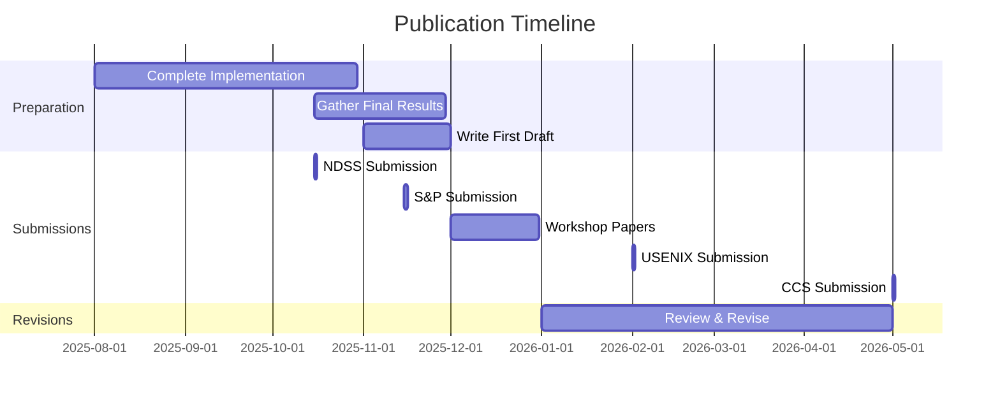

# Conference and Publication Strategy
## Automated Phishing Detection for Frontier AI Inference

**Project:** Automated Phishing Detection for Frontier AI Inference  
**Author:** Krti Tallam  
**Date:** July 29, 2025  
**Target:** 2-3 publications from thesis work  

---

## 1. Executive Summary

This document outlines the publication strategy for disseminating research findings from the Automated Phishing Detection for Frontier AI Inference project. The strategy targets top-tier security and AI conferences, with a backup plan for workshops and journals.

### Publication Goals
1. **Primary Research Paper**: Full system and evaluation results
2. **Dataset Paper**: AI-specific phishing dataset release
3. **Workshop/Poster**: Early results and work-in-progress

## 2. Target Venues Analysis

### 2.1 Tier 1 Conferences (Primary Targets)

#### IEEE Symposium on Security and Privacy (S&P)
- **Deadline:** November 2025 (Spring 2026), June 2026 (Fall 2026)
- **Acceptance Rate:** ~12%
- **Page Limit:** 13 pages + appendix
- **Fit:** Excellent - top security venue
- **Strategy:** Target Spring 2026 deadline with complete results

#### USENIX Security Symposium
- **Deadline:** February 2026 (Fall 2026)
- **Acceptance Rate:** ~16%
- **Page Limit:** 13 pages + appendix
- **Fit:** Excellent - strong systems focus
- **Strategy:** Primary target for February 2026 submission

#### ACM Conference on Computer and Communications Security (CCS)
- **Deadline:** May 2026 (October 2026 conference)
- **Acceptance Rate:** ~18%
- **Page Limit:** 12 pages + appendix
- **Fit:** Very Good - AI security track
- **Strategy:** Good backup option

#### Network and Distributed System Security Symposium (NDSS)
- **Deadline:** October 2025 (February 2026 conference)
- **Acceptance Rate:** ~15%
- **Page Limit:** 13 pages
- **Fit:** Good - network security focus
- **Strategy:** Too early for complete results

### 2.2 Tier 2 Conferences (Alternative Targets)

| Conference | Deadline | Accept Rate | Fit | Notes |
|------------|----------|-------------|-----|-------|
| ACSAC | June 2025 | ~20% | Good | Applied security |
| RAID | March 2026 | ~25% | Very Good | Detection focus |
| EuroS&P | November 2025 | ~20% | Good | European venue |
| AsiaCCS | December 2025 | ~22% | Good | Growing venue |

### 2.3 AI/ML Security Venues

#### Workshops and Specialized Venues

| Venue | Conference | Deadline | Focus |
|-------|------------|----------|-------|
| AISec | CCS | July 2025 | AI security |
| MLSys | Standalone | October 2025 | ML systems |
| SafeAI | AAAI | November 2025 | AI safety |
| AdvML | ICML | April 2026 | Adversarial ML |

### 2.4 Journals (Long-term)

| Journal | Impact Factor | Review Time | Fit |
|---------|---------------|-------------|-----|
| IEEE TDSC | 7.3 | 6-9 months | Excellent |
| ACM TOPS | 2.9 | 4-6 months | Very Good |
| Computers & Security | 5.6 | 3-4 months | Good |
| IEEE Security & Privacy | 3.2 | 3-4 months | Good (magazine) |

## 3. Publication Timeline

### 3.1 Strategic Timeline



### 3.2 Milestone Schedule

| Date | Milestone | Action |
|------|-----------|--------|
| Sept 2025 | Implementation Complete | Freeze features |
| Oct 2025 | Results Finalized | Complete evaluation |
| Nov 2025 | First Draft | Full paper ready |
| Dec 2025 | Internal Review | Advisor feedback |
| Jan 2026 | Submission Ready | Camera-ready quality |

## 4. Paper Strategy

### 4.1 Main Research Paper

**Title Options:**
1. "Protecting Frontier AI: Real-time Phishing Detection for Inference Systems"
2. "PhishGuard: Automated Defense Against AI-Targeted Phishing"
3. "Securing AI Inference: A Machine Learning Approach to Phishing Detection"

**Key Contributions:**
1. First comprehensive phishing detection for AI inference
2. Real-time detection with <100ms latency
3. Novel AI-specific threat model
4. Extensive evaluation on real attacks
5. Open-source implementation

**Paper Structure:**
```
1. Introduction (1.5 pages)
   - AI security challenges
   - Phishing threats to AI
   - Our contributions

2. Background & Threat Model (2 pages)
   - AI inference systems
   - Phishing attack taxonomy
   - Threat model

3. System Design (3 pages)
   - Architecture overview
   - Detection algorithms
   - Real-time processing

4. Implementation (2 pages)
   - Technical details
   - Optimizations
   - Integration

5. Evaluation (4 pages)
   - Experimental setup
   - Detection accuracy
   - Performance analysis
   - Robustness testing

6. Discussion (1 page)
   - Limitations
   - Future work

7. Related Work (1 page)

8. Conclusion (0.5 pages)
```

### 4.2 Dataset Paper

**Target:** NeurIPS Datasets and Benchmarks Track

**Title:** "AI-Phish: A Dataset of Phishing Attacks Targeting AI Systems"

**Contents:**
- 25,000 labeled AI-specific phishing samples
- Annotation methodology
- Baseline results
- Evaluation protocol

### 4.3 Workshop Paper

**Target:** AISec Workshop @ CCS 2025

**Title:** "Early Detection of Phishing in AI Inference Pipelines"

**Focus:** Preliminary results and system design

## 5. Writing Strategy

### 5.1 Writing Timeline

| Week | Task | Output |
|------|------|--------|
| 1-2 | Introduction & Motivation | 2 pages |
| 3-4 | Background & Related Work | 3 pages |
| 5-6 | System Design | 3 pages |
| 7-8 | Evaluation | 4 pages |
| 9-10 | Polish & Revise | Full draft |

### 5.2 Co-authorship Plan

1. **Krti Tallam** - Primary author (First author)
2. **Faculty Advisor** - Senior author (Last author)
3. **Collaborators** (if any) - Middle authors

### 5.3 Writing Best Practices

**Technical Writing Guidelines:**
- One key idea per paragraph
- Active voice preferred
- Define all acronyms
- Consistent terminology
- Clear figure captions

**Security Paper Specifics:**
- Responsible disclosure statement
- Ethical considerations section
- Reproducibility details
- Artifact availability

## 6. Review Process Strategy

### 6.1 Pre-submission Review

**Internal Review Timeline:**
- **Week 1**: Advisor review
- **Week 2**: Lab members review
- **Week 3**: External collaborator review
- **Week 4**: Final revisions

**Review Checklist:**
- [ ] Clarity of contributions
- [ ] Technical soundness
- [ ] Evaluation completeness
- [ ] Writing quality
- [ ] Anonymous submission

### 6.2 Rebuttal Strategy

**Common Criticisms & Responses:**

| Criticism | Response Strategy |
|-----------|------------------|
| "Limited to specific AI systems" | Emphasize generalizability |
| "Performance overhead concerns" | Show real-world deployment |
| "Not novel enough" | Highlight AI-specific innovations |
| "Evaluation not comprehensive" | Provide additional results |

### 6.3 Revision Planning

**Major Revision Checklist:**
- [ ] Address all reviewer comments
- [ ] Add requested experiments
- [ ] Clarify contributions
- [ ] Improve presentation
- [ ] Update related work

## 7. Conference Presentation

### 7.1 Presentation Preparation

**Timeline (from acceptance):**
- Week 1-2: Create slide deck
- Week 3: Practice talks
- Week 4: Incorporate feedback
- Week 5: Final rehearsal

**Slide Structure (20 min talk):**
1. Title & Motivation (2 min)
2. Problem & Threat Model (3 min)
3. Our Approach (5 min)
4. Evaluation Results (6 min)
5. Demo (2 min)
6. Conclusions (2 min)

### 7.2 Poster Design

**Key Elements:**
- Visual threat model
- System architecture diagram
- Performance graphs
- QR code for paper/code

## 8. Promotion Strategy

### 8.1 Pre-publication

- [ ] Arxiv preprint
- [ ] Twitter thread
- [ ] Blog post
- [ ] University news

### 8.2 Post-publication

- [ ] Conference presentation
- [ ] GitHub release
- [ ] Video demo
- [ ] Press release
- [ ] Academic social media

### 8.3 Community Engagement

**Venues for Promotion:**
- Security Twitter community
- Reddit (r/netsec, r/MachineLearning)
- Hacker News
- Academic networks
- Industry contacts

## 9. Impact Metrics

### 9.1 Success Metrics

| Metric | Target | Timeline |
|--------|--------|----------|
| Conference Acceptance | Tier 1 | 12 months |
| Citations | 10+ | 24 months |
| GitHub Stars | 100+ | 12 months |
| Industry Adoption | 1+ company | 18 months |

### 9.2 Tracking Tools

- Google Scholar alerts
- GitHub analytics
- Conference feedback
- Industry inquiries

## 10. Contingency Plans

### 10.1 Rejection Handling

**If Rejected from Tier 1:**
1. Carefully address reviews
2. Target next deadline
3. Consider workshop first
4. Improve evaluation

**Backup Timeline:**
- NDSS → S&P → USENIX → CCS
- 3-month revision cycle
- Workshop papers in parallel

### 10.2 Alternative Dissemination

If traditional publication fails:
- Technical report on Arxiv
- Open-source release priority
- Industry partnerships
- Patent application

## 11. Long-term Strategy

### 11.1 Follow-up Papers

1. **System Paper**: Implementation details (OSDI/SOSP)
2. **Measurement Study**: Real-world deployment (IMC)
3. **Theory Paper**: Formal verification (CSF)
4. **Applied Paper**: Industry case study

### 11.2 Research Agenda

**Building on This Work:**
- Extend to other AI security threats
- Develop formal frameworks
- Create industry standards
- Build research community

## 12. Resources and Support

### 12.1 Writing Resources

- **LaTeX Template**: Conference-specific
- **Reference Manager**: Zotero/BibTeX
- **Collaboration**: Overleaf
- **Figures**: Draw.io, TikZ
- **Plots**: Matplotlib style guide

### 12.2 Funding for Publication

| Expense | Amount | Source |
|---------|--------|--------|
| Conference Registration | $800 | Department |
| Travel | $1,500 | Grant |
| Open Access | $2,000 | University |
| Poster Printing | $150 | Advisor |

### 12.3 Mentorship

- Advisor: Strategy and high-level feedback
- Writing Center: Grammar and clarity
- Senior PhD students: Paper structure
- Industry mentors: Real-world relevance

## 13. Checklist for Submission

### Pre-submission Checklist

- [ ] Paper within page limit
- [ ] Anonymized properly
- [ ] References complete
- [ ] Figures high quality
- [ ] Abstract compelling
- [ ] Title memorable
- [ ] Contributions clear
- [ ] Evaluation thorough
- [ ] Writing polished
- [ ] Supplementary materials

### Submission Day

- [ ] PDF/A format
- [ ] Backup submission site
- [ ] Co-author approval
- [ ] Time zone verified
- [ ] Confirmation saved

---

**Key Dates to Remember:**
- NDSS 2025: October 15, 2025
- S&P Spring 2026: November 15, 2025  
- USENIX Security 2026: February 1, 2026
- CCS 2026: May 1, 2026

**Contact for Questions:**
- Advisor: [Email]
- Conference Chairs: Check CFP
- Writing Support: [University Writing Center]

---

**Document Version:** 1.0  
**Last Updated:** July 29, 2025  
**Next Review:** Before first submission