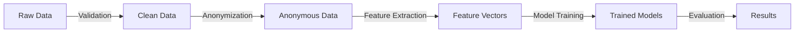

# Data Management Plan
## Automated Phishing Detection for Frontier AI Inference

**Project:** Automated Phishing Detection for Frontier AI Inference  
**Principal Investigator:** Krti Tallam  
**Institution:** George Washington University  
**Last Updated:** July 29, 2025  
**Version:** 1.0  

---

## 1. Executive Summary

This Data Management Plan (DMP) outlines the handling, storage, processing, and sharing protocols for all data associated with the Automated Phishing Detection for Frontier AI Inference project. The plan ensures data security, privacy compliance, and research reproducibility while handling sensitive cybersecurity data.

## 2. Data Types and Sources

### 2.1 Primary Data Categories

#### A. Phishing Attack Data
- **Type**: URLs, payloads, attack signatures
- **Format**: JSON, CSV, PCAP files
- **Volume**: ~500GB total
- **Sensitivity**: Medium-High (contains attack patterns)
- **Sources**:
  - PhishTank API (verified phishing URLs)
  - OpenPhish feed (community-reported phishing)
  - APWG (Anti-Phishing Working Group) datasets
  - VirusTotal API (malicious URL analysis)

#### B. AI System Logs
- **Type**: API request logs, inference patterns
- **Format**: JSON, structured logs
- **Volume**: ~200GB compressed
- **Sensitivity**: High (system behavior patterns)
- **Sources**:
  - Synthetic API logs from test environment
  - Anonymized production logs (with consent)
  - Generated attack simulation logs

#### C. Model Training Data
- **Type**: Feature vectors, labeled datasets
- **Format**: HDF5, NumPy arrays, PyTorch tensors
- **Volume**: ~100GB processed
- **Sensitivity**: Medium (derived from raw data)
- **Processing**: Extracted features from raw phishing data

#### D. Evaluation Metrics
- **Type**: Performance metrics, benchmarks
- **Format**: CSV, JSON, visualization files
- **Volume**: ~10GB
- **Sensitivity**: Low (aggregated results)
- **Generation**: Automated testing pipeline outputs

### 2.2 Metadata Standards

All datasets will include standardized metadata:
```json
{
  "dataset_id": "unique_identifier",
  "collection_date": "ISO-8601",
  "source": "data_source_name",
  "version": "1.0",
  "license": "specified_license",
  "anonymization_applied": true/false,
  "retention_date": "ISO-8601",
  "access_level": "public/restricted/confidential"
}
```

## 3. Data Collection Procedures

### 3.1 Phishing Data Collection

#### Automated Collection Pipeline
```
1. API Integration
   ├── PhishTank API (hourly updates)
   ├── OpenPhish Feed (daily sync)
   └── VirusTotal API (on-demand)
   
2. Data Validation
   ├── URL format verification
   ├── Duplicate detection
   └── Maliciousness confirmation
   
3. Anonymization
   ├── Remove personal information
   ├── Hash sensitive domains
   └── Generalize timestamps
   
4. Storage
   └── Encrypted database insertion
```

#### Manual Collection Protocol
- Security researcher submissions
- Incident response team contributions
- Honeypot-captured attacks
- All require verification before inclusion

### 3.2 AI System Log Collection

#### Synthetic Data Generation
```python
# Example synthetic log generation
{
  "timestamp": "2025-07-29T10:30:00Z",
  "request_id": "uuid",
  "model_endpoint": "/v1/inference",
  "request_size": 1024,
  "response_time_ms": 45,
  "features": {
    "url_length": 156,
    "suspicious_patterns": ["base64", "redirect"],
    "tld": ".tk"
  }
}
```

#### Production Data Collection (with consent)
1. Partner organization agreement
2. Data anonymization at source
3. Secure transfer protocol (SFTP/TLS)
4. Immediate processing and original deletion

## 4. Data Storage and Security

### 4.1 Storage Architecture

```
┌─────────────────────────────────────┐
│         Primary Storage             │
│  ┌─────────────┐ ┌────────────────┐│
│  │   Raw Data  │ │ Processed Data ││
│  │  Encrypted  │ │   Encrypted    ││
│  └─────────────┘ └────────────────┘│
└─────────────────────────────────────┘
           │              │
           ▼              ▼
┌─────────────────────────────────────┐
│        Backup Storage (Cold)        │
│  ┌─────────────┐ ┌────────────────┐│
│  │  Daily      │ │    Weekly      ││
│  │  Snapshots  │ │   Archives     ││
│  └─────────────┘ └────────────────┘│
└─────────────────────────────────────┘
```

### 4.2 Security Measures

#### Encryption
- **At Rest**: AES-256 encryption for all stored data
- **In Transit**: TLS 1.3 for all data transfers
- **Key Management**: AWS KMS or similar service
- **Access Keys**: Rotated every 90 days

#### Access Control
```yaml
Access Levels:
  Level 1 (Public):
    - Aggregated statistics
    - Published results
    
  Level 2 (Restricted):
    - Anonymized datasets
    - Research collaborators
    
  Level 3 (Confidential):
    - Raw phishing data
    - System logs
    - PI and authorized personnel only
```

#### Audit Logging
- All data access logged with timestamp
- User authentication required
- Regular access pattern reviews
- Anomaly detection for unusual access

### 4.3 Backup and Recovery

#### Backup Schedule
- **Incremental**: Daily at 2 AM EST
- **Full Backup**: Weekly on Sundays
- **Archive**: Monthly to cold storage
- **Retention**: 1 year for research data

#### Recovery Procedures
1. **RTO** (Recovery Time Objective): 4 hours
2. **RPO** (Recovery Point Objective): 24 hours
3. **Test Schedule**: Quarterly recovery drills
4. **Documentation**: Step-by-step recovery guide

## 5. Data Processing and Analysis

### 5.1 Processing Pipeline



### 5.2 Version Control

#### Data Versioning
- **Tool**: DVC (Data Version Control)
- **Strategy**: Semantic versioning (v1.0.0)
- **Tracking**: All transformations logged
- **Reproducibility**: Complete pipeline versioned

#### Code Versioning
- **Repository**: Git with GitHub
- **Branches**: main, develop, feature/*
- **Tags**: Release versions
- **CI/CD**: Automated testing on commits

### 5.3 Quality Assurance

#### Data Quality Checks
- Completeness verification
- Consistency validation
- Accuracy assessment
- Timeliness monitoring

#### Automated Validation
```python
validation_rules = {
    "url_format": regex_pattern,
    "timestamp_range": (start, end),
    "required_fields": ["url", "type", "timestamp"],
    "value_ranges": {"confidence": (0.0, 1.0)}
}
```

## 6. Data Sharing and Access

### 6.1 Sharing Protocols

#### Internal Sharing
- Project team members: Full access
- Advisors: Read access to processed data
- Collaborators: Specific dataset access

#### External Sharing
- **Publication Data**: Zenodo or similar repository
- **Format**: CSV/JSON with documentation
- **License**: CC BY 4.0 for datasets
- **Embargo**: 6 months post-publication

### 6.2 Data Publication

#### Repository Selection
1. **Primary**: Zenodo (DOI assignment)
2. **Secondary**: GitHub (code and small datasets)
3. **Specialized**: SecurityData.org for security datasets

#### Documentation Requirements
- README with data description
- Data dictionary
- Usage examples
- Citation information

### 6.3 Access Procedures

#### Request Process
1. Submit access request form
2. Justify research purpose
3. Sign data use agreement
4. Receive time-limited access credentials

#### Data Use Agreement Template
```
1. Use data only for stated research purpose
2. No attempt to re-identify anonymized data
3. Acknowledge data source in publications
4. Report any security issues immediately
5. Delete data after project completion
```

## 7. Data Retention and Disposal

### 7.1 Retention Schedule

| Data Type | Active Storage | Archive | Total Retention |
|-----------|----------------|---------|-----------------|
| Raw phishing data | 1 year | 2 years | 3 years |
| Processed datasets | 2 years | 3 years | 5 years |
| Model checkpoints | 6 months | 1 year | 1.5 years |
| Results/metrics | 5 years | 5 years | 10 years |
| Published data | Indefinite | - | Indefinite |

### 7.2 Disposal Procedures

#### Secure Deletion Protocol
1. **Identification**: Flag data for deletion
2. **Verification**: Confirm no active dependencies
3. **Deletion**: Secure overwrite (3 passes)
4. **Verification**: Confirm deletion complete
5. **Documentation**: Log deletion with reason

#### Compliance Verification
- Annual retention policy review
- Automated expiration alerts
- Deletion audit trail
- Certificate of destruction

## 8. Compliance and Legal

### 8.1 Regulatory Compliance

#### GDPR Compliance
- No personal data collection
- Right to erasure not applicable
- Privacy by design implemented
- Data protection impact assessment completed

#### CCPA Compliance
- No California resident data
- Transparency in data use
- Security measures documented

### 8.2 Institutional Requirements

#### GWU Requirements
- IRB determination: Not human subjects
- Data security review: Completed
- IT security assessment: Approved
- Annual compliance review: Scheduled

### 8.3 Legal Considerations

#### Intellectual Property
- Dataset compilation: Copyright to GWU
- Individual entries: Various sources
- Derived works: Open license
- Attribution required

#### Liability
- No warranty on data accuracy
- Research use only
- Security research safe harbor
- Responsible disclosure policy

## 9. Roles and Responsibilities

### 9.1 Data Management Team

| Role | Name | Responsibilities |
|------|------|------------------|
| PI/Data Manager | Krti Tallam | Overall data governance |
| Faculty Advisor | [Name] | Oversight and guidance |
| System Admin | [TBD] | Technical infrastructure |
| Security Officer | [TBD] | Security compliance |

### 9.2 Responsibilities Matrix

| Task | PI | Advisor | Admin | Security |
|------|----|---------|---------| ------|
| Policy Development | Lead | Review | Input | Review |
| Access Control | Approve | Oversee | Implement | Audit |
| Backup Management | Monitor | - | Execute | Verify |
| Compliance | Ensure | Guide | Support | Validate |

## 10. Budget and Resources

### 10.1 Storage Costs

| Resource | Specification | Monthly Cost | Annual Cost |
|----------|--------------|--------------|-------------|
| Primary Storage | 2TB SSD | $200 | $2,400 |
| Backup Storage | 5TB HDD | $100 | $1,200 |
| Cloud Archive | S3 Glacier | $50 | $600 |
| **Total** | - | **$350** | **$4,200** |

### 10.2 Infrastructure

- Compute: GPU cluster for processing
- Network: 1Gbps minimum bandwidth
- Security: Firewall and IDS/IPS
- Monitoring: Prometheus/Grafana stack

## 11. Training and Documentation

### 11.1 Team Training

#### Required Training
- Data security best practices
- GWU data policies
- Tool-specific training (DVC, encryption)
- Incident response procedures

#### Training Schedule
- Initial: Before data access
- Refresher: Annually
- Updates: As needed
- New members: Onboarding checklist

### 11.2 Documentation

#### Maintained Documents
- This Data Management Plan
- Technical procedures manual
- Security incident playbook
- FAQ and troubleshooting guide

## 12. Review and Updates

### 12.1 Review Schedule

- **Monthly**: Storage utilization and costs
- **Quarterly**: Security audit and access review
- **Semi-annually**: Policy compliance check
- **Annually**: Complete DMP review and update

### 12.2 Change Management

1. Propose changes with justification
2. Review by data management team
3. Update documentation
4. Communicate to all stakeholders
5. Training on significant changes

---

**Appendices**

A. Data Use Agreement Template  
B. Security Incident Response Plan  
C. Technical Architecture Diagrams  
D. Compliance Checklists  
E. Training Materials  

**Document Control**

| Version | Date | Author | Changes |
|---------|------|--------|---------|
| 1.0 | 2025-07-29 | K. Tallam | Initial version |

**Approval**

Student: _________________ Date: _______  
Advisor: _________________ Date: _______