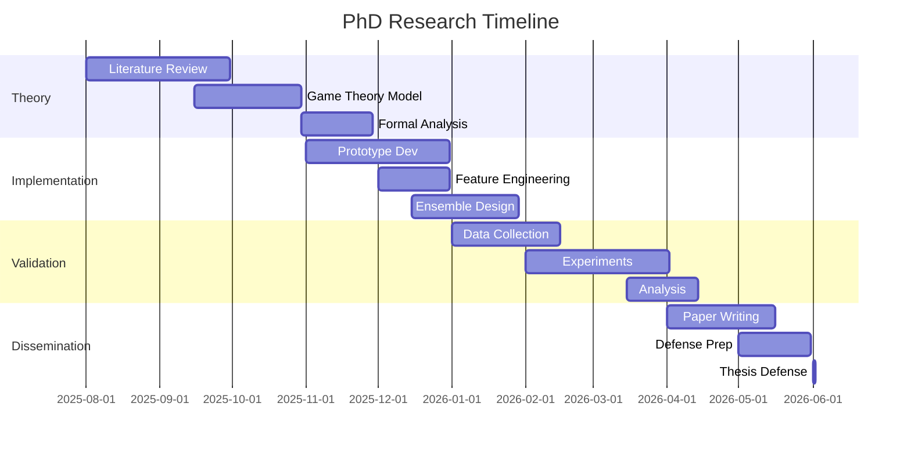

# Research Methodology for Game-Theoretic Phishing Detection in AI Systems

**Doctoral Candidate:** Krti Tallam  
**Institution:** The George Washington University  
**Document Type:** Detailed Research Methodology  
**Version:** 1.0 (PhD-Level)  

---

## 1. Epistemological Framework

### 1.1 Research Paradigm

This research adopts a **post-positivist** paradigm with elements of **critical realism**, acknowledging that:

1. **Objective Reality**: Security threats exist independently of our observation
2. **Imperfect Knowledge**: Our understanding is limited by measurement constraints
3. **Theory-Laden Observation**: Detection methods are influenced by theoretical assumptions
4. **Falsification**: Hypotheses can be disproven but not definitively proven

### 1.2 Philosophical Stance

We embrace **methodological pluralism**, combining:
- **Deductive reasoning**: From game theory to specific predictions
- **Inductive reasoning**: From empirical patterns to general principles
- **Abductive reasoning**: Inference to best explanation for anomalies

### 1.3 Research Design Rationale

Mixed-methods approach justified by:
- **Theoretical work**: Requires formal mathematical analysis
- **Empirical validation**: Demands controlled experiments
- **System building**: Needs engineering methodology
- **Field testing**: Requires quasi-experimental design

---

## 2. Theoretical Research Methodology

### 2.1 Mathematical Modeling Approach

#### 2.1.1 Game-Theoretic Formulation

**Step 1: Define Game Components**
```
G = ⟨N, S, A, T, O, R, β⟩
Where:
- N = {Defender, Attacker} (players)
- S = State space (system + environment)
- A = A_D × A_A (joint action space)
- T: S × A → Δ(S) (transition probability)
- O: S → O_D × O_A (observation function)
- R: S × A → ℝ² (reward function)
- β = Initial belief state
```

**Step 2: Establish Solution Concepts**
- Nash Equilibrium (NE)
- Correlated Equilibrium (CE)  
- Mean Field Equilibrium (MFE) for large-scale

**Step 3: Prove Existence and Uniqueness**
Using fixed-point theorems and convexity arguments

#### 2.1.2 Complexity Analysis

**Computational Complexity Classes**:
```
Decision Problem: PHISH-DETECT ∈ ?
- Input: Query q, threshold τ
- Output: YES if P(phishing|q) > τ

Conjecture: PHISH-DETECT is BPP-complete
Proof approach: Reduction from CIRCUIT-SAT
```

### 2.2 Formal Verification Methods

Using **Coq** proof assistant for critical theorems:

```coq
Theorem detection_soundness : 
  forall (d : detector) (q : query) (τ : threshold),
  classify d q = Phishing ->
  probability (is_phishing q) > τ.
Proof.
  intros d q τ H_classify.
  unfold classify in H_classify.
  destruct (compute_features q) as [features].
  (* ... proof steps ... *)
Qed.
```

### 2.3 Theoretical Validation

1. **Internal Consistency**: Check for contradictions
2. **External Validity**: Compare with established theories
3. **Predictive Power**: Derive testable hypotheses
4. **Parsimony**: Occam's razor application

---

## 3. Empirical Research Methodology

### 3.1 Experimental Design

#### 3.1.1 Factorial Design Structure

**Independent Variables** (2³ factorial):
- Detection Algorithm: {Baseline, Enhanced, Game-theoretic}
- Attack Sophistication: {Low, Medium, High}
- System Load: {Light, Normal, Heavy}

**Dependent Variables**:
- Detection accuracy (TPR, FPR, F1)
- Latency (p50, p95, p99)
- Resource utilization (CPU, memory)
- Robustness (under adversarial perturbation)

**Control Variables**:
- Hardware configuration
- Network conditions
- Dataset distribution
- Random seeds

#### 3.1.2 Randomization and Blocking

```python
class ExperimentalDesign:
    def __init__(self, factors, levels):
        self.factors = factors
        self.levels = levels
        
    def generate_latin_square(self):
        """Latin square design for efficiency"""
        n = len(self.levels[0])
        square = [[((i+j) % n) for j in range(n)] for i in range(n)]
        return square
    
    def randomize_within_blocks(self, block_factor):
        """Randomized block design"""
        blocks = self.stratify_by(block_factor)
        for block in blocks:
            random.shuffle(block.treatments)
        return blocks
```

### 3.2 Data Collection Protocol

#### 3.2.1 Primary Data Sources

**1. Controlled Generation**:
```python
def generate_synthetic_attacks(n_samples, attack_params):
    """Generate phishing samples with known ground truth"""
    generator = PhishingGAN(
        latent_dim=128,
        constraints={
            'semantic_validity': validate_api_schema,
            'statistical_realism': kolmogorov_smirnov_test,
            'diversity_threshold': 0.7
        }
    )
    
    samples = []
    for i in range(n_samples):
        z = sample_latent(attack_params)
        x = generator.generate(z)
        
        # Ensure quality
        if passes_quality_checks(x):
            samples.append({
                'query': x,
                'label': 1,  # phishing
                'params': attack_params,
                'timestamp': time.now()
            })
    
    return samples
```

**2. Honeypot Deployment**:
- Deploy vulnerable AI endpoints
- Monitor and capture attacks
- Validate with security experts

**3. Collaborative Collection**:
- Partner with AI service providers
- Anonymization pipeline
- Legal and ethical compliance

#### 3.2.2 Sampling Strategy

**Power Analysis** for sample size:
```r
# R code for power analysis
library(pwr)

# For two-sample t-test
effect_size <- 0.5  # Medium effect
alpha <- 0.05
power <- 0.80
n <- pwr.t.test(d = effect_size, 
                sig.level = alpha, 
                power = power, 
                type = "two.sample")$n

# Result: n ≈ 64 per group

# For factorial ANOVA
pwr.anova.test(k = 8,  # 2³ groups
               f = 0.25,  # Medium effect
               sig.level = 0.05,
               power = 0.80)
# Result: n ≈ 32 per cell
```

### 3.3 Measurement Instruments

#### 3.3.1 Performance Metrics

**Latency Measurement**:
```python
class LatencyProfiler:
    def __init__(self):
        self.measurements = defaultdict(list)
        
    @contextmanager
    def measure(self, operation):
        start = time.perf_counter_ns()
        try:
            yield
        finally:
            duration = time.perf_counter_ns() - start
            self.measurements[operation].append(duration)
    
    def get_percentiles(self, operation, percentiles=[50, 95, 99]):
        data = np.array(self.measurements[operation])
        return {
            f'p{p}': np.percentile(data, p) / 1e6  # ms
            for p in percentiles
        }
```

#### 3.3.2 Robustness Testing

**Adversarial Perturbation Framework**:
```python
class AdversarialTester:
    def __init__(self, detector, epsilon=0.1):
        self.detector = detector
        self.epsilon = epsilon
        
    def generate_adversarial(self, x, y, method='pgd'):
        """Generate adversarial examples"""
        if method == 'pgd':
            return self._pgd_attack(x, y)
        elif method == 'cw':
            return self._cw_attack(x, y)
        # ... other methods
    
    def evaluate_robustness(self, test_set):
        results = {
            'clean_accuracy': self.detector.evaluate(test_set),
            'robust_accuracy': {},
            'average_distortion': {}
        }
        
        for method in ['fgsm', 'pgd', 'cw']:
            adv_set = self.generate_adversarial_set(test_set, method)
            results['robust_accuracy'][method] = self.detector.evaluate(adv_set)
            results['average_distortion'][method] = self.compute_distortion(test_set, adv_set)
            
        return results
```

### 3.4 Statistical Analysis Plan

#### 3.4.1 Hypothesis Testing Framework

**Primary Hypotheses**:
```
H1: μ(game_theoretic) > μ(baseline) + δ
   where δ = 0.05 (5% improvement threshold)

H2: σ²(ensemble) < σ²(single) 
   (variance reduction through ensemble)

H3: ρ(features, performance) > 0.7
   (strong correlation)
```

**Statistical Tests**:
```r
# R analysis script
library(tidyverse)
library(lme4)
library(emmeans)

# Mixed-effects model for nested data
model <- lmer(accuracy ~ algorithm * attack_level * load + 
              (1 | dataset / fold),
              data = results)

# Post-hoc comparisons
emmeans(model, pairwise ~ algorithm | attack_level)

# Effect sizes
library(effectsize)
cohens_d(accuracy ~ algorithm, data = results)
```

#### 3.4.2 Multiple Comparisons Correction

Using **Holm-Bonferroni** method:
```python
def holm_bonferroni(p_values, alpha=0.05):
    """
    Holm-Bonferroni correction for multiple comparisons
    """
    n = len(p_values)
    sorted_p = np.sort(p_values)
    sorted_idx = np.argsort(p_values)
    
    adjusted_p = np.zeros(n)
    for i in range(n):
        adjusted_p[sorted_idx[i]] = min(
            sorted_p[i] * (n - i),
            1.0
        )
    
    return adjusted_p
```

---

## 4. System Development Methodology

### 4.1 Software Engineering Process

#### 4.1.1 Agile-Inspired Research Development

**Sprint Structure** (2-week cycles):
```
Sprint N:
├── Planning (1 day)
│   ├── Hypothesis formulation
│   ├── Experiment design
│   └── Success metrics
├── Execution (8 days)
│   ├── Implementation
│   ├── Testing
│   └── Data collection
├── Analysis (2 days)
│   ├── Statistical analysis
│   ├── Result interpretation
│   └── Documentation
└── Review (1 day)
    ├── Peer review
    ├── Advisor meeting
    └── Next sprint planning
```

#### 4.1.2 Test-Driven Development (TDD)

```python
class TestDetectionSystem(unittest.TestCase):
    def setUp(self):
        self.detector = create_detector(config='test')
        self.test_data = load_test_dataset()
    
    def test_latency_requirement(self):
        """Test: 95th percentile latency < 100ms"""
        latencies = []
        for sample in self.test_data:
            start = time.time()
            _ = self.detector.predict(sample)
            latencies.append((time.time() - start) * 1000)
        
        p95 = np.percentile(latencies, 95)
        self.assertLess(p95, 100, f"P95 latency {p95}ms exceeds 100ms")
    
    def test_accuracy_requirement(self):
        """Test: F1 score > 0.85"""
        predictions = self.detector.predict_batch(self.test_data.X)
        f1 = f1_score(self.test_data.y, predictions)
        self.assertGreater(f1, 0.85, f"F1 score {f1} below threshold")
```

### 4.2 Reproducibility Framework

#### 4.2.1 Computational Environment

**Docker Configuration**:
```dockerfile
FROM pytorch/pytorch:1.9.0-cuda11.1-cudnn8-runtime

# Reproducibility
ENV PYTHONHASHSEED=0
ENV CUBLAS_WORKSPACE_CONFIG=:16:8

# Install dependencies
COPY requirements.txt .
RUN pip install --no-cache-dir -r requirements.txt

# Set seeds
RUN python -c "import torch; torch.use_deterministic_algorithms(True)"

# Copy code
COPY src/ /app/src/
WORKDIR /app

# Entry point
CMD ["python", "-m", "src.main"]
```

#### 4.2.2 Data Versioning

Using **DVC** (Data Version Control):
```yaml
# dvc.yaml
stages:
  prepare:
    cmd: python src/prepare_data.py
    deps:
      - src/prepare_data.py
      - data/raw
    outs:
      - data/processed
    params:
      - prepare.split_ratio
      - prepare.random_seed

  train:
    cmd: python src/train.py
    deps:
      - src/train.py
      - data/processed
    outs:
      - models/detector.pkl
    metrics:
      - metrics/train.json
    params:
      - train.n_estimators
      - train.learning_rate
```

---

## 5. Validation Methodology

### 5.1 Internal Validity

**Threats and Mitigations**:

| Threat | Description | Mitigation |
|--------|-------------|------------|
| Selection bias | Non-random samples | Stratified sampling |
| History effect | External events | Control group |
| Maturation | System drift | Continuous monitoring |
| Instrumentation | Measurement changes | Calibration checks |
| Testing effect | Learning from tests | Separate test sets |

### 5.2 External Validity

**Generalizability Assessment**:

1. **Cross-dataset validation**: Test on multiple datasets
2. **Cross-platform testing**: Different AI frameworks
3. **Temporal validation**: Performance over time
4. **Geographic diversity**: Global attack patterns

### 5.3 Construct Validity

**Ensuring we measure what we intend**:

```python
def validate_metrics():
    """Validate that metrics align with constructs"""
    
    # Content validity: Expert review
    expert_ratings = get_expert_ratings(metrics)
    assert np.mean(expert_ratings) > 4.0  # 5-point scale
    
    # Convergent validity: Correlation with similar measures
    correlation = np.corrcoef(our_metric, established_metric)[0,1]
    assert correlation > 0.7
    
    # Discriminant validity: Low correlation with different constructs
    correlation = np.corrcoef(our_metric, unrelated_metric)[0,1]
    assert correlation < 0.3
```

---

## 6. Ethical Considerations

### 6.1 Research Ethics Protocol

**IRB Submission Elements**:

1. **No Human Subjects**: Technical systems research
2. **Dual-Use Concerns**: Defensive purpose only
3. **Data Privacy**: No personal information
4. **Responsible Disclosure**: 90-day vendor notice

### 6.2 Ethical AI Principles

Adhering to:
- **Beneficence**: Improving AI security
- **Non-maleficence**: Not enabling attacks
- **Justice**: Equal protection for all
- **Transparency**: Open methodology

---

## 7. Quality Assurance

### 7.1 Code Quality

**Static Analysis**:
```bash
# Pre-commit hooks
pylint src/ --min-score=9.0
mypy src/ --strict
black src/ --check
isort src/ --check-only

# Security scanning
bandit -r src/
safety check
```

### 7.2 Peer Review Process

**Internal Review Cycle**:
1. Self-review checklist
2. Lab member review
3. Advisor review
4. External collaborator review

**Review Criteria**:
- Theoretical soundness
- Methodological rigor
- Statistical validity
- Code quality
- Documentation completeness

---

## 8. Timeline and Milestones

### 8.1 Research Phases



### 8.2 Deliverables Schedule

| Milestone | Date | Deliverable |
|-----------|------|-------------|
| M1 | Month 3 | Theoretical framework paper |
| M2 | Month 6 | Working prototype |
| M3 | Month 9 | Evaluation results |
| M4 | Month 11 | Thesis draft |
| M5 | Month 12 | Defense |

---

## 9. Risk Management

### 9.1 Technical Risks

| Risk | Probability | Impact | Mitigation |
|------|-------------|--------|------------|
| Insufficient data | High | High | Synthetic generation |
| Scalability issues | Medium | High | Distributed architecture |
| Theory-practice gap | Medium | Medium | Iterative refinement |

### 9.2 Research Risks

| Risk | Probability | Impact | Mitigation |
|------|-------------|--------|------------|
| Null results | Low | High | Multiple hypotheses |
| Scooped | Medium | Medium | Rapid publication |
| Scope creep | High | Medium | Clear boundaries |

---

## 10. Conclusion

This methodology document establishes a rigorous framework for conducting doctoral research on game-theoretic phishing detection for AI systems. By combining theoretical depth with empirical validation and systematic development practices, we ensure the research meets the highest standards of academic excellence while producing practical contributions to AI security.

The multi-faceted approach—spanning formal theory, controlled experiments, system building, and field validation—provides multiple forms of evidence to support our thesis. Regular validation checkpoints and quality assurance processes maintain research integrity throughout the project lifecycle.

---

**Approval Signatures:**

Doctoral Candidate: _________________________ Date: _________

Primary Advisor: _________________________ Date: _________

Committee Member: _________________________ Date: _________

Committee Member: _________________________ Date: _________