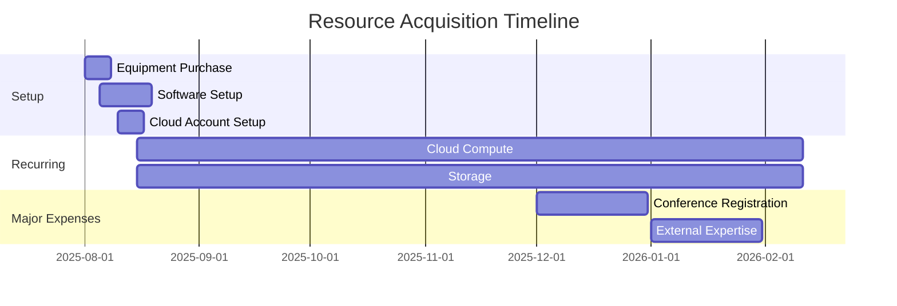

# Resource Requirements Document
## Automated Phishing Detection for Frontier AI Inference

**Project:** Automated Phishing Detection for Frontier AI Inference  
**Author:** Krti Tallam  
**Date:** July 29, 2025  
**Budget Period:** 6 months  
**Version:** 1.0  

---

## 1. Executive Summary

This document outlines all computational, financial, and human resources required for the successful completion of the Automated Phishing Detection for Frontier AI Inference project. Total estimated budget: $8,500 - $12,000.

### Resource Categories
1. **Computational Resources**: GPU/CPU for training and inference
2. **Storage Resources**: Data storage and backup
3. **Software Resources**: Licenses and cloud services
4. **Human Resources**: Expertise and support
5. **Other Resources**: Conference, publication, equipment

## 2. Computational Resources

### 2.1 Training Infrastructure

#### GPU Requirements

| Component | Specification | Purpose | Duration | Cost Estimate |
|-----------|--------------|---------|----------|---------------|
| Primary GPU | NVIDIA A100 40GB or equivalent | Model training | 200 hours | $400-600 |
| Alternative | 2x NVIDIA RTX 4090 24GB | Distributed training | 300 hours | $300-500 |
| Backup Option | Cloud GPU (AWS p3.2xlarge) | On-demand training | 150 hours | $450 |

#### CPU Requirements

| Component | Specification | Purpose | Duration | Cost Estimate |
|-----------|--------------|---------|----------|---------------|
| Data Preprocessing | 32-core CPU, 128GB RAM | Feature extraction | 500 hours | $200 |
| Development | 8-core CPU, 32GB RAM | Code development | Continuous | Existing |

### 2.2 Inference Infrastructure

#### Performance Testing Environment

```yaml
inference_cluster:
  nodes: 3
  per_node:
    cpu: "16 cores"
    ram: "64GB"
    gpu: "NVIDIA T4 or similar"
    network: "10 Gbps"
  
  estimated_cost:
    cloud_based: "$800/month"
    on_premise: "Available at GWU"
```

#### Load Testing Requirements

| Test Type | Resources Needed | Duration | Cost |
|-----------|-----------------|----------|------|
| Normal Load | 1 node | 24 hours | $50 |
| Peak Load | 3 nodes | 12 hours | $150 |
| Stress Test | 5 nodes | 6 hours | $200 |
| Endurance | 2 nodes | 72 hours | $300 |

### 2.3 Development Environment

| Resource | Specification | Cost | Source |
|----------|--------------|------|--------|
| Workstation | i7/Ryzen 7, 32GB RAM, RTX 3070 | $0 | Personal/Provided |
| Remote Access | SSH to compute cluster | $0 | University VPN |
| Version Control | GitHub Pro | $4/month | Personal subscription |

## 3. Storage Resources

### 3.1 Storage Requirements Breakdown

| Data Type | Size | Redundancy | Location | Monthly Cost |
|-----------|------|------------|----------|--------------|
| Raw Phishing Data | 500GB | 3x | Primary + Backup + Archive | $50 |
| Processed Datasets | 200GB | 2x | Primary + Backup | $20 |
| Model Checkpoints | 100GB | 2x | Primary + Cloud | $15 |
| Logs and Metrics | 50GB | 1x | Primary | $5 |
| Code and Docs | 10GB | 3x | Git + Local + Cloud | $0 |
| **Total Active** | **860GB** | - | - | **$90/month** |

### 3.2 Storage Solutions

#### Option 1: Cloud Storage (Recommended)
```yaml
aws_s3:
  hot_tier:
    size: "1TB"
    cost: "$23/month"
    access: "Immediate"
  
  cold_tier:
    size: "2TB"
    cost: "$10/month"
    access: "12-hour retrieval"
  
  glacier:
    size: "5TB"
    cost: "$5/month"
    access: "Archive only"
```

#### Option 2: University Resources
- GWU HPC Storage: 2TB allocation (free)
- Department NAS: 500GB (free)
- Limitations: Slower access, maintenance windows

### 3.3 Backup Strategy

| Backup Type | Frequency | Retention | Storage | Cost |
|-------------|-----------|-----------|---------|------|
| Incremental | Daily | 7 days | Hot | Included |
| Full | Weekly | 4 weeks | Warm | $20/month |
| Archive | Monthly | 1 year | Cold | $10/month |

## 4. Software Resources

### 4.1 Required Software Licenses

| Software | License Type | Cost | Alternative |
|----------|-------------|------|-------------|
| Python | Open Source | $0 | - |
| PyTorch | Open Source | $0 | TensorFlow |
| CUDA Toolkit | Free | $0 | - |
| Docker | Open Source | $0 | Podman |
| Kubernetes | Open Source | $0 | Docker Swarm |

### 4.2 Cloud Services

| Service | Provider | Purpose | Monthly Cost |
|---------|----------|---------|--------------|
| Compute | AWS/GCP | Training/Testing | $500-800 |
| Monitoring | Datadog | Observability | $100 (Academic) |
| CI/CD | GitHub Actions | Automation | $0 (Academic) |
| API Gateway | AWS/Kong | Production test | $50 |

### 4.3 Development Tools

| Tool | Purpose | Cost | Notes |
|------|---------|------|-------|
| VS Code | IDE | $0 | Open source |
| PyCharm Pro | IDE | $0 | Student license |
| Weights & Biases | Experiment tracking | $0 | Academic tier |
| Grafana | Monitoring | $0 | Open source |
| JupyterHub | Notebooks | $0 | Self-hosted |

### 4.4 Security and Analysis Tools

| Tool | Purpose | License | Cost |
|------|---------|---------|------|
| Burp Suite | Security testing | Academic | $0 |
| Wireshark | Network analysis | Open source | $0 |
| OWASP ZAP | Security scanning | Open source | $0 |
| Splunk | Log analysis | Free tier | $0 |

## 5. Data Resources

### 5.1 Primary Datasets

| Dataset | Size | Cost | Access Method |
|---------|------|------|---------------|
| PhishTank | 100GB | $0 | API (free tier) |
| OpenPhish | 50GB | $0 | Public download |
| APWG Feed | 75GB | $500 | Academic license |
| VirusTotal | 25GB | $0 | Academic API |

### 5.2 Threat Intelligence Feeds

| Feed | Update Frequency | Cost | Value |
|------|-----------------|------|-------|
| URLhaus | Real-time | $0 | High |
| PhishLabs | Daily | $200/month | Medium |
| Proofpoint | Weekly | $300/month | High |
| Custom Crawler | Continuous | $50 (hosting) | High |

## 6. Human Resources

### 6.1 Core Team

| Role | Person | Time Commitment | Cost |
|------|--------|----------------|------|
| Project Lead | Krti Tallam | 100% | $0 (student) |
| Faculty Advisor | [Name] | 5-10% | $0 (included) |
| Security Advisor | TBD | 2-3 hours/month | $0 (volunteer) |
| ML Consultant | TBD | As needed | $0-200/hour |

### 6.2 Support Resources

| Resource | Purpose | Availability | Cost |
|----------|---------|--------------|------|
| GWU IT Support | Infrastructure | Business hours | $0 |
| HPC Support | Compute issues | Ticket system | $0 |
| Library Services | Research support | By appointment | $0 |
| Writing Center | Documentation | By appointment | $0 |

### 6.3 External Expertise

| Expertise | When Needed | Estimated Hours | Rate | Total |
|-----------|-------------|-----------------|------|-------|
| Security Audit | Month 5 | 10 hours | $150/hr | $1,500 |
| Statistical Review | Month 5 | 5 hours | $100/hr | $500 |
| System Architecture | Month 2 | 8 hours | $125/hr | $1,000 |

## 7. Equipment and Hardware

### 7.1 Required Equipment

| Item | Specification | Cost | Status |
|------|--------------|------|--------|
| Development Laptop | Already owned | $0 | ✓ |
| External Storage | 2TB SSD | $150 | Needed |
| Backup Drive | 4TB HDD | $100 | Needed |
| Cloud Storage | See above | $90/month | Needed |

### 7.2 Optional Equipment

| Item | Purpose | Cost | Priority |
|------|---------|------|----------|
| GPU Workstation | Local testing | $3,000 | Low |
| Network TAP | Traffic analysis | $500 | Medium |
| Hardware Security Key | 2FA | $50 | High |

## 8. Conference and Publication

### 8.1 Target Conferences

| Conference | Location | Dates | Estimated Cost |
|------------|----------|-------|----------------|
| IEEE S&P | San Francisco | May 2025 | $2,500 |
| USENIX Security | Boston | August 2025 | $2,000 |
| ACM CCS | Virtual option | November 2025 | $500 |
| Local Workshop | Washington DC | Various | $200 |

### 8.2 Publication Costs

| Item | Cost | Notes |
|------|------|-------|
| Open Access Fee | $2,000-3,000 | If accepted |
| Poster Printing | $150 | For conferences |
| Graphics/Figures | $200 | Professional service |

## 9. Budget Summary

### 9.1 One-Time Costs

| Category | Low Estimate | High Estimate |
|----------|--------------|---------------|
| Equipment | $250 | $400 |
| Software Setup | $0 | $200 |
| Data Acquisition | $500 | $1,000 |
| **Total One-Time** | **$750** | **$1,600** |

### 9.2 Monthly Recurring Costs

| Category | Low Estimate | High Estimate |
|----------|--------------|---------------|
| Cloud Compute | $400 | $800 |
| Storage | $90 | $150 |
| Software Services | $100 | $200 |
| **Total Monthly** | **$590** | **$1,150** |

### 9.3 Project Total (6 months)

| Category | Low Estimate | High Estimate |
|----------|--------------|---------------|
| One-Time Costs | $750 | $1,600 |
| Recurring (6 mo) | $3,540 | $6,900 |
| External Expertise | $2,000 | $3,000 |
| Conference/Publication | $500 | $2,500 |
| 10% Contingency | $680 | $1,400 |
| **Total Project** | **$7,470** | **$15,400** |

## 10. Cost Optimization Strategies

### 10.1 Free/Discounted Resources

1. **Academic Discounts**
   - AWS Educate: $100 credits
   - Google Cloud: $300 credits
   - Azure: $100 credits
   - GitHub Education Pack

2. **University Resources**
   - GWU HPC Cluster
   - Library databases
   - Software licenses
   - Conference funding

3. **Open Source Alternatives**
   - Replace commercial tools
   - Community support
   - No licensing fees

### 10.2 Resource Scheduling

```python
# Optimize GPU usage
gpu_schedule = {
    "training": {
        "time": "nights and weekends",
        "discount": "30% spot pricing"
    },
    "inference": {
        "time": "business hours",
        "type": "CPU when possible"
    }
}
```

### 10.3 Phased Approach

| Phase | Resources | Cost | Duration |
|-------|-----------|------|----------|
| Phase 1 | Minimal cloud | $500/mo | Month 1-2 |
| Phase 2 | Scale up | $750/mo | Month 3-4 |
| Phase 3 | Full testing | $1,000/mo | Month 5-6 |

## 11. Funding Sources

### 11.1 Potential Funding

| Source | Amount | Deadline | Status |
|--------|--------|----------|---------|
| SEAS Research Grant | $5,000 | Quarterly | To apply |
| Cybersecurity Grant | $10,000 | Annual | To apply |
| Conference Travel | $1,500 | Per event | Available |
| Department Funding | $2,000 | As needed | Requested |

### 11.2 In-Kind Contributions

| Resource | Value | Provider |
|----------|-------|----------|
| Advisor Time | $5,000 | University |
| HPC Access | $3,000 | University |
| Software Licenses | $1,000 | Academic |
| **Total In-Kind** | **$9,000** | - |

## 12. Resource Timeline

### 12.1 Resource Acquisition Schedule



## 13. Risk Mitigation

### 13.1 Budget Risks

| Risk | Impact | Mitigation |
|------|--------|------------|
| Cloud cost overrun | High | Set spending alerts, use spot instances |
| Equipment failure | Medium | Backup equipment, cloud fallback |
| Funding delay | High | Phase work, use free tier initially |

### 13.2 Resource Availability

| Risk | Impact | Mitigation |
|------|--------|------------|
| GPU shortage | High | Reserve in advance, use multiple providers |
| Expert unavailable | Medium | Identify multiple consultants |
| Data source changes | Medium | Mirror data locally |

## 14. Approval and Tracking

### 14.1 Approval Required

- [ ] Advisor approval for budget
- [ ] Department approval for resources
- [ ] IT approval for cloud accounts
- [ ] Finance approval for purchases

### 14.2 Expense Tracking

| Month | Budgeted | Actual | Variance | Notes |
|-------|----------|--------|----------|-------|
| Month 1 | $1,340 | - | - | - |
| Month 2 | $590 | - | - | - |
| Month 3 | $590 | - | - | - |
| Month 4 | $750 | - | - | - |
| Month 5 | $1,590 | - | - | - |
| Month 6 | $2,090 | - | - | - |

---

**Document Control:**
- Version: 1.0
- Last Updated: July 29, 2025
- Next Review: Monthly
- Approved by: _______________ Date: _______________