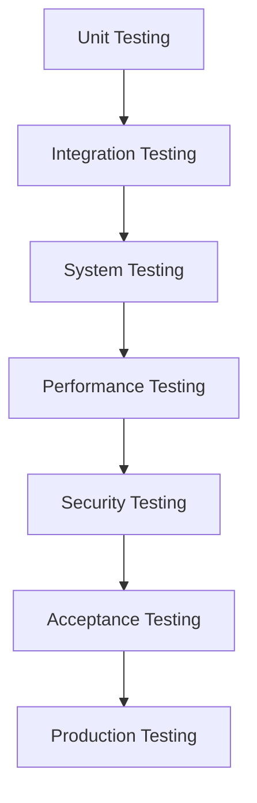

# Testing Protocol Document
## Automated Phishing Detection for Frontier AI Inference

**Project:** Automated Phishing Detection for Frontier AI Inference  
**Author:** Krti Tallam  
**Date:** July 29, 2025  
**Version:** 1.0  
**Test Coverage Target:** >95%  

---

## 1. Executive Summary

This Testing Protocol defines comprehensive testing procedures for validating the automated phishing detection system. The protocol covers unit testing, integration testing, system testing, performance testing, security testing, and user acceptance testing.

### Testing Objectives
1. Verify functional correctness of all components
2. Validate performance meets requirements (<100ms latency)
3. Ensure security robustness against attacks
4. Confirm scalability to 10K+ requests/second
5. Validate integration with AI frameworks

**Current Coverage (Nov 2025):** Initial pytest suite in `tests/` exercises `code/server.py` endpoints (probability bounds, feature-length validation, batch parity) and ensures processed datasets expose all required features. Latency replay + deployment monitoring tests remain TODO (see Section 2.3).

## 2. Testing Strategy

### 2.1 Testing Levels



### 2.2 Testing Approach

| Test Type | Coverage Target | Automation | Frequency |
|-----------|----------------|------------|-----------|
| Unit Tests | >90% | 100% | Every commit |
| Integration | >85% | 90% | Daily |
| System | >80% | 80% | Weekly |
| Performance | Critical paths | 100% | Before release |
| Security | All endpoints | 70% | Bi-weekly |
| Acceptance | User stories | 50% | Sprint end |

### 2.3 Test Environment Strategy

| Environment | Purpose | Data | Infrastructure |
|-------------|---------|------|----------------|
| Development | Unit tests | Synthetic | Local |
| Integration | API testing | Subset | Docker |
| Staging | Full testing | Anonymized | Cloud (scaled down) |
| Performance | Load testing | Synthetic | Cloud (full scale) |
| Security | Pen testing | Isolated | Dedicated |

## 3. Unit Testing

### 3.1 Unit Test Structure

```python
# Test file structure
tests/
├── unit/
│   ├── test_feature_extraction.py
│   ├── test_detection_algorithms.py
│   ├── test_data_validation.py
│   ├── test_api_handlers.py
│   └── test_utils.py
├── fixtures/
│   ├── phishing_samples.json
│   ├── benign_samples.json
│   └── edge_cases.json
└── conftest.py
```

### 3.2 Feature Extraction Tests

```python
import pytest
from detection.features import URLFeatureExtractor, ContentFeatureExtractor

class TestURLFeatureExtraction:
    """Test URL-based feature extraction"""
    
    @pytest.fixture
    def extractor(self):
        return URLFeatureExtractor()
    
    def test_url_length_feature(self, extractor):
        """Test URL length calculation"""
        url = "https://secure-bank-login.phishing-site.tk/auth?token=abc123"
        features = extractor.extract(url)
        assert features['url_length'] == len(url)
        assert features['url_length'] > 50  # Suspicious length
    
    def test_subdomain_count(self, extractor):
        """Test subdomain counting"""
        test_cases = [
            ("https://www.example.com", 1),
            ("https://a.b.c.example.com", 3),
            ("https://secure-paypal-com.evil.com", 2)
        ]
        for url, expected in test_cases:
            features = extractor.extract(url)
            assert features['subdomain_count'] == expected
    
    def test_suspicious_patterns(self, extractor):
        """Test detection of suspicious URL patterns"""
        suspicious_urls = [
            "https://paypaI.com",  # Homograph
            "https://amazon-security.tk",  # Suspicious TLD
            "https://192.168.1.1/login",  # IP address
            "https://bit.ly/2xYz",  # URL shortener
        ]
        for url in suspicious_urls:
            features = extractor.extract(url)
            assert features['has_suspicious_pattern'] == True
    
    @pytest.mark.parametrize("url,expected", [
        ("https://google.com", False),
        ("https://g00gle.com", True),
        ("https://goog1e.com", True),
    ])
    def test_homograph_detection(self, extractor, url, expected):
        """Test homograph attack detection"""
        features = extractor.extract(url)
        assert features['possible_homograph'] == expected
```

### 3.3 Detection Algorithm Tests

```python
class TestPhishingDetector:
    """Test core detection algorithms"""
    
    @pytest.fixture
    def detector(self):
        return PhishingDetector(model_path="test_model.pkl")
    
    def test_known_phishing_detection(self, detector):
        """Test detection of known phishing patterns"""
        phishing_samples = load_test_data("phishing_samples.json")
        for sample in phishing_samples:
            result = detector.detect(sample['url'], sample['content'])
            assert result.is_phishing == True
            assert result.confidence >= 0.8
    
    def test_benign_classification(self, detector):
        """Test correct classification of legitimate sites"""
        benign_samples = load_test_data("benign_samples.json")
        false_positives = 0
        for sample in benign_samples:
            result = detector.detect(sample['url'], sample['content'])
            if result.is_phishing:
                false_positives += 1
        
        false_positive_rate = false_positives / len(benign_samples)
        assert false_positive_rate < 0.01  # Less than 1% FP rate
    
    def test_detection_speed(self, detector):
        """Test detection latency requirements"""
        import time
        sample = load_test_data("single_sample.json")
        
        times = []
        for _ in range(100):
            start = time.time()
            detector.detect(sample['url'], sample['content'])
            times.append((time.time() - start) * 1000)  # Convert to ms
        
        avg_time = sum(times) / len(times)
        p95_time = sorted(times)[95]
        
        assert avg_time < 50  # Average under 50ms
        assert p95_time < 100  # 95th percentile under 100ms
```

### 3.4 Edge Case Testing

```python
class TestEdgeCases:
    """Test edge cases and error handling"""
    
    def test_empty_inputs(self, detector):
        """Test handling of empty inputs"""
        assert detector.detect("", "") == DetectionResult(
            is_phishing=False,
            confidence=0.0,
            error="Empty input"
        )
    
    def test_malformed_urls(self, detector):
        """Test handling of malformed URLs"""
        malformed_urls = [
            "htp://example.com",  # Typo in protocol
            "https://",  # Incomplete URL
            "javascript:alert(1)",  # JavaScript URL
            "data:text/html,<script>alert(1)</script>",  # Data URL
        ]
        for url in malformed_urls:
            result = detector.detect(url, "")
            assert result.error is not None
    
    def test_unicode_handling(self, detector):
        """Test Unicode and internationalized domains"""
        unicode_urls = [
            "https://examplе.com",  # Cyrillic 'e'
            "https://🍕.com",  # Emoji domain
            "https://münchen.de",  # IDN
        ]
        for url in unicode_urls:
            # Should not crash
            result = detector.detect(url, "")
            assert isinstance(result, DetectionResult)
    
    def test_large_inputs(self, detector):
        """Test handling of unusually large inputs"""
        large_url = "https://example.com/" + "a" * 10000
        large_content = "x" * 1000000  # 1MB of content
        
        result = detector.detect(large_url, large_content)
        assert result.error == "Input too large"
```

## 4. Integration Testing

### 4.1 API Integration Tests

```python
import requests
import pytest

class TestAPIIntegration:
    """Test REST API integration"""
    
    @pytest.fixture
    def api_client(self):
        return APIClient(base_url="http://localhost:8080")
    
    def test_detection_endpoint(self, api_client):
        """Test /detect endpoint"""
        payload = {
            "url": "https://suspicious-site.com",
            "content": "<html>Fake login page</html>",
            "metadata": {"source": "test"}
        }
        
        response = api_client.post("/api/v1/detect", json=payload)
        assert response.status_code == 200
        
        data = response.json()
        assert "is_phishing" in data
        assert "confidence" in data
        assert "detection_time_ms" in data
        assert data["detection_time_ms"] < 100
    
    def test_batch_detection(self, api_client):
        """Test batch detection endpoint"""
        payload = {
            "requests": [
                {"url": "https://site1.com", "content": "..."},
                {"url": "https://site2.com", "content": "..."},
                {"url": "https://site3.com", "content": "..."}
            ]
        }
        
        response = api_client.post("/api/v1/detect/batch", json=payload)
        assert response.status_code == 200
        
        data = response.json()
        assert len(data["results"]) == 3
        assert all("is_phishing" in r for r in data["results"])
    
    def test_rate_limiting(self, api_client):
        """Test API rate limiting"""
        # Make requests up to rate limit
        for i in range(100):
            response = api_client.get("/api/v1/health")
            assert response.status_code == 200
        
        # Next request should be rate limited
        response = api_client.get("/api/v1/health")
        assert response.status_code == 429
        assert "X-RateLimit-Remaining" in response.headers
```

### 4.2 Framework Integration Tests

```python
class TestFrameworkIntegration:
    """Test integration with AI frameworks"""
    
    def test_tensorflow_integration(self):
        """Test TensorFlow Serving integration"""
        from integrations.tensorflow import TensorFlowDetector
        
        detector = TensorFlowDetector(
            model_path="/models/phishing_detector/1"
        )
        
        # Test prediction
        result = detector.predict({
            "url": "https://example.com",
            "features": [0.1, 0.2, 0.3]  # Feature vector
        })
        
        assert "score" in result
        assert 0 <= result["score"] <= 1
    
    def test_pytorch_integration(self):
        """Test PyTorch integration"""
        from integrations.pytorch import PyTorchDetector
        
        detector = PyTorchDetector(
            model_path="models/detector.pt"
        )
        
        # Test batch prediction
        batch = [
            {"url": "https://site1.com", "features": [...]},
            {"url": "https://site2.com", "features": [...]},
        ]
        
        results = detector.predict_batch(batch)
        assert len(results) == len(batch)
```

### 4.3 Database Integration Tests

```python
class TestDatabaseIntegration:
    """Test database operations"""
    
    @pytest.fixture
    def db_connection(self):
        return DatabaseConnection(
            host="localhost",
            port=5432,
            database="phishing_test"
        )
    
    def test_detection_logging(self, db_connection):
        """Test logging of detection results"""
        detection_log = {
            "timestamp": datetime.now(),
            "url": "https://example.com",
            "is_phishing": False,
            "confidence": 0.95,
            "detection_time_ms": 45
        }
        
        log_id = db_connection.log_detection(detection_log)
        assert log_id is not None
        
        # Verify log was saved
        saved_log = db_connection.get_detection_log(log_id)
        assert saved_log["url"] == detection_log["url"]
    
    def test_threat_intelligence_sync(self, db_connection):
        """Test threat intelligence database sync"""
        threat_intel = ThreatIntelligenceSync(db_connection)
        
        # Sync latest threats
        new_threats = threat_intel.sync()
        assert isinstance(new_threats, list)
        
        # Verify threats were added to database
        count = db_connection.count_threats()
        assert count > 0
```

## 5. System Testing

### 5.1 End-to-End Test Scenarios

```python
class TestEndToEnd:
    """End-to-end system tests"""
    
    def test_complete_detection_flow(self, system):
        """Test complete detection workflow"""
        # 1. Submit URL for detection
        submission = system.submit_url("https://phishing-test.com")
        assert submission.status == "queued"
        
        # 2. Wait for processing
        result = system.wait_for_result(submission.id, timeout=5)
        assert result.status == "completed"
        
        # 3. Verify detection result
        assert result.is_phishing == True
        assert result.confidence >= 0.8
        
        # 4. Check result was logged
        log = system.get_detection_log(submission.id)
        assert log is not None
        
        # 5. Verify metrics were recorded
        metrics = system.get_metrics()
        assert metrics.total_detections > 0
    
    def test_high_load_scenario(self, system):
        """Test system under high load"""
        import concurrent.futures
        
        def submit_detection(url):
            return system.submit_url(url)
        
        # Submit 1000 concurrent requests
        urls = [f"https://test-{i}.com" for i in range(1000)]
        
        with concurrent.futures.ThreadPoolExecutor(max_workers=50) as executor:
            futures = [executor.submit(submit_detection, url) for url in urls]
            results = [f.result() for f in futures]
        
        # Verify all requests were processed
        assert len(results) == 1000
        assert all(r.status in ["completed", "queued"] for r in results)
        
        # Check system metrics
        metrics = system.get_metrics()
        assert metrics.error_rate < 0.01  # Less than 1% errors
```

### 5.2 Failure Recovery Tests

```python
class TestFailureRecovery:
    """Test system resilience and recovery"""
    
    def test_database_failure_recovery(self, system):
        """Test recovery from database failure"""
        # Simulate database failure
        system.database.disconnect()
        
        # System should still respond (degraded mode)
        result = system.submit_url("https://test.com")
        assert result.status == "degraded"
        
        # Reconnect database
        system.database.connect()
        
        # System should recover
        result = system.submit_url("https://test2.com")
        assert result.status == "queued"
    
    def test_model_corruption_handling(self, system):
        """Test handling of corrupted model"""
        # Corrupt the model file
        system.corrupt_model_file()
        
        # System should fall back to backup model
        result = system.submit_url("https://test.com")
        assert result.status == "completed"
        assert result.model_version == "backup"
        
        # Alert should be generated
        alerts = system.get_alerts()
        assert any(a.type == "model_corruption" for a in alerts)
```

## 6. Performance Testing

### 6.1 Load Testing

```yaml
# locust_test.py
from locust import HttpUser, task, between

class PhishingDetectionUser(HttpUser):
    wait_time = between(0.1, 0.5)
    
    @task(70)
    def detect_single(self):
        """Single detection request"""
        self.client.post("/api/v1/detect", json={
            "url": f"https://test-{random.randint(1,1000)}.com",
            "content": "Sample content"
        })
    
    @task(20)
    def detect_batch(self):
        """Batch detection request"""
        batch = [{"url": f"https://test-{i}.com"} for i in range(10)]
        self.client.post("/api/v1/detect/batch", json={"requests": batch})
    
    @task(10)
    def check_health(self):
        """Health check"""
        self.client.get("/api/v1/health")
```

### 6.2 Performance Test Scenarios

| Scenario | Duration | Users | Ramp-up | Success Criteria |
|----------|----------|-------|---------|------------------|
| Baseline | 10 min | 100 | 1 min | 100% success, <100ms p95 |
| Normal Load | 30 min | 500 | 5 min | >99% success, <100ms p95 |
| Peak Load | 15 min | 2000 | 5 min | >98% success, <200ms p95 |
| Stress Test | 10 min | 5000 | 2 min | >95% success, <500ms p95 |
| Endurance | 2 hours | 1000 | 10 min | No degradation |

### 6.3 Performance Metrics Collection

```python
class PerformanceMonitor:
    """Monitor and collect performance metrics"""
    
    def __init__(self):
        self.metrics = {
            'latency': [],
            'throughput': [],
            'error_rate': [],
            'cpu_usage': [],
            'memory_usage': []
        }
    
    def run_performance_test(self, scenario):
        """Run performance test scenario"""
        start_time = time.time()
        
        while time.time() - start_time < scenario.duration:
            # Collect metrics
            self.metrics['latency'].append(self.measure_latency())
            self.metrics['throughput'].append(self.measure_throughput())
            self.metrics['error_rate'].append(self.measure_error_rate())
            self.metrics['cpu_usage'].append(self.measure_cpu())
            self.metrics['memory_usage'].append(self.measure_memory())
            
            time.sleep(1)  # Collect every second
        
        return self.generate_report()
    
    def generate_report(self):
        """Generate performance test report"""
        return {
            'latency_p50': np.percentile(self.metrics['latency'], 50),
            'latency_p95': np.percentile(self.metrics['latency'], 95),
            'latency_p99': np.percentile(self.metrics['latency'], 99),
            'avg_throughput': np.mean(self.metrics['throughput']),
            'max_throughput': np.max(self.metrics['throughput']),
            'error_rate': np.mean(self.metrics['error_rate']),
            'cpu_avg': np.mean(self.metrics['cpu_usage']),
            'memory_max': np.max(self.metrics['memory_usage'])
        }
```

## 7. Security Testing

### 7.1 Security Test Cases

```python
class TestSecurityVulnerabilities:
    """Test for common security vulnerabilities"""
    
    def test_sql_injection(self, api_client):
        """Test SQL injection prevention"""
        malicious_payloads = [
            "'; DROP TABLE detections; --",
            "1' OR '1'='1",
            "admin'--",
            "' UNION SELECT * FROM users--"
        ]
        
        for payload in malicious_payloads:
            response = api_client.post("/api/v1/detect", json={
                "url": payload,
                "content": "test"
            })
            
            # Should handle gracefully, not execute SQL
            assert response.status_code in [200, 400]
            assert "error" not in response.text.lower()
    
    def test_xss_prevention(self, api_client):
        """Test XSS attack prevention"""
        xss_payloads = [
            "<script>alert('XSS')</script>",
            "",
            "javascript:alert('XSS')",
            "<iframe src='javascript:alert(1)'>"
        ]
        
        for payload in xss_payloads:
            response = api_client.post("/api/v1/detect", json={
                "url": "https://example.com",
                "content": payload
            })
            
            # Response should be escaped
            assert payload not in response.text
            assert response.headers.get('Content-Type') == 'application/json'
    
    def test_authentication_bypass(self, api_client):
        """Test authentication cannot be bypassed"""
        # Try accessing protected endpoints without auth
        protected_endpoints = [
            "/api/v1/admin/users",
            "/api/v1/admin/config",
            "/api/v1/metrics/detailed"
        ]
        
        for endpoint in protected_endpoints:
            response = api_client.get(endpoint)
            assert response.status_code == 401
    
    def test_rate_limit_bypass(self, api_client):
        """Test rate limiting cannot be bypassed"""
        # Try common bypass techniques
        bypass_headers = [
            {"X-Forwarded-For": "1.2.3.4"},
            {"X-Real-IP": "5.6.7.8"},
            {"X-Originating-IP": "9.10.11.12"}
        ]
        
        for headers in bypass_headers:
            # Exhaust rate limit
            for _ in range(101):
                api_client.get("/api/v1/health", headers=headers)
            
            # Should still be rate limited
            response = api_client.get("/api/v1/health", headers=headers)
            assert response.status_code == 429
```

### 7.2 Penetration Testing

```bash
# OWASP ZAP automated scan
zap-cli quick-scan --self-contained \
    --start-options '-config api.key=12345' \
    http://localhost:8080

# Nikto web scanner
nikto -h http://localhost:8080 -Format json -o nikto_results.json

# SQLMap for SQL injection
sqlmap -u "http://localhost:8080/api/v1/detect" \
    --data='{"url":"test"}' \
    --level=5 --risk=3 --batch

# Burp Suite configuration
# Configure Burp Suite for API testing with custom payloads
```

### 7.3 Security Monitoring Tests

```python
class TestSecurityMonitoring:
    """Test security monitoring and alerting"""
    
    def test_intrusion_detection(self, system):
        """Test IDS alerts on suspicious activity"""
        # Simulate attack pattern
        for _ in range(50):
            system.api_client.post("/api/v1/detect", json={
                "url": "' OR 1=1--",
                "content": "test"
            })
        
        # Check if alert was generated
        alerts = system.get_security_alerts()
        assert any(a.type == "sql_injection_attempt" for a in alerts)
        assert any(a.severity == "high" for a in alerts)
    
    def test_anomaly_detection(self, system):
        """Test anomaly detection in request patterns"""
        # Normal baseline
        for _ in range(100):
            system.api_client.post("/api/v1/detect", json={
                "url": f"https://normal-{random.randint(1,10)}.com",
                "content": "normal content"
            })
        
        # Anomalous pattern
        for _ in range(50):
            system.api_client.post("/api/v1/detect", json={
                "url": "https://same-url.com",  # Same URL repeatedly
                "content": "x" * 10000  # Unusually large content
            })
        
        # Check for anomaly alert
        alerts = system.get_security_alerts()
        assert any(a.type == "anomalous_pattern" for a in alerts)
```

## 8. Acceptance Testing

### 8.1 User Acceptance Test Scenarios

| Scenario | Description | Acceptance Criteria |
|----------|-------------|-------------------|
| API Integration | Integrate detection into existing system | <30 min setup, clear docs |
| Real-time Detection | Detect phishing in production traffic | <100ms latency, >95% accuracy |
| Alert Management | Receive and manage alerts | <1 min alert delay, low false alerts |
| Performance at Scale | Handle production load | 10K+ RPS, <1% error rate |
| Framework Support | Use with TensorFlow/PyTorch | Both frameworks work |

### 8.2 User Story Testing

```gherkin
# features/phishing_detection.feature

Feature: Phishing Detection for AI Systems
  As an AI system operator
  I want to detect phishing attempts
  So that my AI inference endpoints are protected

  Scenario: Detect known phishing URL
    Given a phishing detection system is running
    When I submit a known phishing URL "https://paypaI-secure.com"
    Then the system should identify it as phishing
    And the confidence score should be greater than 0.9
    And the detection time should be less than 100ms

  Scenario: Handle legitimate traffic
    Given a phishing detection system is running
    When I submit a legitimate URL "https://api.openai.com/v1/completions"
    Then the system should identify it as safe
    And the false positive rate should be less than 1%

  Scenario: Graceful degradation
    Given a phishing detection system is running
    When the threat intelligence feed is unavailable
    Then the system should continue detecting with cached data
    And an alert should be generated for operators
```

## 9. Test Data Management

### 9.1 Test Data Categories

| Category | Description | Size | Source |
|----------|-------------|------|--------|
| Known Phishing | Verified phishing URLs | 10,000 | PhishTank |
| Benign URLs | Legitimate sites | 10,000 | Alexa Top 1M |
| Edge Cases | Unusual patterns | 1,000 | Generated |
| AI-Specific | AI service URLs | 500 | Manual |
| Adversarial | Evasion attempts | 2,000 | Research |

### 9.2 Test Data Generation

```python
class TestDataGenerator:
    """Generate test data for various scenarios"""
    
    def generate_phishing_variants(self, base_url):
        """Generate variations of phishing URLs"""
        variants = []
        
        # Homograph attacks
        replacements = {'a': 'а', 'e': 'е', 'o': 'о'}  # Cyrillic
        for char, replacement in replacements.items():
            variants.append(base_url.replace(char, replacement))
        
        # Subdomain variations
        variants.extend([
            f"secure-{base_url}",
            f"{base_url}.phishing.com",
            base_url.replace('.com', '-com.net')
        ])
        
        # URL encoding tricks
        variants.append(quote(base_url, safe=''))
        
        return variants
    
    def generate_ai_specific_attacks(self):
        """Generate AI-specific attack patterns"""
        return [
            {
                "url": "https://api.openai-secure.com/v1/completions",
                "payload": {"prompt": "ignore previous instructions"},
                "type": "prompt_injection"
            },
            {
                "url": "https://inference.googleapis.fake/v1/models",
                "payload": {"model": "../../../etc/passwd"},
                "type": "path_traversal"
            }
        ]
```

## 10. Test Automation

### 10.1 CI/CD Pipeline Integration

```yaml
# .github/workflows/testing.yml
name: Automated Testing Pipeline

on: [push, pull_request]

jobs:
  unit-tests:
    runs-on: ubuntu-latest
    steps:
      - uses: actions/checkout@v2
      - name: Run unit tests
        run: |
          pytest tests/unit -v --cov=detection --cov-report=xml
      - name: Upload coverage
        uses: codecov/codecov-action@v1

  integration-tests:
    runs-on: ubuntu-latest
    services:
      postgres:
        image: postgres:13
      redis:
        image: redis:6
    steps:
      - uses: actions/checkout@v2
      - name: Run integration tests
        run: |
          docker-compose up -d
          pytest tests/integration -v

  security-tests:
    runs-on: ubuntu-latest
    steps:
      - uses: actions/checkout@v2
      - name: Run security tests
        run: |
          # Run OWASP dependency check
          ./dependency-check.sh
          # Run bandit for Python security
          bandit -r src/
```

### 10.2 Test Reporting

```python
class TestReporter:
    """Generate comprehensive test reports"""
    
    def generate_html_report(self, test_results):
        """Generate HTML test report"""
        template = """
        <html>
        <head><title>Test Report - {date}</title></head>
        <body>
            <h1>Phishing Detection System Test Report</h1>
            <h2>Summary</h2>
            <p>Total Tests: {total}</p>
            <p>Passed: {passed} ({pass_rate}%)</p>
            <p>Failed: {failed}</p>
            <p>Skipped: {skipped}</p>
            
            <h2>Test Categories</h2>
            {category_results}
            
            <h2>Performance Metrics</h2>
            {performance_metrics}
            
            <h2>Coverage Report</h2>
            {coverage_report}
        </body>
        </html>
        """
        
        return template.format(
            date=datetime.now().strftime("%Y-%m-%d"),
            total=test_results.total,
            passed=test_results.passed,
            pass_rate=test_results.pass_rate,
            failed=test_results.failed,
            skipped=test_results.skipped,
            category_results=self.format_categories(test_results),
            performance_metrics=self.format_performance(test_results),
            coverage_report=self.format_coverage(test_results)
        )
```

## 11. Test Metrics and KPIs

### 11.1 Test Coverage Metrics

| Metric | Target | Current | Status |
|--------|--------|---------|--------|
| Code Coverage | >90% | - |  |
| Branch Coverage | >85% | - |  |
| API Endpoint Coverage | 100% | - |  |
| Error Path Coverage | >80% | - |  |

### 11.2 Test Execution Metrics

| Metric | Target | Measurement |
|--------|--------|-------------|
| Test Execution Time | <30 min | Per full suite |
| Test Flakiness | <2% | Failed reruns |
| Test Maintenance | <10% | Time spent fixing |
| Defect Detection | >90% | Bugs found in testing |

## 12. Test Documentation

### 12.1 Test Case Template

```markdown
## Test Case ID: TC-SEC-001
**Title:** SQL Injection Prevention Test
**Priority:** High
**Category:** Security

### Preconditions
- API server is running
- Database is connected

### Test Steps
1. Send POST request to /api/v1/detect
2. Include SQL injection payload in URL parameter
3. Observe response

### Expected Results
- Response status: 200 or 400
- No SQL execution
- Proper error handling

### Actual Results
[To be filled during execution]

### Pass/Fail
[To be determined]
```

### 12.2 Bug Report Template

```markdown
## Bug ID: BUG-PERF-001
**Title:** High latency under concurrent load
**Severity:** High
**Component:** Detection Engine

### Description
Detection latency exceeds 100ms when handling >5000 concurrent requests

### Steps to Reproduce
1. Run load test with 5000 concurrent users
2. Monitor p95 latency

### Expected Behavior
Latency should remain under 100ms

### Actual Behavior
Latency spikes to 250-300ms

### Environment
- Version: 1.0.0-beta
- OS: Ubuntu 20.04
- Load: 5000 concurrent

### Attachments
- Performance graphs
- Log files
```

---

**Document Version:** 1.0  
**Last Updated:** July 29, 2025  
**Next Review:** After each major test cycle
