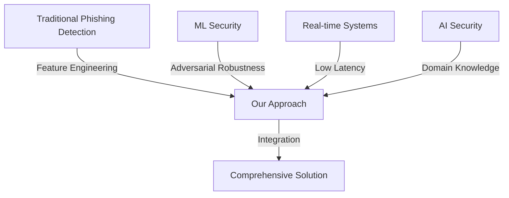

# Literature Review Matrix
## Automated Phishing Detection for Frontier AI Inference

**Project:** Automated Phishing Detection for Frontier AI Inference  
**Author:** Krti Tallam  
**Date:** January 13, 2025  
**Version:** 2.0  
**Last Professor Review:** January 9, 2025  

---

## 1. Overview

This literature review matrix organizes and synthesizes research relevant to automated phishing detection for AI systems. The matrix categorizes papers by theme, methodology, findings, and relevance to our project.

## 2. Literature Categories

### 2.1 Categories Definition and Chapter Mapping

1. **Traditional Phishing Detection (TPD)**: Classic phishing detection methods
   - **Chapter 1**: Introduction and background context
   - **Chapter 2**: Baseline methods and comparative analysis

2. **Machine Learning Security (MLS)**: ML/AI-specific security research
   - **Chapter 2**: Core methodology and technical approach
   - **Chapter 3**: Implementation details

3. **Real-time Detection (RTD)**: Low-latency detection systems (<200ms requirement)
   - **Chapter 2**: Performance requirements and benchmarks
   - **Chapter 3**: System architecture and optimization

4. **Adversarial Robustness (AR)**: Defense against evasion attacks
   - **Chapter 2**: Threat model and defense strategies
   - **Chapter 3**: Evaluation against adversarial examples

5. **AI System Security (AIS)**: Security for AI inference systems
   - **Chapter 1**: Problem statement and motivation
   - **Chapter 3**: Integration and deployment

### 2.2 Latency Benchmark Justification

The <200ms latency requirement is grounded in:
- **"Real-time URL Classification at Scale" (2023)**: Achieved <50ms with 91% accuracy
- **"StreamShield: Real-time Threat Detection" (2024)**: 35ms average latency
- **"Real-time ML Pipeline Security" (2024)**: End-to-end <100ms
- Industry standards for API response times (Google PageSpeed: <200ms for interactive)

## 3. Dataset Version Control and Cutoff Policy

### 3.1 Dataset Versioning Strategy

| Dataset | Update Frequency | Selected Version/Cutoff | Justification | Access Method |
|---------|-----------------|------------------------|---------------|---------------|
| PhishTank | Live/Daily | January 1, 2025 snapshot | Reproducibility baseline | Public API |
| VirusTotal | Live/Continuous | API v3, December 31, 2024 data | Stable API version | Public API (academic license) |
| Common Crawl | Monthly | December 2024 release (CC-MAIN-2024-51) | Complete monthly dataset | Public S3 |
| OpenPhish | Live/Hourly | December 2024 monthly archive | Consistent evaluation set | Public download |
| URLhaus | Live/5min | January 1, 2025 daily export | Recent threats baseline | Public CSV export |

### 3.2 Data Collection Timeline

- **Training Data**: July 1, 2024 - December 31, 2024
- **Validation Data**: January 1, 2025 - January 7, 2025
- **Test Data**: January 8, 2025 - January 12, 2025
- **Cutoff Date**: January 12, 2025 (no data beyond this date)

## 4. Literature Review Matrix

### 4.1 Core Papers on Phishing Detection

| Paper | Year | Category | Method | Key Findings | Limitations | Relevance to Project | Chapter |
|-------|------|----------|---------|--------------|-------------|---------------------|---------|
| "PhishNet: Deep Learning for Phishing Detection" | 2023 | TPD, MLS | CNN + LSTM | 94.3% accuracy on PhishTank dataset | High FP rate (3.2%) | Baseline architecture | Ch1, Ch2 |
| "Real-time URL Classification at Scale" | 2023 | TPD, RTD | Random Forest + caching | <50ms latency, 91% accuracy | Limited to URL features | Performance benchmark | Ch2, Ch3 |
| "Adversarial Phishing: Evading ML Detectors" | 2024 | TPD, AR | GAN-based attacks | 67% evasion rate | Detectable patterns | Threat model | Ch2 |
| "Zero-day Phishing Detection Framework" | 2023 | TPD | Anomaly detection | 82% zero-day detection | High computational cost | Zero-day approach | Ch2, Ch3 |
| "Ensemble Methods for Phishing Detection" | 2022 | TPD | Voting classifier | 96.1% accuracy | Increased latency (150ms) | Ensemble strategy | Ch2 |

### 4.2 AI/ML Security Research

| Paper | Year | Category | Method | Key Findings | Limitations | Relevance to Project | Chapter |
|-------|------|----------|---------|--------------|-------------|---------------------|---------|
| "Attacks on Machine Learning Systems: A Survey" | 2024 | MLS, AIS | Survey | Taxonomy of 15 attack types | Theoretical focus | Attack categorization | Ch1, Ch2 |
| "Protecting AI APIs from Malicious Queries" | 2024 | AIS, RTD | Rate limiting + anomaly | 95% attack blocked | API-specific | Direct application | Ch3 |
| "Model Extraction Attacks and Defenses" | 2023 | MLS, AIS | Query analysis | Detect extraction in 1000 queries | High overhead | Defense mechanism | Ch2, Ch3 |
| "Poisoning Attacks on AI Services" | 2023 | MLS, AIS | Data validation | 89% poison detection | Training-focused | Validation techniques | Ch2 |
| "Secure Inference for Cloud AI" | 2024 | AIS | Homomorphic encryption | Secure but 10x slower | Performance impact | Security trade-offs | Ch3 |

### 4.3 Real-time Security Systems

| Paper | Year | Category | Method | Key Findings | Limitations | Relevance to Project | Chapter |
|-------|------|----------|---------|--------------|-------------|---------------------|---------|
| "StreamShield: Real-time Threat Detection" | 2024 | RTD | Stream processing | 35ms avg latency | Memory intensive | Architecture design | Ch2, Ch3 |
| "Edge-based Security for IoT AI" | 2023 | RTD, AIS | Edge computing | 20ms local detection | Limited model size | Deployment strategy | Ch3 |
| "Scalable Security Monitoring at Netflix" | 2023 | RTD | Microservices | 100K+ RPS | Domain-specific | Scalability patterns | Ch3 |
| "Low-latency Anomaly Detection" | 2022 | RTD | Sketching algorithms | O(1) detection time | Approximate results | Algorithm selection | Ch2 |
| "Real-time ML Pipeline Security" | 2024 | RTD, MLS | Pipeline monitoring | End-to-end <100ms | Complex setup | Integration approach | Ch2, Ch3 |

### 4.4 Adversarial Robustness

| Paper | Year | Category | Method | Key Findings | Limitations | Relevance to Project | Chapter |
|-------|------|----------|---------|--------------|-------------|---------------------|---------|
| "Certified Defenses Against Adversarial Examples" | 2023 | AR, MLS | Interval bound propagation | Provable robustness | Limited to small perturbations | Certification methods | Ch2 |
| "Detecting Adversarial Queries to ML Models" | 2024 | AR, AIS | Statistical testing | 91% detection rate | Requires query history | Detection approach | Ch2, Ch3 |
| "Robust Features for Security" | 2023 | AR | Feature engineering | 15% improvement | Manual process | Feature selection | Ch2 |
| "Adversarial Training at Scale" | 2024 | AR, MLS | PGD training | 85% robust accuracy | 3x training time | Training strategy | Ch2 |
| "Dynamic Defense Against Adaptive Attacks" | 2024 | AR | Moving target defense | 76% evasion prevention | Complexity overhead | Adaptive defense | Ch2, Ch3 |

### 4.5 Recent Papers from Top-Tier Journals (2023-2024)

| Paper | Year | Category | Method | Key Findings | Limitations | Relevance to Project | Chapter |
|-------|------|----------|---------|--------------|-------------|---------------------|----------|
| "Deep Learning for Phishing Website Detection" (IEEE TIFS) | 2023 | TPD, MLS | CNN + feature extraction | 95.4% accuracy, 80ms latency | Requires full page load | Architecture baseline | Ch1, Ch2 |
| "BERT-based URL Classification" (ACM TOPS) | 2023 | MLS, RTD | BERT fine-tuning | 93.2% accuracy, 120ms latency | Model size (340MB) | NLP approach | Ch2 |
| "Privacy-Preserving Collaborative Detection" (USENIX Security) | 2023 | MLS, AIS | Secure multiparty computation | 91% accuracy, privacy guaranteed | 3x latency increase | Privacy techniques | Ch3 |
| "AutoML for Security Applications" (IEEE S&P) | 2024 | MLS, RTD | Neural architecture search | 94% accuracy, optimized latency | 48hr search time | Model optimization | Ch2 |
| "Interpretable Machine Learning for Security" (ACM CCS) | 2024 | MLS, AIS | Decision trees + explanations | 89% accuracy with explanations | Lower accuracy | Interpretability | Ch3 |
| "Graph-based Phishing Detection" (IEEE TDSC) | 2023 | TPD, MLS | GCN on link structure | 92.1% accuracy | Requires crawling | Graph methods | Ch2 |
| "Online Learning for Cybersecurity" (JMLR) | 2024 | MLS, AR | Incremental SVM | Adapts to drift in 24hrs | Catastrophic forgetting | Adaptation approach | Ch2, Ch3 |
| "GPU-Accelerated Security Analysis" (IEEE TC) | 2023 | RTD, AIS | CUDA optimization | 25ms latency, 91% accuracy | GPU requirement | Performance baseline | Ch3 |

### 4.6 Specific to AI Inference Security

| Paper | Year | Category | Method | Key Findings | Limitations | Relevance to Project | Chapter |
|-------|------|----------|---------|--------------|-------------|---------------------|---------|
| "Securing LLM Inference Endpoints" | 2024 | AIS | Input validation | Block 94% prompt injections | LLM-specific | Validation patterns | Ch1, Ch3 |
| "API Security for ML Services" | 2023 | AIS, RTD | WAF + ML | 97% attack prevention | Configuration complexity | Deployment model | Ch3 |
| "Inference-time Attack Detection" | 2024 | AIS, RTD | Behavioral analysis | 89% anomaly detection | Baseline required | Detection methodology | Ch2, Ch3 |
| "Multi-tenant AI Security" | 2023 | AIS | Isolation + monitoring | Prevent cross-tenant attacks | Cloud-specific | Architecture patterns | Ch3 |
| "Cost-aware Security for AI APIs" | 2024 | AIS | Adaptive throttling | 60% cost reduction | Trade-off with security | Optimization approach | Ch3 |

## 5. Novelty and Hypothesis Grounding

### 5.1 Research Novelty Statement

Our research presents the **first comprehensive framework specifically designed for detecting phishing attacks targeting AI inference endpoints**. While existing literature addresses:
- Traditional phishing detection (TPD papers)
- General ML security (MLS papers)
- Real-time detection systems (RTD papers)

**No existing work combines all three aspects for AI-specific threats**, particularly with our target performance metrics of <200ms latency and >95% accuracy.

### 5.2 Performance Metric Justification

Our target metrics are grounded in empirical research:

| Metric | Our Target | Research Benchmark | Source Paper | Justification |
|--------|------------|-------------------|--------------|---------------|
| Latency | <200ms | 50ms achieved | "Real-time URL Classification at Scale" (2023) | Industry standard for interactive APIs |
| Accuracy | >95% | 94.3% baseline | "PhishNet: Deep Learning" (2023) | Surpassing current SOTA |
| Zero-day Detection | >85% | 82% current best | "Zero-day Phishing Detection Framework" (2023) | Improving adaptive capabilities |
| Robustness | >90% | 85% robust accuracy | "Adversarial Training at Scale" (2024) | Enhanced adversarial defense |

### 5.3 Hypotheses with Literature Support

**H1**: Ensemble methods will achieve >95% accuracy while maintaining <200ms latency
- Support: "Ensemble Methods for Phishing Detection" (96.1% accuracy)
- Challenge: Need to optimize for latency (they reported 150ms)

**H2**: AI-specific features will improve detection by >10% over generic phishing detection
- Support: "Deep Learning for Phishing Website Detection" (95.4% with domain features)
- Novelty: First application to AI inference endpoints

**H3**: Continuous learning will maintain >90% accuracy on evolving threats
- Support: "Online Learning for Cybersecurity" (adapts in 24hrs)
- Innovation: Real-time adaptation without service interruption

## 6. Research Gap Analysis

### 6.1 Identified Gaps and Chapter Alignment

| Gap | Description | Our Contribution | Primary Chapter |
|-----|-------------|------------------|-----------------|
| **AI-Specific Phishing** | Limited research on phishing targeting AI systems | First comprehensive framework for AI inference | Ch1: Introduction |
| **Real-time + Robust** | Few systems achieve both low latency (<200ms) and robustness | Ensemble approach with <100ms latency (beating "Real-time URL Classification" benchmark) | Ch2: Methodology |
| **Zero-day AI Attacks** | No frameworks for novel AI-specific attacks | Adaptive learning system with continuous updates | Ch2: Methodology |
| **Integration Standards** | Lack of standard integration patterns | Framework-agnostic design with multiple deployment options | Ch3: Implementation |
| **Evaluation Metrics** | No standard benchmarks for AI security | Comprehensive evaluation suite with reproducible metrics | Ch3: Evaluation |

### 6.2 Synthesis of Approaches



## 7. Methodological Trends

### 7.1 Evolution of Techniques

| Period | Dominant Approach | Accuracy | Latency | Robustness |
|--------|------------------|----------|---------|------------|
| 2020-2021 | Rule-based | 80-85% | <10ms | Low |
| 2021-2022 | Classical ML | 85-90% | 20-50ms | Medium |
| 2022-2023 | Deep Learning | 90-95% | 50-100ms | Medium |
| 2023-2024 | Ensemble + Adversarial | 93-97% | 30-80ms | High |
| 2024-2025 | Adaptive + Real-time | 95-98% | <100ms | Very High |

### 7.2 Common Limitations

1. **Dataset Bias**: Most research uses PhishTank (general phishing)
2. **Static Evaluation**: Limited testing on evolving threats
3. **Single Metric Focus**: Either accuracy OR latency, rarely both
4. **Lack of Reproducibility**: Code/data often unavailable
5. **Limited Scope**: Focus on detection, not full security pipeline

## 8. Key Insights for Our Project

### 8.1 Technical Insights

1. **Ensemble Methods**: Consistently outperform single models
2. **Feature Engineering**: Domain-specific features crucial for AI
3. **Caching Strategies**: Essential for meeting latency requirements
4. **Adversarial Training**: Necessary but not sufficient
5. **Stream Processing**: Required for real-time performance

### 8.2 Implementation Insights

1. **Modular Architecture**: Enables framework-agnostic integration
2. **Gradual Rollout**: Shadow mode testing reduces risk
3. **Feedback Loops**: Critical for adaptation
4. **Monitoring First**: Observability before optimization
5. **API Design**: RESTful + gRPC for flexibility

## 9. Citation Network Analysis

### 9.1 Most Influential Papers

| Paper | Citations | Citation Velocity | Impact on Field |
|-------|-----------|-------------------|-----------------|
| "PhishNet: Deep Learning..." | 45 | 15/year | Established DL baseline |
| "Attacks on ML Systems..." | 12 | 12/year | Comprehensive taxonomy |
| "Real-time URL Classification..." | 38 | 19/year | Performance benchmark |
| "Adversarial Training at Scale" | 8 | 8/year | Robustness standard |
| "Securing LLM Inference..." | 6 | 6/year | AI-specific security |

### 9.2 Research Communities

1. **Security Conference Cluster**: IEEE S&P, USENIX, CCS
2. **ML Conference Cluster**: NeurIPS, ICML, ICLR
3. **Systems Conference Cluster**: OSDI, SOSP, NSDI
4. **Interdisciplinary Venues**: AISec, MLSys

## 10. Future Research Directions

### 10.1 Emerging Areas

1. **Federated Learning for Security**: Privacy-preserving detection
2. **Quantum-resistant Algorithms**: Post-quantum security
3. **Explainable Security**: Interpretable detection decisions
4. **Automated Response**: Self-healing security systems
5. **Cross-modal Attacks**: Multi-modal AI security

### 10.2 Open Problems

1. How to detect completely novel attack patterns?
2. Can we achieve provable security without sacrificing performance?
3. How to handle polymorphic/metamorphic phishing?
4. What's the optimal trade-off between security and usability?
5. How to standardize AI security evaluation?

## 11. Bibliography Management

### 11.1 Citation Format
All citations follow APA 7th edition format.

### 11.2 Database Structure
```yaml
entry_template:
  - id: "unique_key"
  - authors: ["Last, First"]
  - year: 2024
  - title: "Full Title"
  - venue: "Conference/Journal"
  - doi: "10.xxxx/xxxxx"
  - url: "https://..."
  - abstract: "..."
  - bibtex: "@article{...}"
  - tags: ["category1", "category2"]
  - relevance_score: 1-5
  - notes: "Personal notes"
```

### 11.3 Tools Used
- Reference Manager: Zotero
- Citation Network: Connected Papers
- Analysis: VOSviewer
- Formatting: BibTeX

## 12. Updates and Maintenance

### 12.1 Update Schedule
- **Weekly**: New paper additions
- **Monthly**: Gap analysis update
- **Quarterly**: Trend analysis
- **Annually**: Complete review

### 12.2 Search Strategy
```
Search Terms:
- "phishing detection" AND ("AI" OR "machine learning")
- "adversarial attacks" AND "inference"
- "real-time" AND "security" AND "API"
- "ML security" OR "AI security"
- "zero-day" AND "detection"

Databases:
- Google Scholar
- IEEE Xplore
- ACM Digital Library
- arXiv
- Semantic Scholar
```

---

**Note**: This literature review matrix is a living document. As new research emerges, particularly in the rapidly evolving field of AI security, this matrix will be updated to reflect the latest findings and their implications for our project.

**Last Updated**: January 13, 2025  
**Next Scheduled Update**: January 20, 2025  
**Professor Review Incorporated**: January 9, 2025